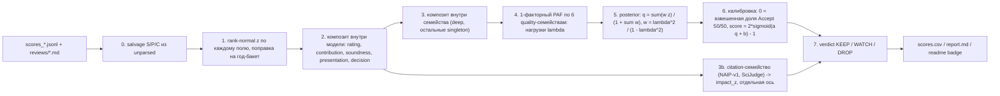

# Единый скор качества статьи [-1, 1]

## Что показал разведочный анализ (read-only, 319 статей)

- Все попарные Spearman низкие (0.1–0.5). Единственные явные кластеры: **DeepReviewer 7B/7B-Fast/14B** (ρ 0.32–0.38, macro-F1 0.59–0.64 — максимум в таблице) и **NAIP-v1 + SciJudge** (ρ 0.46, оба предсказывают цитируемость). NAIPv2 кластеризуется с DR (ρ 0.49 с DR-14B), но это другая линейка — его высокая согласованность с консенсусом это плюс, а не «семейственность».
- Надёжность = ρ(модель, консенсус остальных **семейств**): NAIPv2 0.53, DR-7B 0.42, DR-14B 0.40, SEA-E 0.36, DR-7B-Fast 0.35, CR-8B 0.32, DGC-BERT 0.27, SciJudge 0.26, OR-8B 0.23, NAIP-v1 0.22. Если считать «остальные модели» без учёта семейств, DR и NAIP-v1/SciJudge завышаются на 0.05–0.11 — это и есть эффект интеркорреляции.
- **Sub-scores несут больше сигнала, чем rating**: у DR-14B `contribution` 0.50 и `soundness` 0.46 против `rating` 0.40; у OR-8B `contribution` 0.33 против `rating` 0.23 (65% статей у OR-8B получили ровно 6, 57% у SEA-E). Presentation везде слабее.
- **Decision не дублирует rating** у DeepReviewer: 51/314 (14B) и 43/258 (7B-Fast) расходятся с `rating>=6`. У OR-8B — 0/316 (decision выводится из rating).
- **Unparsed почти не смещён**: средний консенсус-z статей, где DR-7B-Fast не распарсился, −0.06/−0.13 против +0.02 у распарсенных (n=37/24). Только у DR-7B Std −0.3/−0.4, но n=6/12. Значит, отсутствие можно считать случайным (MAR), не считать за reject.
- **Salvage возможен**: в unparsed-ревью есть S/P/C у 49/61 (DR-7B-Fast), 8/8 (CR-8B), 7/18, 3/5, 3/3.
- Годы: 2015–2022 по 4–18 статей, 2023–2026 по 47–80 → по-годовая z-нормализация в ранних годах шумная, нужны бакеты + shrinkage.

## Метод

### 0. Salvage unparsed
Для строк `error: unparsed:*` прочитать `reviews/<model>/<key>.md`, прогнать `parse_review` из [filter/remote/score_reviewers.py](filter/remote/score_reviewers.py) (как это делает [filter/reparse_reviews.py](filter/reparse_reviews.py)). Если есть хотя бы S/P/C — использовать композит только из sub-scores с множителем веса **0.5**. `no_fulltext`, полностью пустые — missing. jsonl не переписываем, salvage живёт внутри агрегатора.

### 1. Нормализация
Каждое числовое поле каждой модели → rank-normal z (`norm.ppf(rank/(n+1))`, средние ранги для ties; сжатые шкалы OR-8B/SEA-E автоматически дают меньшую дисперсию). Поправка на pretraining-инфляцию старых статей: вычесть среднее z по год-бакету (`<=2020`, `2021-22`, `2023`, `2024`, `2025`, `2026`), сжатое к 0 с псевдо-счётом k=10. Для SciJudge (уже внутри года) это no-op. Флаг `--no-year-adjust`.

Опционально `--section-adjust` (по умолчанию выкл.): та же поправка по секции readme (8 секций по 17–55 статей, 7 мелких по 2–12 — их shrinkage почти не трогает). Снимает domain-bias ICLR-обученных ревьюеров против NeuroAI / Finance / bioRxiv, но предполагает одинаковое распределение качества по секциям. Ранжирование внутри секции в отчёте есть и без этого.

### 2. Композит внутри модели
Для full-paper ревьюеров: `z_m = 0.45 z(rating) + 0.25 z(contribution) + 0.20 z(soundness) + 0.10 z(presentation) + 0.15 * (+1 Accept / -1 Reject)`, затем повторная стандартизация. Веса — константы в конфиге; в отчёт выводится таблица ρ(sub-score, консенсус других семейств), чтобы их можно было подправить. Для title+abstract моделей композит = само значение. Для `partial: true` (короткий fulltext) — множитель веса 0.5.

### 3. Семейства и две оси
Конфиг `FAMILIES = {'deep': [dr7b, dr7bf, dr14b], 'citation': [naipv1, scijudge]}`, остальные singleton (naipv2, cr8b, or8b, seae, dgcbert). Внутри семейства — взвешенное среднее доступных членов, вес ∝ LOFO-ρ члена. Семейство = один голос. Диагностика: иерархическая кластеризация на `1 - ρ` печатается в отчёт для проверки конфига (сейчас при порогах 0.6–0.75 стабильно выделяются ровно эти два кластера).

`IMPACT_FAMILIES = {'citation'}` — это другой конструкт (предсказание цитируемости, а не качества рецензии; ρ с остальными 0.1–0.26). В quality-фактор не входит, выдаётся отдельной колонкой `impact_z` (год-скорректированный композит NAIP-v1 + SciJudge). Если убрать из `IMPACT_FAMILIES`, семейство вернётся в фактор с data-driven весом (сейчас он был бы ~6% суммы).

### 4–5. Веса и объединение
1-факторный principal-axis factoring на матрице попарно-полных Spearman между 6 quality-семействами (naipv2, deep, cr8b, or8b, seae, dgcbert) → нагрузки λ_f. Байесовская модель: prior q ~ N(0,1), наблюдение z_f ~ N(q, (1-λ²)/λ²):

- вес w_f = λ_f² / (1 − λ_f²) × множитель (1 / 0.5 для partial или salvage);
- q̂ = Σ w_f z_f / (1 + Σ w_f) — отсутствующие семейства просто выпадают, скор сам сжимается к 0;
- `final_conf` = Σ w_f / (1 + Σ w_f) — статья, оценённая только DGC-BERT, получает низкий |q̂| и низкий conf.

Кросс-чек в отчёте: LOFO-ρ и PC1-нагрузки рядом с λ. `WEIGHT_OVERRIDE: dict` в конфиге, если хочется руками. Опубликованные бенчмарки (NAIPv2 AUC 78% на ICLR; DeepReviewer-14B decision acc ~69%, Spearman 0.41; CycleReviewer-8B ~59%) согласуются с порядком LOFO на нашем корпусе (NAIPv2 > DR > CR-8B), но это метрики на ICLR-распределении — использовать только как sanity-check для override, а не как веса.

### 6. Калибровка в [-1, 1] (абсолютный ноль)
Мягкая цель p_i = взвешенная (теми же w) доля Accept среди моделей с decision (full-paper ревьюеры + DGC-BERT). Подогнать 2 параметра `sigmoid(a q̂ + b)` к p_i минимизацией взвешенной cross-entropy (`scipy.optimize`). `final_score = 2 sigmoid(a q̂ + b) − 1`: 0 = граница accept/reject по самим ревьюерам. Дополнительно `final_pct` (перцентиль q̂, 100 = лучшая). В отчёт: a, b, доля статей > 0.

### 7. Вердикт
Три класса вместо бинарного, пороги в конфиге (`DROP_BELOW = -0.2`, `MIN_CONF = 0.5`, `HIGH_IMPACT = +0.5`):

- **DROP** — `final_score < DROP_BELOW` и `final_conf >= MIN_CONF` и `impact_z < HIGH_IMPACT`;
- **WATCH** — низкий score, но высокий `impact_z` (рискованная/свежая идея), либо `final_conf < MIN_CONF` (мало источников: `no_fulltext`, много unparsed), либо `|final_score| <= |DROP_BELOW|`;
- **KEEP** — остальное.

Колонка `verdict` в csv/отчёте; bottom-30 разбивается на DROP и WATCH. Бейдж остаётся числовым.

## Файлы

- **Новый** [filter/aggregate.py](filter/aggregate.py): конфиг-константы сверху (`FAMILIES`, `IMPACT_FAMILIES`, `SUBSCORE_WEIGHTS`, `DECISION_NUDGE`, `PARTIAL_MULT`, `YEAR_BUCKETS`, `YEAR_SHRINK_K`, `WEIGHT_OVERRIDE`, пороги вердикта), функции `load_tables`, `salvage_unparsed`, `rank_normal`, `group_adjust` (год / секция), `model_composite`, `family_composite`, `paf_loadings`, `posterior`, `calibrate`, `verdict`, `aggregate() -> (rows, diagnostics)`. CLI `python filter/aggregate.py [--no-year-adjust] [--section-adjust]` печатает таблицы весов/кластеров/bias-чека с прогрессом; numpy/scipy уже установлены. pathlib, одинарные кавычки, PEP8.
- [filter/build_report.py](filter/build_report.py): вызвать `aggregate`, добавить в `CSV_FIELDS` `final_score, final_conf, final_pct, impact_z, verdict`; новая секция `## Aggregation` (веса λ/w/LOFO по семействам и моделям, кластеры, sub-score диагностика, unparsed-bias check, параметры калибровки, счётчики KEEP/WATCH/DROP); `Bottom 30` → два списка DROP / WATCH по `final_score`; сортировка по секциям — по `final_score`; в per-paper строке `final +0.42 (conf 0.81, pct 63) · impact +0.3 · KEEP`.
- [filter/add_score_badges.py](filter/add_score_badges.py): `badge_text` → `[⚖ +0.42 · 5/6](...)` из `final_score` (знак обязателен), легенда обновлена: «−1 reject … +1 approve, 0 = порог accept».
- [filter/paths.py](filter/paths.py): без изменений (при необходимости — константа `AGGREGATE_FIELDS`).

## Почему агрегация, а не каскад NAIPv2 → SciJudge → DeepReviewer

Каскад с ручными весами (0.30/0.20/0.25/0.15/0.10) решает задачу экономии GPU до прогона. Здесь все 10 моделей уже прогнаны на всех 319 статьях, экономить нечего, а ранняя отсечка нижних 25–40% по одному NAIPv2 (ρ с остальными 0.17–0.49) выбросит статьи, которые другие модели ставят высоко. Ручные веса из опубликованных бенчмарков расходятся с данными: DeepReviewer там получает 0.10 при том, что это второе по надёжности семейство на нашем корпусе (LOFO 0.40–0.42), а SEA-E объявлен бесполезным при LOFO 0.36 (4-е место из 10, выше CR-8B, SciJudge, DGC-BERT). Взято из того предложения: импакт отдельной осью, три класса вердикта, опциональная нормализация по секции.

## Состояние после ревью (Opus / GPT 5.6 / Codex)

Ревью описывает более раннюю версию. В [filter/aggregate.py](filter/aggregate.py) на диске все шесть «Act on» уже закрыты, CLI на Windows отрабатывает:

- citation вне quality-LOFO — `quality_temp` фильтрует `IMPACT_FAMILIES` (`family_composites`);
- ренормализация композита — `num / used_w` (`model_composites`);
- partial/salvage в числителе семьи и `wts = den / full_den`, полная семья = 1.0 (`family_composites`);
- настоящий Spearman — `midranks` + Pearson;
- ASCII в `print_report`; `last_by_key` — последний valid, error только без valid;
- из lone findings: `bounds a >= 1e-3` + `result.success`; SciJudge rank-normal внутри года; нулевое покрытие → `score=None`; нет `impact_z` → WATCH.

Фактический прогон: λ NAIPv2 0.59, Deep 0.77, SEA-E 0.49, CR-8B 0.37, DGC 0.34, OR-8B 0.32; Σw 2.66, доля Deep 53%; conf 0.54–0.73 (медиана 0.73, статьи без fulltext → 0.40 → WATCH, `MIN_CONF` живой); калибровка a=1.25, b=+0.48, 79% статей > 0; KEEP 197 / WATCH 90 / DROP 32.

### «Consider» — позиция по каждому

- **Калибровка на тех же decision.** a, b — два скаляра монотонного отображения, порядок статей не меняют; выбор — только где стоит 0. Настоящая проблема другая: семейства с вырожденной долей Accept не несут информации о границе. Доли Accept по семействам: SEA-E 0.93, OR-8B 0.81, Deep 0.56, DGC 0.52, CR-8B 0.23. Варианты (посчитано):
  - текущий, все семейства без весов: b=+0.48, 79% > 0, 197/90/32;
  - только семейства с долей в [0.1, 0.9] (без SEA-E): b=+0.11, 65% > 0, KEEP 119 / WATCH 141 / DROP 59, 45 статей меняют знак;
  - взвешенно по w: b=+0.45, 72% > 0, 187/75/57.
  **Утверждено:** второй вариант через `CAL_VOTE_RANGE = (0.1, 0.9)` — SEA-E «одобряет» 93% и его голос о границе ничего не говорит. Диапазон считается по данным при каждом прогоне (семейство выпадает из цели, если его доля Accept выходит за границы), в отчёт выводится список семейств, вошедших в цель.
- **Deep 53% суммы w.** Следствие λ²/(1−λ²) для среднего трёх моделей (Spearman–Brown: при межмодельной ρ≈0.35 надёжность среднего ≈0.62). Cap доли на 0.40 даёт Spearman 0.989 с текущим, 7 смен знака, вердикты 200/85/34 — ранжирование не меняется, падает только conf (медиана 0.73 → 0.67). Не капить; доля показывается в отчёте, `WEIGHT_OVERRIDE` работает.
- **SciJudge внутри года** — уже так.
- **Бейдж `5/6`.** `accept_votes/n_models` — сырые голоса ревьюеров, другая величина, чем `final_score`. Оставить, но в легенде назвать явно.

### Новое, чего ревью не заметило

- `cluster_labels(corr, names, 0.25)` подписан «rho>=0.75»: порог по расстоянию 0.25 означает ρ ≥ 0.75, а максимум между моделями 0.49 → диагностика всегда выдаёт singletons. Нужны пороги 0.65/0.75 по расстоянию (ρ ≥ 0.35/0.25), при которых воспроизводятся кластеры deep и citation.
- После retry-коммита оставшиеся unparsed смещены вниз: DR-7B Std n=9, консенсус-z −0.88; DR-7B Fast n=12, −0.36; DR-14B n=2, −1.52. Раньше (до retry) сдвига не было. Импутировать не надо — эти статьи уже получают отрицательный final через другие семейства (DR-7B: 6 из 9 < 0), но в отчёте это стоит отметить как известное смещение MAR-предположения.
- Salvage сейчас 6 строк (все DR-7B Fast): retry сократил unparsed, оценка «49/61» устарела.

## Что НЕ делаем
- Не переписываем `scores_*.jsonl` и не перезапускаем модели.
- Не импутируем unparsed как reject.
- CycleReviewer-70B (0 строк) игнорируется автоматически.
- Не выкидываем SEA-E / OR-8B / DGC-BERT по априорным соображениям — их вес задаёт фактор.

## Возможное продолжение (вне плана)
- Внешняя валидация «какая модель точнее»: цитирования Semantic Scholar по году и число TG-каналов (`tg_posts`) как независимые прокси импакта → ρ каждой модели с ними. Даст непротиворечивую основу для `WEIGHT_OVERRIDE`.
- Новые сигналы с низкой корреляцией к существующим (ценнее, чем ещё один ревьюер): (а) **empirical audit** — LLM-экстракция из fulltext структурированных полей (семейства моделей, бенчмарки, seeds, error bars, OOD, contamination, open code) → `evidence_z`; рубрика должна быть секционно-зависимой, у readme 15 секций от Post-training до NeuroAI и Finance; (б) **masked-results soundness judge** в духе SoundnessBench — скрыть Results и спросить, способен ли дизайн проверить гипотезу. Оба подключаются в `aggregate.py` как ещё одно singleton-семейство без изменения схемы.