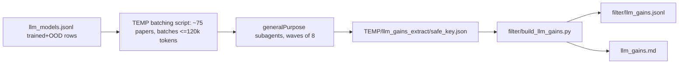

# Compact OOD gain tables (`llm_gains.md`)

## What exists / what is missing

`filter/llm_models.jsonl` has 264 trained open-model rows with an OOD list across **96 papers**, but no numbers. Dominant checkpoints: Qwen3-8B (25 rows), Qwen3-4B-Instruct-2507 (12), Qwen2.5-Math-7B (11), R1-Distill-Qwen-1.5B (9), Llama-3.2-3B(-Instruct) (17 across spellings), Qwen2.5-Math-1.5B (8), Qwen2.5-7B(-Base) (10), Qwen3-1.7B-Base (6). Dominant OOD benches: AIME24, AIME25, OlympiadBench, AMC23, MATH-500, Minerva, GSM8K, MMLU-Pro, GPQA-D, LCB. Numbers must be re-extracted from `filter/fulltext/*.md` (1.8M tokens total, max 63k per paper).

Decisions taken from the user's answers: split into several tables; when there is no vanilla GRPO, use the paper's nearest vanilla RLVR baseline and mark it.

## Scope of rows

- Candidate papers: the 96 with `role=trained`, non-empty `eval_ood`, open model (not `api`, not GPT family), **minus** papers whose methods are only from-scratch pretraining (`pretrain|next-token|autoregressive|MLM|causal LM`) — no untrained checkpoint exists there. Expected ~75 papers; the dropped ones are listed under "Not applicable" at the bottom of `llm_gains.md`.
- One table row = (paper, method code). Baseline methods the paper itself trains (SFT, GRPO, DAPO, RFT...) are rows too, as in the user's example `SC-GRPO, RIFT, SFT`.
- Row label: `[SC-GRPO](arxiv abs)` + arXiv id column. Codes come from `method` in `llm_models.jsonl`, shortened to the paper's own acronym (`1-shot RLVR (GRPO)` -> `1-shot RLVR`, `DAPO (top-20% high-entropy tokens)` -> `DAPO-top20%`), with a small `CODE_ALIASES` dict in the new script.

## Table layout (fits one GitHub screen, one line per row)

- `llm_gains.md` (repo root), two top-level sections:
  1. **Gain over the untrained checkpoint** — cell = `score - base`, pp, one decimal, signed (`+12.3`, `-1.2`), blank when the paper does not report the base on that bench.
  2. **Gain over GRPO** — cell = `score - ref`; extra `vs` column with the reference method (`GRPO`, `Dr. GRPO`, `DAPO`, `PPO`, `RLOO`, `REINFORCE++`); values with a non-vanilla-GRPO reference get a trailing `*`. Rows whose method is the reference itself are skipped.
- Within each section, one sub-table per base checkpoint (`### Qwen2.5-Math-7B`, `### Qwen3-8B`, ...), columns = that checkpoint's OOD benches (short labels: `AIME24 AIME25 AMC23 MATH500 Minerva Olymp GSM8K GPQA-D MMLU-Pro LCB HMMT25 AIME26`), pruned to benches with at least one filled cell, sorted by coverage. Checkpoints with < 3 rows are merged into an `Other checkpoints` table whose columns are `model · bench`.
- Hard cap `MAX_ROWS = 45` per table (roughly one 1080p screen); a taller checkpoint table is split by variant (Base / Instruct) or into `(a)/(b)` halves. Text cells are only the code and the id, so rows never wrap.
- Legend line under each section: metric caveat (numbers are the paper's own `avg@k`/`pass@1` from the same table; deltas are never computed across metrics) and the `*` meaning.

## Data model: `filter/llm_gains.jsonl`

```json
{"key": "arxiv:2506.10947", "code": "GRPO-random", "method": "GRPO (random reward)",
 "model": "Qwen2.5-Math-7B", "bench": "MATH-500", "metric": "avg@8",
 "base": 49.4, "ref": null, "ref_method": "", "score": 70.8,
 "source": "Table 1", "ood": true}
```

- `base` = the untrained starting checkpoint **as evaluated in this paper** (never copied from another paper); `ref` = vanilla GRPO if present, else nearest vanilla RLVR baseline in `ref_method` (priority GRPO > Dr. GRPO > DAPO > PPO > RLOO/REINFORCE++); `score` = the method's headline configuration (main results table / the row the paper bolds). Several named variants (Intuitor vs Intuitor-Code) are separate codes.
- `ood` is decided by the builder from `eval_ood` of the matching `llm_models.jsonl` row (key + normalised model), so MATH-500 stays ID where the paper trains on MATH and OOD where it trains on DeepScaleR. Only `ood=true` rows are rendered.
- Figure-only numbers are skipped unless the text states them.

## Extraction (same pattern as the inventory run)



- Temp script under `%TEMP%` (not in repo) writes `candidates.json` and batches; each candidate carries its expected `(model, method, eval_ood)` triples from `llm_models.jsonl` so the agent fills a known grid and reuses model strings verbatim, adding rows only for baselines it finds.
- Agent instruction sheet: locate the main results table(s), copy numbers verbatim, same table for base/ref/score, record `metric` and `source`, never fill from memory, write per-paper JSON, return a one-line summary. Re-run missing batches.

## Builder: `filter/build_llm_gains.py`

- Repo style (pathlib, single quotes, PEP8, `print_progress`). Imports `norm_model`, `resolve_bench`, `paper_url`, `md_link`, `is_omitted_row` from `filter/build_llm_models.py` (same pattern as `llm_reliability` import there), `read_jsonl`/`write_jsonl` from `paths.py`.
- Modes mirror the existing script: `--extract-dir PATH` (merge + write jsonl + render) and bare run (re-render from jsonl); same `refuse_shrink`/`--force` fail-safe.
- Prints per-table row/column counts and lists `score` rows lacking `base` or `ref`.
- Small edit in `render_md` of `build_llm_models.py`: one sentence in the intro linking to `llm_gains.md`.
- `.gitignore`: add `!filter/llm_gains.jsonl` next to the existing `!filter/llm_models.jsonl`.
- `AGENTS.md` pipeline table: one `llm gains` line.

## Verification

- Coverage: every candidate key has a JSON; no duplicate `(key, code, model, bench)`.
- Spot-check against fulltext: Spurious Rewards (Qwen2.5-Math-7B MATH-500 must give +21.4 random / +29.1 GT, matching `SHAO_MATH500_*_PP` in `filter/llm_reliability.py`), Dr. GRPO, One-shot RLVR, Intuitor, TTRL, SC-GRPO, DFT, Critique-GRPO.
- Every rendered table has <= 45 rows; no cell contains text longer than a number.
- `filter/test_build_llm_gains.py`: delta arithmetic and blank cells, `*` marker and `vs` column, OOD filtering via `llm_models.jsonl`, row-cap splitting; run with existing `filter/test_build_llm_models.py`.
- Delete `%TEMP%` extracts and batching script; do not commit.