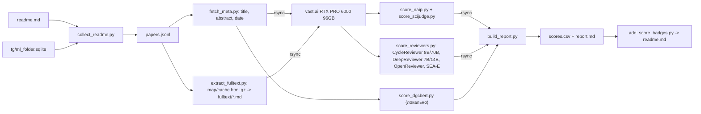

# Скоринг статей из readme всеми моделями с рейтингом / Accept-Reject

## Пересмотренный набор моделей

Scope теперь — только статьи из `readme.md` (~320 работ: 294 arXiv, 8 OpenReview, 4 ACL, 13 DOI; 57 web/repo не статьи — не скорим). Для ~300 статей full-paper ревьюеры реалистичны: 289/294 arXiv уже лежат в `map/cache/*.html.gz` полным HTML.

Критерий: модель выдаёт **хотя бы Accept/Reject, лучше рейтинг**. Проверено по HF/GitHub:

- **Title + abstract → рейтинг/скор**
  - **NAIPv2** — `ssocean/NAIPv2`, `LlamaForSequenceClassification` 8B fp16 (15 GB, не gated). Скаляр качества, prompt verbatim: `Given a research paper, Title: {title}\nAbstract: {abstract}\nEvaluate the quality of this paper:`.
  - **NAIP-v1** — `ssocean/NAIP`, 8-bit bnb + LoRA r=16 (8 GB). Impact 0–1. `AutoPeftModelForSequenceClassification`, prompt из `demo_v1.py`.
  - **SciJudge-30B-2605** — Qwen3-30B-A3B bf16 61 GB (не gated). Pairwise «у кого выше цитируемость» с `<reason>…<answer>A|B</answer>` → Bradley-Terry внутри года.
  - **DGC-BERT** — SciBERT + state_dict с Google Drive (ссылка в README репо), датасеты AAPR/PeerRead; выдаёт Accept/Reject по abstract. Формально проходит критерий, ожидаю шум (данные 2007–2017). Включаем best-effort, локально на RTX 3080; если Google Drive не отдаёт веса — колонка N/A.
- **Full paper → ревью + Rating + Decision**
  - **CycleReviewer-ML-Llama-3.1-8B** (16 GB) и **CycleReviewer-Llama-3.1-70B** (~140 GB) — `WestlakeNLP/…`, gated=auto (нужен HF_TOKEN + accept на странице). Через `pip install ai_researcher`: `CycleReviewer(model_size=…).evaluate(paper_text)` → `avg_rating`, `paper_decision`.
  - **DeepReviewer-7B / -14B** (Phi-4, 29 GB для 14B), gated=auto. `DeepReviewer(model_size=…).evaluate(paper_text, mode='Standard Mode')` → scores + decision. Контекст Phi-4 16k → текст режем до ~12k токенов.
  - **Llama-OpenReviewer-8B** (`maxidl/…`, 16 GB, 128k ctx, не gated). Системный промпт и `REVIEW_FIELDS` ICLR 2025 с model card → парсим `Soundness/Presentation/Contribution` 1–4 и `Rating` 1–10; decision = Rating ≥ 6. Текст в markdown с references, без appendix.
  - **SEA-E** (`ECNU-SEA/SEA-E`, Mistral-7B-Instruct-v0.2, 14.5 GB). `instruction_e` из `paper_review/template.json` → `Rating` 1–10 + `Paper Decision: Accept/Reject`. Текст обрезаем на `## References`.
- **Не берём:** Reviewer2 Mp+Mr (генерирует текст ревью без гарантированного рейтинга/решения); CycleReviewer-ML-123B (244 GB, 4-bit обязателен, прирост к 70B минимален) — можно добавить отдельно по запросу; DeepReviewer-v2 (веса не опубликованы); вторая таблица кроме SciJudge — бенчмарки без весов.
- **Важная оговорка:** многие статьи readme (Llama 3, DeepSeekMath, DAPO…) есть в претрейне Llama-3.1/Qwen3/Phi-4 → рейтинги старых статей завышены. В отчёте ранжируем внутри года и предупреждаем об этом.

## Источники данных

- Список статей — `readme.md` (371 bullets; регэкспы `PAPER_PATTERNS` из `add_tg_links.py`).
- Telegram — **только** `tg/ml_folder.sqlite` (Telethon-индекс из `tg/export.py`: 35 каналов, 28.6k сообщений до 2026-09-10, таблицы `channels` / `messages` / `paper_keys`, 2662 arXiv-ключей, 166 из них в readme). Доступ через `tg/common.py` (`open_db`, `public_post_url`, `badge_for`). Экспорты `D:\Downloads\Telegram Desktop\*` не используются.
- Полные тексты — `map/cache/*.html.gz` (289/294 arXiv), недостающее докачиваем.
- Метаданные — arXiv API / OpenReview API / Crossref.

## Поток данных

## Файлы (папка `filter/`)

- `collect_readme.py` — парсит bullets `readme.md` по регэкспам из `add_tg_links.py` (`PAPER_PATTERNS`), берёт секцию (`## …`) и заголовок до `—`. Для каждого ключа тянет посты из `tg/ml_folder.sqlite` (`paper_keys` JOIN `messages` JOIN `channels`, как в `tg/find.py::_fetch_keys`): `tg_posts: [{channel, msg_id, date, url, public}]`. Выход `papers.jsonl`: `key (arxiv:…/openreview:…/acl:…/doi:…), section, line_title, urls, readme_line_no, tg_posts`. web/repo пропускаем.
- `fetch_meta.py` — arXiv API (`id_list`, батч 100, sleep 3, как в `fetch_titles.py` + `a:summary`), OpenReview notes API (`content.title/abstract`), ACL (HTML meta `citation_abstract`), DOI (Crossref `abstract`, иначе N/A). Кэш `meta.jsonl`, прогресс в консоли.
- `extract_fulltext.py` — из `map/cache/arxiv_<id>.html.gz` (LaTeXML/ar5iv) → markdown: заголовки, абзацы, подписи, формулы как текст; отдельно `body`, `references`, `appendix`. Для 5 arXiv без кэша и для ACL/OpenReview — скачать HTML/PDF (`pymupdf`). Выход `fulltext/<key>.md` + `fulltext_index.jsonl` (`n_tokens`, `has_refs`, `source`). Файлы < 3k токенов помечаем как неполные.
- `remote/score_naip.py`, `remote/score_scijudge.py` — как в прошлой версии, но на ~300 статьях: SciJudge пары внутри года, K=8 соперников × 2 порядка, BT (numpy MM, ridge), `bt_score`, `win_rate`.
- `remote/score_reviewers.py` — единый раннер: `--model {cyclereviewer-8b, cyclereviewer-70b, deepreviewer-7b, deepreviewer-14b, openreviewer-8b, sea-e}`. Для CycleReviewer/DeepReviewer — через `ai_researcher` (внутри vLLM); для OpenReviewer/SEA-E — vLLM offline с промптами из model card/template. `max_tokens` 4096 (DeepReviewer Standard Mode — сколько требует пакет). Парсинг → `rating`, `decision`, sub-scores, сырой текст в `reviews/<model>/<key>.md`. tqdm, resume по `<key>` (jsonl append).
- `score_dgcbert.py` — локально: `gdown` state_dict + SciBERT, `git clone` DGC-BERT, инференс по abstract → `p_accept`. Best-effort.
- `remote/setup.sh` — `pip install vllm ai_researcher peft bitsandbytes tqdm`, `hf download` всех весов (HF_TOKEN из env-var vast.ai). `remote/run_all.sh` — последовательно на **одной** GPU: NAIP → SciJudge → OpenReviewer → SEA-E → DeepReviewer 7B → 14B → CycleReviewer 8B → 70B (FP8/4-bit, `tensor_parallel_size=1`); каждый шаг под `nohup`, лог в `logs/<model>.log`, результаты в `scores_<model>.jsonl`.
- `build_report.py` → `scores.csv`: `key, section, title, published, tg_channels, tg_first_post, naipv2, naipv1, scijudge_bt, dgcbert_p, cr8b_rating, cr8b_decision, cr70b_rating, cr70b_decision, dr7b_rating, dr7b_decision, dr14b_rating, dr14b_decision, or8b_rating, or8b_soundness, or8b_presentation, or8b_contribution, seae_rating, seae_decision, mean_rating10, accept_votes, n_models, rank_avg, rank_in_year`. `report.md`:
  - таблица моделей и покрытие (сколько статей оценено каждой);
  - согласие: Spearman между всеми парами скоров, **macro-F1** Accept/Reject между парами моделей (без ground truth — только взаимное согласие);
  - ранжирование по секциям readme, **bottom-30** по `rank_avg` как кандидаты на удаление (решение за вами);
  - per-paper секции с якорями `#<key>` (рейтинги всех моделей + 1–2 строки weaknesses из ревью + ссылки на t.me посты из `tg/ml_folder.sqlite`) — на них ссылаются бейджи.
- `add_score_badges.py` — по образцу `annotate_line` в `add_tg_links.py`: после ссылок статьи добавляет `[⚖ 7.2 · 5/6](filter/report.md#<anchor>)` (7.2 = `mean_rating10` по ревьюерам, 5/6 = `accept_votes/n_models`). Идемпотентно (регэксп на существующий бейдж), web/repo пропускает; в шапку readme одна строка-легенда.
- `.gitignore`: `filter/*.jsonl`, `filter/fulltext/`, `filter/reviews/`, `filter/logs/` (правила для `tg/*.sqlite*` у вас уже добавлены, не трогаю); коммитим скрипты, `scores.csv`, `report.md`, `readme.md`. Новый код кладу в `filter/` рядом с `tg/` и `map/`, как в readme; текущую незакоммиченную реорганизацию (`src/`, `assets/`) не трогаю.

## vast.ai

- Предусловия (вы): пополнить баланс (сейчас $0; оценка ниже); на HF нажать accept у `WestlakeNLP/CycleReviewer-ML-Llama-3.1-8B`, `CycleReviewer-Llama-3.1-70B`, `DeepReviewer-7B`, `DeepReviewer-14B`; `vastai create env-var HF_TOKEN <token>`.
- Оффер: `vastai search offers 'gpu_name=RTX_PRO_6000 gpu_ram>=90 num_gpus=1 disk_space>=450 inet_down>=800 reliability>0.95 direct_port_count>=1' -o dph_total --raw` → 1× RTX PRO 6000 Blackwell 96 GB (~$1–1.6/ч). Веса ≈ 320 GB → `--disk 450`. CycleReviewer-70B в **FP8** (vLLM), fallback `quantization=bitsandbytes` 4-bit. Если такого имени нет в фильтре — `gpu_ram>=90 num_gpus=1` и взять оффер с 96 GB. Fallback: 1× H100/A100 80 GB (70B тоже FP8/4-bit).
- `vastai create instance <OFFER> --image vastai/pytorch:@vastai-automatic-tag --disk 450 --ssh --direct --cancel-unavail --label key-papers-filter`; `rsync` `filter/remote/`, `meta.jsonl`, `fulltext/` (zip) → `/workspace/filter/`; `nohup bash run_all.sh`; мониторинг `logs/`; `rsync` `scores_*.jsonl` + `reviews/` назад; **`vastai destroy instance <ID> -y`**.
- Оценка vs старого плана 2×H100: 8B/14B/SciJudge **±20%**, CycleReviewer-70B **×1.5–2** (FP8 на одной карте вместо bf16 TP=2), загрузка весов 20–40 мин, весь прогон **~3.5–4.5 ч**, **≈ $5–8**. 2×6000 Pro не брать: нет NVLink.

## Вне scope

- Обучение на своих данных; фильтрация потока из Telegram-каналов. Если понадобится позже — пул кандидатов берётся из `tg/ml_folder.sqlite` (2496 arXiv-ключей вне readme), тем же `collect` с флагом.
- CycleReviewer-123B и Reviewer2 — по отдельному запросу.
