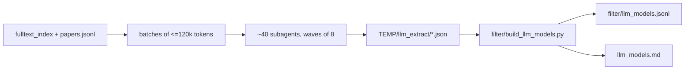

# LLM inventory from the key-papers fulltexts

## Scope (decided with the user)

- All papers with LLM experiments, extraction done by reading, not by a model.
- Candidate set = fulltexts in `filter/fulltext/*.md` whose text matches a broad LLM-name regex (Qwen, Llama-2/3, DeepSeek, Gemma, OLMo, Phi, Mistral, GPT-3.5/4/5, o1/o3, Claude, Gemini, Pythia, Tulu, PaLM, LLaDA, MiniMax, Kimi, ...) plus every paper in the `Post-training` and `Reasoning` sections regardless of regex.
  - 247 papers, 5.39M tokens (largest single file 93k). Breakdown: Post-training 56, Reasoning 54, LLMs 34, Data 28, Agents 27, Retrieval 12, Safety 8, SSL/vision 8, RL 8, Harness 6, other 6.
  - Excluded 79 fulltexts contain no LLM name at all (classic RL, vision SSL, NeuroAI, finance, books). Listed in the final report, not read.
  - Readme entries without fulltext (blog posts, notion pages) are skipped and listed.
- Sources: `filter/fulltext/<safe_key>.md` (text), `filter/papers.jsonl` (key, section, readme title), `filter/fulltext_index.jsonl` (token counts for batching).

## Data model: `filter/llm_models.jsonl`

One row per (paper, model line). A model line = one family/generation/variant/start-point; size sweeps go into `sizes`.

```json
{"key": "arxiv:2503.20783", "title": "Understanding R1-Zero-Like Training: Dr. GRPO", "section": "Post-training",
 "model": "Qwen2.5-Math-7B", "family": "Qwen", "generation": "2.5", "variant": "Math", "sizes": ["1.5B", "7B"],
 "start_point": "base", "role": "trained", "method": "Dr. GRPO",
 "train_data": ["MATH train, levels 3-5 (~8k)"],
 "eval_id": ["MATH-500"], "eval_ood": ["AIME 2024", "AMC 2023", "Minerva Math", "OlympiadBench"],
 "ood_basis": "inferred", "notes": ""}
```

- `start_point`: `base` | `instruct` | `reasoning-distilled` (R1-Distill-*) | `rl-tuned` (R1, QwQ) | `api` (closed) | `unknown`.
- `role`: `trained` | `baseline` | `teacher` | `judge/reward` | `introduced` (tech reports: Llama 3, OLMo 3, MiniMax-M1, LLaDA2.x, DiffusionGemma, T5Gemma 2) | `analyzed` (interp papers, no training).
- `eval_id` vs `eval_ood`: OOD = what the paper itself labels OOD/generalisation, otherwise benchmarks whose source differs from `train_data` (train on MATH -> MATH-500 is ID; AIME/AMC/Minerva/OlympiadBench/LiveCodeBench/GPQA are OOD). `ood_basis` records `paper` or `inferred`.
- Papers with no LLM experiment get a single row with `model: null` and a `notes` reason, so coverage can be checked.

## Extraction by subagents

- A temp script under `%TEMP%` builds the candidate list from `fulltext_index.jsonl` + `papers.jsonl` and splits it into ~40 batches of <=120k tokens (6-8 small papers, or 1-2 tech reports).
- Each `generalPurpose` subagent gets its batch (paths, readme titles) and a fixed instruction sheet: locate setup/training/eval/appendix sections (grep for model names, `train`, `benchmark`, `Table`), read them, copy checkpoint names and dataset names verbatim, never fill from memory, write `%TEMP%\llm_extract\<safe_key>.json` (list of rows in the schema above), return a one-line summary per paper.
- Run in waves of ~8 parallel subagents; re-run any batch that is missing JSON files.



## Render: `filter/build_llm_models.py` -> `llm_models.md`

Repo style (pathlib, single quotes, PEP8, progress output). Merges the per-paper JSON, normalises family/generation spelling (`Qwen-2.5` -> `Qwen2.5`, `LLaMA` -> `Llama`), writes the jsonl in readme order, then renders:

1. Summary counts: papers read, papers with LLM experiments, distinct model lines, distinct OOD benchmarks.
2. Model index (primary ask): one row per family/generation/variant/start-point -> sizes seen, start point, number of papers, papers (arXiv links), post-training data seen across papers, OOD benchmarks seen across papers.
3. Per-paper table grouped by readme section: paper | models (sizes, start point, role) | method | post-training data | ID eval | OOD eval.
4. OOD benchmark index: benchmark | domain (math / code / science QA / general / agentic) | papers using it as OOD.

## Verification

- Coverage: every one of the 247 keys has a JSON file; no duplicate keys; `sizes` and `start_point` non-empty on every `trained` row.
- Spot-check ~10 rows against the fulltext: Dr. GRPO, DAPO, TTRL, Intuitor, GSPO, Klear-Reasoner, OLMo 3, Self-Distillation Bridges, Critique-GRPO, Spurious Rewards.
- Scan the model index for near-duplicates the normaliser missed and fix them in the JSON, then re-render.
- Delete `%TEMP%\llm_extract` and the batching script; do not commit.

## Deliverables

- `llm_models.md` (repo root) - human-readable inventory.
- `filter/llm_models.jsonl` - machine-readable rows.
- `filter/build_llm_models.py` - rebuilds the md from the jsonl.
- Final report: counts, notable patterns (dominant families/sizes, most common post-training sets and OOD suites), the 79 excluded papers by section, and readme entries without fulltext.