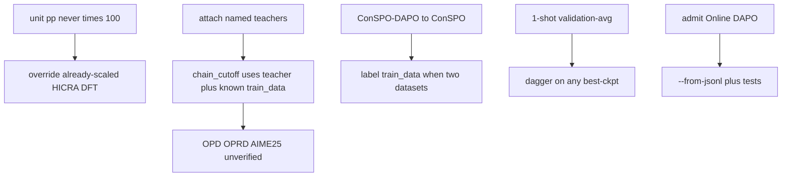

# Fix scale, teacher chain, and ConSPO duplicates

Правки в [`filter/build_llm_gains.py`](filter/build_llm_gains.py) и [`filter/llm_gains_ood.py`](filter/llm_gains_ood.py). Полный re-extract не нужен: `--from-jsonl` + точечные overrides. Markdown по-прежнему только `ood_basis=temporal`.

## 1. Units: explicit `pp` never multiplies; unscale victims

[`coerce_pp_rows()`](filter/build_llm_gains.py) сегодня делает ×100, если `unit=='frac'` **или** [`row_looks_fraction()`](filter/build_llm_gains.py) (все `base`/`ref`/`score` в `[0, 1]`), даже при `unit='pp'`. Отсюда HICRA Llama AIME25 `0.6 / 0.5 / 0.8` → `60 / 50 / 80` и скрытые DFT `0.41 → 0.83` → `41 → 83`.

Правило:

- `unit == 'pp'` — не трогать.
- `unit == 'frac'` — ×100, затем `unit='pp'`.
- пустой `unit` — старый infer (`row_looks_fraction` / mixed-scale warning). Так остаются Intuitor / Mid-training / Power Sampling.

Повторный `--from-jsonl` **не** вернёт HICRA сам: в jsonl уже `unit='pp'` и 60/50/80. Нужен override (делить на 100 только известные жертвы):

- HICRA [`arxiv:2509.03646`](https://arxiv.org/html/2509.03646) Table 1, `Llama-3.1-*-Instruct` × AIME25: GRPO `0.6 → 0.5`, HICRA `0.6 → 0.8`. Ячейки: **−0.1 / +0.2 / +0.3**.
- DFT [`arxiv:2508.05629`](https://arxiv.org/html/2508.05629) Table 1: пары вроде `0.41 → 0.83`, которые сейчас 41/83 (строки не temporal, но jsonl должен быть честным).

Алиас модели: `Llama-3.1-Instruct` → `Llama-3.1-8B-Instruct` в `PAPER_MODEL_ALIASES` (HICRA Table 1; не менять глобальный `MODEL_CANON` — в семействе есть 70B). После coerce сверить HICRA Qwen2.5-7B-Base AIME25 (`+13.1` / `+3.4`): это уже pp, не откатывать.

Тест `test_mixed_scale_paper_scales_fraction_row` оставить для **пустого** `unit` (доли). Добавить: `unit='pp'` + `0.6/0.5/0.8` не масштабируется.

## 2. Full chain: empty teacher is not “no teacher”

[`chain_cutoff()`](filter/llm_gains_ood.py) принимает `train_data` и не использует его. Пустой `teacher` = нет учителя, поэтому R1-Distill / Qwen2.5 студенты пропускают позднюю дистилляцию.

Структурно:

- `attach_teacher`: inventory `role=teacher` на тот же `key`, плюс `PAPER_TEACHERS`.
- `chain_cutoff` = `max` известных дат student / teacher / `DATASET_CUTOFFS[train_data]`. Неизвестная дата датасета сама по себе не fail-closed (иначе ConSPO DeepScaleR выпадет).
- Если учитель **назван** и `model_cutoff(teacher)` пуст → `unverified` (уже есть в `has_unknown_teacher`, но teacher сейчас не ставится).
- Бумаги с обязательным учителем (пустой teacher = дыра, не «нет учителя»): `2606.06021`, `2603.25562`, offline-ветки `2606.23740`.

Конкретные имена из статей:

- OPRD [`2606.06021` §4.1.1](https://arxiv.org/html/2606.06021): **JustRL-Deepseek-1.5B** → AIME25 OPD-top1 / OPD-top16 / OPRD (`+11.6 / +12.1 / +12.7`) → `unverified`.
- Revisiting OPD [`2603.25562` §4.1](https://arxiv.org/html/2603.25562): **OpenThinker3-7B**; multi-task ещё **GiGPO-Qwen2.5-7B-Instruct-ALFWorld** → AIME25 OPD / top-K OPD / top-K OPD-MT (`+16.7 / +26.7 / +16.7`) → `unverified`.

Это отсутствие подтверждения OOD, не доказанная утечка. `TEMPORAL_ADMITS` их не трогает.

## 3. ConSPO: merge aliases, show train_data, drop fake +0.0

Сейчас Table 1 DeepScaleR (`+6.0 / +10.0`) рядом с безымянными дублями и `ConSPO-DAPO` / `DAPO-DAPO` / `GRPO-DAPO`. `GRPO-DAPO − GRPO` того же эксперимента рисует `+0.0`, потому что `is_self_ref` не считает `GRPO-DAPO` ванильным GRPO.

Только для `arxiv:2605.12969`:

- `ConSPO-DAPO` → `ConSPO`, `DAPO-DAPO` → `DAPO`, `GRPO-DAPO` → `GRPO` (не трогать `2-GRPO-DAPO` в `2510.00977`).
- Display-pivot: `(key, code, model, metric, train_data)` — **без** `source`, чтобы Table 4 и extract-алиас слились. `fill_baselines` по-прежнему с `source`, чтобы Table 1 и Table 4 не делили base.
- Если у бумаги × модели два `train_data`, в ячейке method короткий тег: `ConSPO · DeepScaleR` vs `ConSPO · DAPO-Math`.
- После алиаса `is_self_ref(GRPO vs GRPO)` скрывает ложный `+0.0`.

Ожидание на 1.5B: две строки ConSPO (DeepScaleR `+6.0 / +10.0 / +5.2` и DAPO-Math `+5.1 / +10.9`), без третьей `ConSPO-DAPO`; то же для DAPO/GRPO. Минус шесть повторных start-клеток.

## 4. 1-shot RLVR checkpoint pick

Авторы берут лучшее среднее по шести бенчмаркам, включая AIME25 ([протокол и Table 8](https://arxiv.org/html/2504.20571)). Inventory уже ставит `mixed-avg-and-per-bench` в [`filter/llm_reliability.py`](filter/llm_reliability.py); gains этого не читает.

- Расширить `CKPT_SELECT` значениями reliability: `validation-avg`, `mixed-avg-and-per-bench`, `per-bench-best`, `last` / `final`.
- `PAPER_CKPT_SELECT['arxiv:2504.20571'] = 'validation-avg'` (default tables = среднее по шести; `best-every-100` остаётся только ConSPO).
- `†` на любой выбор по eval, не только `best-every-100`.
- Легенда: `†` = checkpoint выбран по оценочным бенчмаркам; ConSPO — каждые 100 шагов; 1-shot RLVR — лучшее среднее по шести, включая AIME25. Temporal OOD задач остаётся; независимости итоговой оценки нет.

## 5. Admit Online DAPO on `2606.23740`

Тот же checkpoint и historical prompts, что у уже допущенного Online GRPO ([Table 2](https://arxiv.org/html/2606.23740)).

- `TEMPORAL_ADMITS`: `(WEIGHT_GEO, 'Qwen3-4B-Instruct-2507', 'DAPO', 'AIME26')`.
- Алиас `Online DAPO` → `DAPO` (как `Online GRPO` → `GRPO`).
- Если в jsonl нет строки: override `base=16.7`, `score=16.7`, `ref=20.0` → **+0.0** к старту, **−3.3** к Online GRPO.

Offline SFT / DPO / Off-GRPO по-прежнему `unverified` (DeepSeek-V4-Flash).

## 6. Tests and rebuild

В [`filter/test_build_llm_gains.py`](filter/test_build_llm_gains.py):

- `unit='pp'` + значения ≤1 не ×100; HICRA Llama AIME25 −0.1 / +0.2 / +0.3; модель `Llama-3.1-8B-Instruct`.
- DFT `unit='pp'` 0.41/0.83 остаётся; пустой unit по-прежнему ×100.
- OPD/OPRD AIME25 + названный teacher → `unverified`; `chain_cutoff` учитывает teacher.
- ConSPO: один ряд на `train_data`; нет `ConSPO-DAPO`; нет `GRPO-DAPO +0.0`.
- 1-shot `ckpt_select=validation-avg` и `†` в markdown.
- Online DAPO temporal `+0.0` / `−3.3`.

Затем `python filter/build_llm_gains.py --from-jsonl` и `pytest filter/test_build_llm_gains.py filter/test_build_llm_models.py`. Счётчики 70/46 уменьшатся (минус 6 OPD + дубли ConSPO; плюс клетки DAPO). Не коммитить, пока не попросят.
