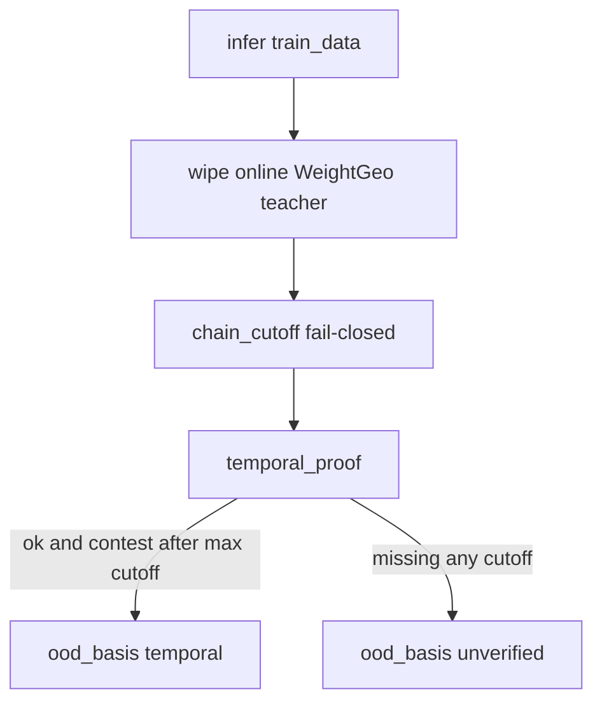

# Строгий temporal OOD для `llm_gains`

Текущий классификатор в [`filter/llm_gains_ood.py`](filter/llm_gains_ood.py) fail-open: `DATASET_CUTOFFS = ()`, пустой `train_data` не ломает cutoff, а `TEMPORAL_ADMITS` возвращает `temporal` **до** проверки цепочки. Из-за этого в markdown остаются DAPO-Math / SmolTalk2 / HICRA / пустой 1-shot.

Целевые счётчики (проверить после сборки, не подгонять числами из памяти):

- После только фильтра: **45** temporal raw / **5** papers / **43** base / **31** ref.
- После фильтра + ConSPO gaps: **~90** temporal raw / **87** base / **70** ref.

JSONL строки не удалять — только `ood_basis=unverified`. Markdown по-прежнему рисует только `temporal`.

## 1. Fail-closed цепочка

В [`classify_ood_basis`](filter/llm_gains_ood.py) / [`chain_cutoff`](filter/llm_gains_ood.py):

- Пустой или нераспознанный `train_data` → `chain_cutoff` is `None` → не `temporal`.
- `dataset_cutoff` собирает **все** совпадения и берёт `max` (смесь DeepScaleR+DAPO = дата DAPO).
- `TEMPORAL_ADMITS` больше не early-return. Оставить как узкий override **только если** `temporal_proof` уже зелёный; иначе удалить — после дат Qwen3-Instruct-2507 / Qwen3-4B-Base admits не нужны.
- Новый `temporal_proof(model, teacher, train_data, ...)`: есть `model_cutoff`; есть `dataset_cutoff`; если teacher непустой — у каждого имени есть `model_cutoff`; если paper в `REQUIRE_TEACHER` — teacher непустой. Любая `temporal` строка обязана пройти proof (тест-инвариант + вызов из классификатора).

Не добавлять голый префикс `Qwen3` в `MODEL_CUTOFFS` (AIME25 должен остаться закрытым через `is_qwen3`). Добавить только точечные даты, скопированные с карточек, не из памяти:

- `Qwen3-4B-Instruct-2507` — релиз Instruct-2507 (июль 2025, карточка/блог Qwen).
- `Qwen3-4B-Base` — Qwen3 tech report `2505.09388` (29 Apr 2025).

`REQUIRE_TEACHER`: убрать `WEIGHT_GEO`. Online GRPO/DAPO учителя не требуют.

## 2. `DATASET_CUTOFFS` (длинные префиксы первыми)

| token | cutoff | зачем |
|---|---|---|
| `dapo-math-17k` / `dapo-math-sub` / `dapo-math` | 2025-03-17 | [DAPO](https://arxiv.org/html/2503.14476) v1; AIME25 и HMMT25 (февр. 2025) не проходят; AIME26 проходит |
| `deepscaler` | 2024-10-01 | card: AIME 1984–2023; поздняя названная компонента ≈ окт 2024 ([dataset](https://huggingface.co/datasets/agentica-org/DeepScaleR-Preview-Dataset)) |
| `smoltalk2` | 2025-07-11 | публичный релиз; генерация Qwen3 ([smoltalk2](https://huggingface.co/datasets/HuggingFaceTB/smoltalk2)) |
| `math` | 2021-03-05 | Hendrycks MATH [`2103.03874`](https://arxiv.org/abs/2103.03874); срабатывает на `MATH (7,500…)` у iGRPO |

`max` по всем хитам: `DAPO-Math` + голый `math` → март 2025. `DeepScaleR prompts … math_verify` → окт 2024 (DeepScaleR новее MATH). Не добавлять Omni-MATH/Still отдельными поздними датами — пользователь уже принял DeepScaleR для AIME25.

## 3. Сначала заполнить `train_data`, иначе fail-closed снесёт нужное

Сейчас пустой `train_data` у тех, кого надо оставить или явно закрыть:

- **1-shot** `arxiv:2504.20571` — `PAPER_TRAIN_DATA` / default `'DeepScaleR subset'` ([HTML](https://arxiv.org/html/2504.20571)). Иначе пропадут все AIME25 1-shot.
- **2-GRPO** `arxiv:2510.00977` — поле пустое, датасет только в `source`. Infer: `MATH train` → `MATH` (3 AIME25 строки **оставить**); `DAPO-Math-Sub` → `DAPO-Math-sub` (2-GRPO-DAPO, 2-GRPO+RS-DAPO, GRPO-DAPO — **unverified**).
- **Self-distill SFT** `arxiv:2603.24472` — `DAPO-Math-17k` (D_sg из DAPO; [HTML](https://arxiv.org/html/2603.24472)).
- **HICRA** — **не** выдумывать маппинг модели на DeepScaleR vs DAPO ([HTML](https://arxiv.org/html/2509.03646)). Пустой `train_data` → unverified (4 AIME25: Llama/Qwen × GRPO/HICRA).
- ConSPO уже ставит train через `conspo_train_data` (Table 4 → DAPO-Math-17k, иначе DeepScaleR).

Делать infer в `apply_gain_overrides` / тонком `attach_train_data` **до** `attach_ood`.

## 4. WeightGeo teacher

[`resolve_teacher`](filter/llm_gains_ood.py) для `arxiv:2606.23740` + `GRPO`/`DAPO`/`Online GRPO`/`Online DAPO`: всегда `teacher=''`, даже если в jsonl уже `DeepSeek-V4-Flash`. Offline (SFT/DPO/Off-GRPO) оставляют Flash и остаются unverified (нет cutoff у V4-Flash + `UNKNOWN_TEACHER`).

## 5. 16 строк: jsonl живёт, markdown нет

Ожидаемый эффект классификатора (не хардкод списка):

| что | raw | станет |
|---|---:|---|
| ConSPO × DAPO-Math-17k × {AIME25, HMMT25} | 6 | unverified; AIME26 temporal |
| SFT `2603.24472` AIME25 | 1 | unverified |
| SR-GRPO SmolTalk2 AIME25 | 2 | unverified |
| 2-GRPO DAPO-Math-sub AIME25 | 3 | unverified; MATH-train temporal |
| HICRA/GRPO AIME25 (Llama + Qwen2.5-7B-Base) | 4 | unverified |

Пять papers после фильтра: ConSPO, WeightGeo, 1-shot, 2-GRPO (MATH), iGRPO/`2602.09000`.

## 6. 45 пропущенных ConSPO

[`CONSPO_T1_1P5`](filter/llm_gains_ood.py) / `CONSPO_EXTRA` дополнить **только числами с HTML** [`arxiv.org/html/2605.12969`](https://arxiv.org/html/2605.12969) (в `filter/fulltext/arxiv_2605.12969.md` таблиц почти нет). Не из памяти.

Добавить методы Table 1/2/3/4/9: Dr.GRPO, DisCO, GMPO, CISPO, SAPO + недостающие GRPO/DAPO/HMMT. Короткие коды в `CODE_ALIASES`. Где в таблице есть base/score — писать их, не один `gain`. Table 9 Qwen-32B HMMT: ConSPO vs GRPO (у пользователя 1 raw, 0 base, 1 ref).

`have`-ключи extras не должны затирать уже существующие ConSPO-only gain-строки, если пришли полные score-строки — предпочесть более богатую (как `dedupe_rows` / `>=`).

## 7. Spurious Rewards + Paradox (не агрегаты)

По выбору пользователя: **не** оцифровывать графики и **не** класть диапазон в `table_gain_rows`.

В [`render_md`](filter/build_llm_gains.py) после Summary — короткий **Notes**:

- [Spurious Rewards](https://arxiv.org/html/2506.10947) (`2506.10947`): AIME 2025 есть в приложении на графиках; для **негрунтовых** rewards (random / incorrect / format и т.д. — перечислить по тексту appendix) на указанных моделях (как минимум Qwen2.5-Math-7B; остальные только если appendix явно называет) наблюдаются gains примерно **−0.4…+4.5 pp**. Это не CI и не gain одного метода; в 59/40 (и новые 87/70) не входит. OOD-статус отдельно: Qwen2.5-Math + DeepScaleR → AIME25 после известных cutoff.
- [Paradox](https://arxiv.org/html/2601.11061v1#S4.SS1) (`2601.11061`, уже в `readme.md`): MATH-500 и MinervaMath contaminated, LiveMathBench — leakage-free control. Не заменяет AIME25 у Shao. Qwen2.5 дедуп с `2506.10947`; Qwen3-8B не temporal; Llama/OLMo без явного dataset cutoff не добавлять.

Отдельный jsonl-ряд с `source_precision='plot'` не нужен, пока нет логов/оцифровки.

## 8. Канонический sort и byte-idempotence

Первый `--from-jsonl` сейчас переставляет jsonl (~2562 diff) при том же содержимом: `sort_rows` неполный, `json.dumps` без `sort_keys`, `renormalize_rows` не сортирует.

- Расширить ключ [`sort_rows`](filter/build_llm_gains.py): `method`, `ref_method`, `teacher`, `unit`, `ood_basis`.
- Вызывать `sort_rows` в конце `renormalize_rows` (один путь с `main`).
- В `write_outputs` писать jsonl с `sort_keys=True` (опция в [`filter/paths.py`](filter/paths.py), default `False`, чтобы не переписывать `llm_models.jsonl`).
- Тест: два прогона `renormalize_rows` + сериализация в temp → одинаковые байты; второй `--from-jsonl --force` без `--force` тоже 0 diff.

## 9. Тесты и прогон

Обновить/добавить в [`filter/test_build_llm_gains.py`](filter/test_build_llm_gains.py):

- fail-closed: пустой `train_data` → unverified.
- ConSPO DAPO-Math AIME25/HMMT unverified, AIME26 temporal.
- 1-shot `train_data='DeepScaleR subset'`, AIME25 temporal + `†`.
- 2-GRPO MATH temporal / DAPO-sub unverified.
- HICRA AIME25 unverified; Qwen HICRA **+13.1 не в markdown**.
- SR-GRPO SmolTalk2 AIME25 unverified; SFT `2603.24472` unverified.
- WeightGeo Online: `teacher=''`, AIME26 temporal через даты (не admit).
- `temporal_proof` обязателен для любой temporal.
- Notes содержат диапазон Shao и не меняют счётчики клеток.
- byte-idempotence.

Прогон: `pytest filter/test_build_llm_gains.py filter/test_build_llm_models.py`, затем `python filter/build_llm_gains.py --from-jsonl --force`, сверка summary и повторный `--from-jsonl` без изменений. Не коммитить, пока не попросят.

Не трогать `.cursor/plans/*` и TG-файлы.
