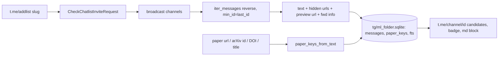

# Telegram folder export + t.me post lookup

## Decisions (confirmed)
- Access via **Telethon** (MTProto, your account). One-time: `api_id`/`api_hash` from my.telegram.org in `.env`, phone + code login on first run; session file reused afterwards (already covered by `.gitignore`: `.env`, `*.session`).
- Scope: **broadcast channels only**, **full history**; incremental and resumable after the first sync.
- Folder resolved at runtime by slug: `chatlists.CheckChatlistInviteRequest(slug='5iWgAjztpOJiYTQy')` returns `.chats` in both `ChatlistInvite` and `ChatlistInviteAlready` (verified against Telethon 1.45). Fallback flags: `--folder "ML"` (via `GetDialogFiltersRequest`) or `--channels channels.txt`.

## Files

### `tg/common.py` (new)
- Paths: `ROOT`, `DB = ROOT / 'tg' / 'ml_folder.sqlite'`, `SESSION = ROOT / 'tg' / 'ml_folder'`, `ENV = ROOT / '.env'`.
- `load_env()` (tiny `.env` parser, no python-dotenv), `make_client()` with `flood_sleep_threshold` high enough to just wait out FloodWait.
- Reuse existing key extraction: `sys.path.insert(ROOT)` then `from add_tg_links import paper_keys_from_text, normalize_keys, channel_translate_link, TME_POST` (already handles arxiv/openreview/acl/doi/nature/tc/openai/anthropic/... and the translate.goog badge).
- `open_db()` creating the schema:
  - `channels(id PK, username, title, kind, last_id DEFAULT 0, total, synced_at)`
  - `messages(channel_id, id, date, text, urls, fwd_channel_id, fwd_username, fwd_post_id, fwd_name, grouped_id, views, PRIMARY KEY(channel_id, id))`
  - `paper_keys(key, channel_id, msg_id, PRIMARY KEY(key, channel_id, msg_id))` + index on `key`
  - `fts` = FTS5 `(channel_id UNINDEXED, msg_id UNINDEXED, text)` (FTS5 confirmed available in the local Python 3.10 / SQLite 3.51).
- `message_row(msg)`: text = `msg.message` + hidden `MessageEntityTextUrl.url`s + `MessageMediaWebPage.webpage.url` (paper links often live only in the preview or behind link text); forward info from `msg.fwd_from` (`from_id.channel_id`, `channel_post`, username via `msg.forward.chat`).

### `tg/export.py` (new)
- CLI: `python tg/export.py [--slug 5iWgAjztpOJiYTQy] [--folder NAME | --channels FILE] [--include-groups] [--since YYYY-MM-DD] [--only gonzo_ML,data_secrets] [--reindex]`.
- Flow: connect → resolve folder chats → keep `Channel.broadcast` (groups only with `--include-groups`) → upsert `channels` → per channel: `total = (await client.get_messages(ch, limit=0)).total`, then `iter_messages(ch, min_id=last_id, reverse=True)` (oldest→newest so an interrupted run resumes from `last_id`), insert in batches of 200 with commit + `last_id` update.
- Progress in console (required): `[03/43] gonzo_ML  1200/6012 (20%)  new=1200` refreshed every batch, newline + elapsed per channel, final summary (channels, new messages, paper keys, DB size). Skips channels already at head with `no new posts`.
- `--reindex`: rebuild `paper_keys` + `fts` from stored `messages` without network (for when `PAPER_PATTERNS` in `add_tg_links.py` change).

### `tg/find.py` (new)
- CLI: `python tg/find.py <query> [<query> ...] [--limit 10] [--badge] [--md]`; query = any paper URL, bare arXiv id (`2608.17163`, `2608.17163v2`, pdf/html/hf-papers variants), DOI, or a title string.
- Lookup: `paper_keys_from_text(query)` → `paper_keys` join `messages`/`channels`; if no key or no hits → FTS5 phrase search on the title (quoted phrase first, then AND of significant words).
- Ranking: original posts before forwards, then newest first; forwards additionally print the original `https://t.me/<fwd_username>/<fwd_post_id>` when the source is public.
- Output per hit: `https://t.me/<handle>/<id>  YYYY-MM-DD  <channel title>  «first ~160 chars»`; `--badge` prints the `[⌲ tg](https://t-me.translate.goog/s/...)` string for the readme; `--md` prints a `tg_link_choices.md`-style block (`## <title>` + full links) so I can paste candidates for you to pick. Private channels (`username` NULL) are shown as `t.me/c/<id>/<msg>` and marked `private, no public badge`.

### Small edits
- `.gitignore`: add `tg/*.sqlite`, `tg/*.sqlite-journal` (session and `.env` already ignored).
- `readme.md`: one sentence next to the map rebuild instructions: sync with `python tg/export.py`, look up with `python tg/find.py <url>`.

## Data flow

## What you do once
- Create an app at my.telegram.org → put `TG_API_ID=...` and `TG_API_HASH=...` into `.env`.
- `pip install telethon` (not installed yet; 1.45.0 is current).
- Run `python tg/export.py` in your terminal the first time (phone, code, 2FA if set). Later runs are non-interactive, so I can refresh the index myself before searching.

## Verification
- First run on `--only gonzo_ML` to check resume/progress, then full folder.
- `python tg/find.py https://arxiv.org/abs/2503.14858` must return `gonzo_ML/4277` (badge already in the readme); `python tg/find.py 2501.20802`-style and title-only queries spot-checked against existing badges.
- Interrupt a sync mid-channel and rerun: continues from `last_id`, no duplicates (PK).