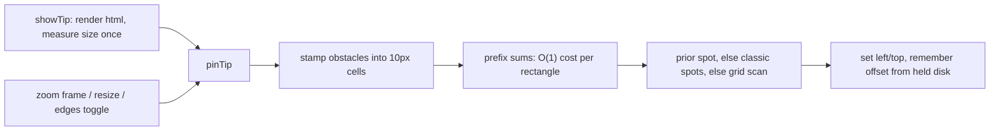

# Pinned tooltip that avoids the selection

## Current behaviour

`pinTip(d)` in [src/map.js](src/map.js) (L1202) always puts the popup to the right of the held paper (the last one selected), at `cy - 12`. It only flips left or clamps when the popup would run off-screen. With two or more selected papers, it regularly covers the other selected disks, their labels and the orange/blue links. `pinTip` runs on every zoom frame from `restyleForZoom()`, so the replacement has to be cheap and must not jitter.

## Approach: a cost grid in screen space



Obstacles and their weights, stamped into a `Float64Array` covering the viewport:

- Selected disks (bbox plus 4 px) and their labels: `TIP_HIT = 1000` per cell. This effectively forbids covering them.
- Highlighted links (edges touching any selected node, only when `#edges` is checked): `TIP_LINK = 4` per cell. Each quadratic curve is sampled every ~5 px in screen space, and each edge is counted at most once per cell (tracked with an `Int32Array` stamp).
- Neighbour disks (`related()` of the selection, minus the selection itself): `TIP_LINK` per cell.

Cost of a placement = the sum over the rectangle (from the prefix sums) + `TIP_DIST * max(0, distance(held centre, rect) - rr - TIP_GAP)`. The distance term keeps the popup near the paper it describes.

Choosing a spot, in priority order (each fallback must be cheaper by more than `TIP_STICKY`):

1. The previous offset from the held disk (`tipOffset`). Panning then keeps the popup glued to the node, and zooming does not flicker.
2. The four classic spots: right (today's placement), left, below the label, above.
3. The best position from a scan of every cell inside the allowed area.

Allowed area: x in `[8, width - w - 8]`, y in `[header bottom + 4, height - h - 8]`, falling back to `y >= 8` when the window is too short. The popup no longer covers the header controls.

For a 1920x1080 window the grid is about 20k cells, so each frame costs one fill, one prefix-sum pass and one scan, all well under a millisecond.

## Changes in [src/map.js](src/map.js)

- Constants next to `FOCUS_PAD` (L337): `TIP_CELL = 10`, `TIP_GAP = 14`, `TIP_HIT`, `TIP_LINK`, `TIP_DIST = 0.05`, `TIP_STICKY = 8`. State: `var tipSize = null, tipOffset = null;`.
- Extract `edgeControl(e)` from `edgePath()` (L681) so the path and the sampler share the curve's control point. An affine zoom keeps a quadratic Bezier a quadratic Bezier, so the three points can be transformed with `transform.applyX/applyY`.
- Extract `labelBox(d, sx, sy)` from `placeLabels()` (L910-916). The obstacle code then uses the same box for the selected labels, which `placeLabels` always puts below the disk.
- `layout()` already reads the header rect. Store `plot.headerBottom = header.bottom` so `pinTip` does not force a layout read.
- `showTip()`: after `tip.html(...)`, when `locked`, set `left/top` to `0px`, measure once into `tipSize`, reset `tipOffset = null`, then call `pinTip`. Measuring at 0,0 avoids the shrink-to-fit width you get near the right edge. The hover path (`moveTip`) stays as it is.
- Rewrite `pinTip(d)` as described above. It is still called from `restyleForZoom()` and `showTip()`.
- `focusSelection()`: add `.on('end', function () { tipOffset = null; if (locked) pinTip(locked); })` to the transition, so a deep link gets a fresh placement at its final zoom rather than a sticky spot from the first frame.
- `#edges` change handler (L1548): after `syncEdges()`, add `if (locked) pinTip(locked);`.
- Add one line to the header comment: the pinned tooltip goes where it covers the fewest selected papers and links.

This applies to single selections too. The popup stays right of the paper unless that spot covers its links.

## Check in [src/verify_map.py](src/verify_map.py)

- Add `TIP_CLEAR_JS` and `check_tip_clear(page, errors, label)`, which return and check:
  - `heldHits`: `#tip` rect intersects a `.nodes g.held circle` rect, inflated by 3 px. Any hit is an error.
  - `labelHits`: `#tip` intersects a visible `.labels text` of a held node. Any hit is an error.
  - `linkPoints`: highlighted `.edges path` points inside the tip, from `getPointAtLength` samples mapped through `getScreenCTM()`. Printed only.
- Call it after `'deep link'` (Llama 3 + OLMo 2), after `'deep link reload'`, and after the shift-click that makes three selected. Save a screenshot `10-tip-three.png` after the shift-click.

## Verification

```powershell
node --check src/map.js
$env:PYTHONIOENCODING='utf-8'
python src/verify_map.py
```

- The script must end with `no console errors`. Look at `09-deep-link.png` and `10-tip-three.png`: the popup should sit clear of the rings and labels and next to the held paper.
- Manual check over `python -m http.server 8000`: shift-select three or four papers, then pan and zoom. The popup should follow the held paper without jumping around, and move only when its spot becomes covered.
- `git diff --stat` should show only `src/map.js` and `src/verify_map.py`.