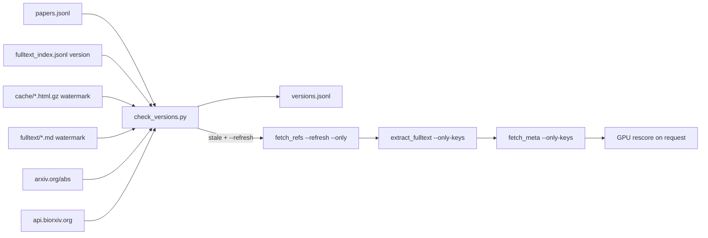

# Version check as a pipeline step

## What the audit taught (drives the design)

- arXiv export API with 100-id batches → `429` on every batch, retries useless. Scraping `arxiv.org/abs/<id>` one page per 1.2 s worked for 301 ids in ~7 min with zero errors. Final script uses `/abs` pages only, exponential backoff 8→90 s on 429.
- Local version is recoverable from a watermark: `arXiv:<id>vN [` or `href="/abs/<id>vN"` in `cache/<key>.html.gz`; `arXiv:<id>vN` in the first ~12k chars of PDF-derived `fulltext/*.md`. ar5iv HTML and publisher/OpenReview PDFs carry no watermark → must be an explicit `unknown`, not silently `ok`.
- `extract_fulltext.pdf_fallback_urls()` hardcodes `biorxiv.org/content/<doi>v1.full.pdf` → MetaWorm was scored as v1 while v2 exists. `api.biorxiv.org/details/biorxiv/<doi>` returns every version with dates; the md keeps `this version posted <Month D, YYYY>` so used version is derivable.
- `download`-source fulltext loses the watermark in `html_to_markdown` → version must be recorded at extraction time, not reconstructed later.
- Non-greedy `[\d.]+?` truncated bioRxiv DOIs in my readme scan; final regex is greedy with explicit terminators (`(?=v\d|\.full|\.pdf|/|$)`).
- Findings to act on: `arxiv:2605.06241` v2→v3 (6 Sep 2026), `doi:10.1101/2024.02.22.581686` v1→v2. Informational: OpenReview camera-readies whose arXiv mirrors moved on (`pOoKI3ouv1`→v7, `wUU-7XTL5XO`→v4); publisher PDFs without arXiv watermark (Chalmers, NeuroAI/Neuron, TPU v4, Attractors); `arxiv:2201.00650` fulltext is a 273-token landing page (separate bug, note only).

## 1. New `filter/check_versions.py`

```text
python filter/check_versions.py --only-keys k1,k2   # new papers, seconds
python filter/check_versions.py                     # every versioned key, incremental (skips rows checked < --max-age 7 days), ~7 min cold
python filter/check_versions.py --force             # ignore the age cache
python filter/check_versions.py --refresh           # re-download stale keys (see 3) and re-check them
```

- Inputs: `papers.jsonl`, `fulltext_index.jsonl` (new `version` field, see 2), `cache/`, `fulltext/*.md`. Output: `filter/versions.jsonl` (gitignored like the other jsonl) with `key, aid, source, used, latest, latest_date, status, checked`.
- Scope per key kind:
  - `arxiv:` → used = index `version` → cache watermark → md watermark; latest from `/abs` (`this version, v(\d+)`, submission-history date).
  - `doi:10.1101/` → used from `this version posted …` date matched to API version dates; latest from bioRxiv API.
  - `openreview:` / other `doi:` with an arXiv mirror in `EXTRA_PDF_URLS` or md watermark → status `mirror` (informational, never stale).
  - `PUBLISHER_OK = {key: reason}` allowlist for the four publisher PDFs → status `ok-publisher`.
- Statuses: `ok`, `stale`, `unknown`, `mirror`, `ok-publisher`, `no-fetch`. Console: progress line per fetch, then STALE / UNKNOWN blocks and macro counts; exit code 1 if any `stale` so it can gate the checklist.
- Networking: `urllib` only, UA from `fetch_meta.py`, 1.2 s between arXiv hits, 1 s bioRxiv, backoff 8→90 s ×6 on HTTP 429/5xx, `404` = `no-fetch`. Never call `export.arxiv.org/api/query` in batches.
- `--refresh` (stale keys only): delete `cache/<key>.html.gz`; `python src/fetch_refs.py --refresh --only <key>` (this path keeps `refs.json` merged, no full rebuild); `python filter/extract_fulltext.py --only-keys <keys>`; `python filter/fetch_meta.py --only-keys <keys>`; re-check the keys; print the `KEYS=... MODELS=... _rescore_eight.sh` line for the GPU box and the reminder that abstract scorers only need rerun if `meta.jsonl` abstract changed. No GPU call from the script.
- Constants for paths go into `filter/paths.py`: `VERSIONS_JSONL = FILTER_DIR / 'versions.jsonl'`.

## 2. `filter/extract_fulltext.py`

- `pdf_fallback_urls()`: replace the `v1` literal with `biorxiv_latest_version(doi)` (one API call, fallback `v1` if the API fails, cached per run). Same for `BIORXIV_RE` hits on bullet URLs when the URL has no explicit version.
- `extract_paper()`: detect `version` from the source text before markdown conversion (`arXiv:<id>vN` watermark for arXiv HTML/PDF, `href="/abs/<id>vN"` for arxiv.org HTML, bioRxiv `this version posted` date) and write it into the index entry (`'version': N or None`). Existing entries stay valid; `check_versions.py` falls back to watermarks when the field is missing.

## 3. `filter/fetch_meta.py`

- Add `--only-keys k1,k2` (implies force for those keys) so `--refresh` can update title/abstract of a bumped version without refetching all ~330 papers. Everything else unchanged.

## 4. `AGENTS.md`

- Quick checklist: insert `2b. versions   check_versions.py --only-keys ... (new keys) ; bare run before every GPU session ; stale -> --refresh -> rescore the key` between step 2 and 3, and add a `CHECK` line: `status ok / mirror / ok-publisher for every new key; unknown means no watermark -> fetch arxiv.org/pdf`.
- New section `## 2b. Version check` after `## 2. Filter inputs`: the four commands, status meanings, what `stale` requires (refresh → rescore with the `_rescore_eight.sh` pattern → `build_report.py` → `add_score_badges.py`), and the traps: arXiv API 429 on batches, ar5iv/local PDFs have no watermark, bioRxiv fallback used to be pinned to v1, greedy DOI regex, readme links stay versionless on purpose (they always resolve to latest; only cached text goes stale).
- Step 5: one line that a stale key is rescored exactly like a rescoring request (drop rows + review file first).
- Pipeline reference table: row `versions | filter/check_versions.py [--only-keys] [--refresh] | filter/versions.jsonl`.

## 5. Run it

- `python filter/check_versions.py --force` to populate `versions.jsonl`, confirm 2 stale / expected unknowns.
- `python filter/check_versions.py --refresh` for `arxiv:2605.06241` and `doi:10.1101/2024.02.22.581686`; verify the `#` title and the new watermark; regenerate `fulltext.zip` (extract does it).
- Do not rescore on the Vast.ai box without an explicit go-ahead (SciJudge shifts every existing score); report the ready-to-run `_rescore_eight.sh` line instead.
- Temp scripts under `%TEMP%` (`check_arxiv_versions.py`, `local_arxiv_versions.py`, `merge_arxiv_versions.py`, `inspect_unknown.py`, `resolve_remaining.py`, `check_other_versions.py`, `check_biorxiv4.py`, `abs_one.py`) get deleted; nothing new lands in the repo besides the files above.

