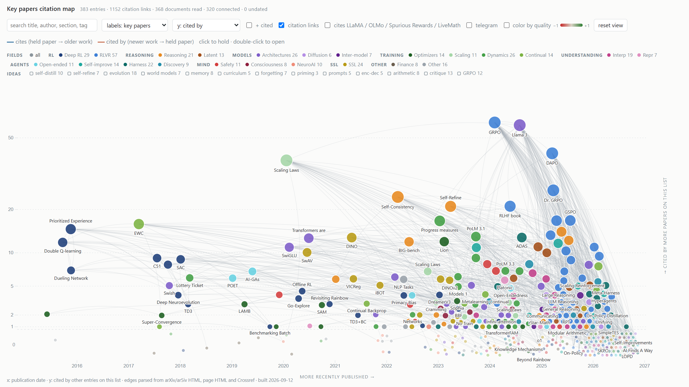
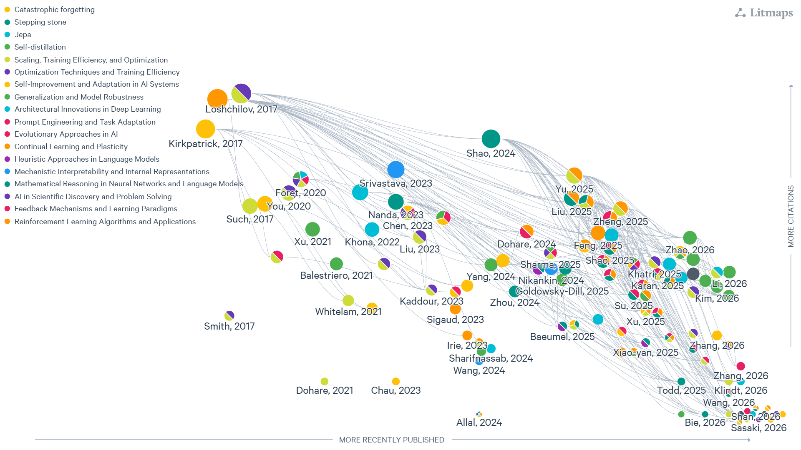

# Key papers of AI/AGI/ASI

Score badges: [⚖ final · accepts/models · WATCH|DROP](filter/report.md) — aggregated quality in [-1, +1]. 0 is where reviewer Accept/Reject votes split 50/50. accepts/models are raw reviewer votes, not the aggregated score. WATCH/DROP is appended when the verdict is not KEEP. Older landmark papers can be inflated (pretrain leakage).

Own version of the Litmaps map (preferred), with the links parsed straight out of the papers (arXiv/ar5iv HTML, page HTML, Crossref) instead of a hosted service: [live map](https://vinnik-dmitry07.github.io/favorite-papers/) or open [src/index.html](src/index.html) locally (`python -m http.server` from the repo root). Rebuild with `python src/parse_readme.py`, then `python src/fetch_refs.py`, then `python src/build_graph.py`. Telegram posts: put `TG_API_ID` and `TG_API_HASH` in `.env`, then `python tg/export.py` (interactive first login; the local index is hundreds of MB). Look up with `python tg/find.py <url>`.

Litmaps — [https://app.litmaps.com/shared/5bb436d0-a026-493a-a765-f48fda77ad0c](https://app.litmaps.com/shared/5bb436d0-a026-493a-a765-f48fda77ad0c)

## Reinforcement learning

- Q-Learning With World Models (QWM) — [https://arxiv.org/abs/2608.17163](https://arxiv.org/abs/2608.17163) [⚖ +0.08 · 6/7 · WATCH](filter/report.md#arxiv-2608.17163)
- CDE: Curiosity-Driven Exploration for RL in LLMs — [https://arxiv.org/abs/2509.09675](https://arxiv.org/abs/2509.09675) [⚖ +0.11 · 6/7 · WATCH](filter/report.md#arxiv-2509.09675)
- 1000 Layer Networks for Self-Supervised RL (NeurIPS 2025 Best Paper) — [https://arxiv.org/abs/2503.14858](https://arxiv.org/abs/2503.14858) [⌲ tg](https://t-me.translate.goog/s/gonzo_ML/4277?_x_tr_sl=auto&_x_tr_tl=en&_x_tr_hl=en&_x_tr_pto=wapp) · [https://openreview.net/forum?id=s0JVsx3bx1](https://openreview.net/forum?id=s0JVsx3bx1) · [https://arxiviq.substack.com/p/neurips-2025-1000-layer-networks](https://arxiviq.substack.com/p/neurips-2025-1000-layer-networks) [⚖ +0.01 · 5/7 · WATCH](filter/report.md#arxiv-2503.14858)
- Towards General-Purpose Model-Free RL (MR.Q) — [https://arxiv.org/abs/2501.16142](https://arxiv.org/abs/2501.16142) [⚖ -0.13 · 5/7 · WATCH](filter/report.md#arxiv-2501.16142)
- Beyond The Rainbow: High Performance Deep RL on a Desktop PC — [https://arxiv.org/abs/2411.03820](https://arxiv.org/abs/2411.03820) [⚖ +0.20 · 2/7](filter/report.md#arxiv-2411.03820)
- DIAMOND: a diffusion world model that plays CS:GO — [https://diamond-wm.github.io/](https://diamond-wm.github.io/) [⌲ tg](https://t-me.translate.goog/s/data_secrets/5127?_x_tr_sl=auto&_x_tr_tl=en&_x_tr_hl=en&_x_tr_pto=wapp)
- In-Context RL for Variable Action Spaces — [https://arxiv.org/abs/2312.13327](https://arxiv.org/abs/2312.13327) [⌲ tg](https://t-me.translate.goog/s/knowledge_accumulator/135?_x_tr_sl=auto&_x_tr_tl=en&_x_tr_hl=en&_x_tr_pto=wapp) [⚖ -0.05 · 4/7 · WATCH](filter/report.md#arxiv-2312.13327)
- Metalearning Continual Learning Algorithms — [https://arxiv.org/abs/2312.00276](https://arxiv.org/abs/2312.00276) [⌲ tg](https://t-me.translate.goog/s/knowledge_accumulator/93?_x_tr_sl=auto&_x_tr_tl=en&_x_tr_hl=en&_x_tr_pto=wapp) [⚖ +0.13 · 5/7 · WATCH](filter/report.md#arxiv-2312.00276)
- For SALE: State-Action Representation Learning — [https://arxiv.org/abs/2306.02451](https://arxiv.org/abs/2306.02451) [⚖ +0.05 · 5/7 · WATCH](filter/report.md#arxiv-2306.02451)
- BBF: Bigger, Better, Faster — Human-level Atari with human-level efficiency — [https://arxiv.org/abs/2305.19452](https://arxiv.org/abs/2305.19452) [⌲ tg](https://t-me.translate.goog/s/knowledge_accumulator/192?_x_tr_sl=auto&_x_tr_tl=en&_x_tr_hl=en&_x_tr_pto=wapp) [⚖ +0.23 · 3/7](filter/report.md#arxiv-2305.19452)
- DreamerV3: Mastering Diverse Domains through World Models — [https://arxiv.org/abs/2301.04104](https://arxiv.org/abs/2301.04104) [⚖ +0.16 · 5/7 · WATCH](filter/report.md#arxiv-2301.04104)
- Meta-Reinforcement Learning with Zero-Shot RL — [https://openreview.net/forum?id=XyGJJ4FPoX](https://openreview.net/forum?id=XyGJJ4FPoX) [⚖ -0.47 · 0/7 · DROP](filter/report.md#openreview-XyGJJ4FPoX)
- Sample-Efficient RL by Breaking the Replay Ratio Barrier (ICLR 2023, precursor of BBF) — [https://openreview.net/forum?id=OpC-9aBBVJe](https://openreview.net/forum?id=OpC-9aBBVJe) [⌲ tg](https://t-me.translate.goog/s/knowledge_accumulator/192?_x_tr_sl=auto&_x_tr_tl=en&_x_tr_hl=en&_x_tr_pto=wapp) [⚖ +0.16 · 6/7 · WATCH](filter/report.md#openreview-OpC-9aBBVJe)
- The Primacy Bias in Deep RL — [https://arxiv.org/abs/2205.07802](https://arxiv.org/abs/2205.07802) [⚖ +0.27 · 6/7](filter/report.md#arxiv-2205.07802)
- A Minimalist Approach to Offline RL (TD3+BC) — [https://arxiv.org/abs/2106.06860](https://arxiv.org/abs/2106.06860) [⚖ -0.49 · 3/7 · DROP](filter/report.md#arxiv-2106.06860)
- Revisiting Rainbow — [https://arxiv.org/abs/2011.14826](https://arxiv.org/abs/2011.14826) [⚖ -0.26 · 1/7 · DROP](filter/report.md#arxiv-2011.14826)
- Offline RL: Tutorial, Review, and Perspectives — [https://arxiv.org/abs/2005.01643](https://arxiv.org/abs/2005.01643) [⚖ -0.41 · 0/7 · WATCH](filter/report.md#arxiv-2005.01643)
- First return, then explore (Go-Explore, Nature) — [https://arxiv.org/abs/2004.12919](https://arxiv.org/abs/2004.12919) [⚖ +0.59 · 6/7](filter/report.md#arxiv-2004.12919)
- Benchmarking Batch Deep RL Algorithms — [https://arxiv.org/abs/1910.01708](https://arxiv.org/abs/1910.01708) [⚖ -0.56 · 2/7 · DROP](filter/report.md#arxiv-1910.01708)
- Addressing Function Approximation Error in Actor-Critic (TD3) — [https://arxiv.org/abs/1802.09477](https://arxiv.org/abs/1802.09477) [⚖ -0.37 · 1/4 · WATCH](filter/report.md#arxiv-1802.09477)
- The Multi-Armed Bandit Problem and Its Solutions (Lilian Weng) — [https://lilianweng.github.io/lil-log/2018/01/23/the-multi-armed-bandit-problem-and-its-solutions.html](https://lilianweng.github.io/lil-log/2018/01/23/the-multi-armed-bandit-problem-and-its-solutions.html)
- Soft Actor-Critic (SAC) — [https://arxiv.org/abs/1801.01290](https://arxiv.org/abs/1801.01290) [⚖ +0.47 · 6/7](filter/report.md#arxiv-1801.01290)
- Deep Neuroevolution: GAs as an alternative to training RL networks — [https://arxiv.org/abs/1712.06567](https://arxiv.org/abs/1712.06567) [⚖ +0.41 · 4/7](filter/report.md#arxiv-1712.06567)
- Rainbow: Combining Improvements in Deep RL — [https://arxiv.org/abs/1710.02298](https://arxiv.org/abs/1710.02298) [⌲ tg](https://t-me.translate.goog/s/knowledge_accumulator/192?_x_tr_sl=auto&_x_tr_tl=en&_x_tr_hl=en&_x_tr_pto=wapp) [⚖ -0.04 · 3/7 · WATCH](filter/report.md#arxiv-1710.02298)
- A Distributional Perspective on RL (C51) — [https://arxiv.org/abs/1707.06887](https://arxiv.org/abs/1707.06887) [⌲ tg](https://t-me.translate.goog/s/knowledge_accumulator/192?_x_tr_sl=auto&_x_tr_tl=en&_x_tr_hl=en&_x_tr_pto=wapp) [⚖ +0.36 · 6/7](filter/report.md#arxiv-1707.06887)
- Dueling Network Architectures for Deep RL — [https://arxiv.org/abs/1511.06581](https://arxiv.org/abs/1511.06581) [⌲ tg](https://t-me.translate.goog/s/knowledge_accumulator/192?_x_tr_sl=auto&_x_tr_tl=en&_x_tr_hl=en&_x_tr_pto=wapp) [⚖ +0.11 · 6/7 · WATCH](filter/report.md#arxiv-1511.06581)
- Prioritized Experience Replay — [https://arxiv.org/abs/1511.05952](https://arxiv.org/abs/1511.05952) [⌲ tg](https://t-me.translate.goog/s/knowledge_accumulator/192?_x_tr_sl=auto&_x_tr_tl=en&_x_tr_hl=en&_x_tr_pto=wapp) [⚖ +0.01 · 4/7 · WATCH](filter/report.md#arxiv-1511.05952)
- Deep Reinforcement Learning with Double Q-learning — [https://arxiv.org/abs/1509.06461](https://arxiv.org/abs/1509.06461) [⌲ tg](https://t-me.translate.goog/s/knowledge_accumulator/192?_x_tr_sl=auto&_x_tr_tl=en&_x_tr_hl=en&_x_tr_pto=wapp) [⚖ +0.09 · 5/7 · WATCH](filter/report.md#arxiv-1509.06461)

## Post-training

- Litmaps — [https://app.litmaps.com/shared/9f68a972-570d-48c9-9895-8d4979d52df0](https://app.litmaps.com/shared/9f68a972-570d-48c9-9895-8d4979d52df0)
- Latent On-Policy Self-Distillation (LOPD) — [https://arxiv.org/abs/2608.13040](https://arxiv.org/abs/2608.13040) [⚖ +0.13 · 6/7 · WATCH](filter/report.md#arxiv-2608.13040)
- BDH-CQ: In-Context Learning with Recurrent Latent Reasoning — [https://arxiv.org/abs/2608.09888](https://arxiv.org/abs/2608.09888) [⚖ -0.35 · 2/7 · DROP](filter/report.md#arxiv-2608.09888)
- When Does Continual Learning Require Learning — [https://arxiv.org/abs/2607.07847](https://arxiv.org/abs/2607.07847) [⌲ tg](https://t-me.translate.goog/s/gonzo_ML/5812?_x_tr_sl=auto&_x_tr_tl=en&_x_tr_hl=en&_x_tr_pto=wapp) [⚖ +0.01 · 4/7 · WATCH](filter/report.md#arxiv-2607.07847)
- To Retain or to Adapt? Generalizing Continual Learning — [https://arxiv.org/abs/2607.05609](https://arxiv.org/abs/2607.05609) [⌲ tg](https://t-me.translate.goog/s/gonzo_ML/5817?_x_tr_sl=auto&_x_tr_tl=en&_x_tr_hl=en&_x_tr_pto=wapp) [⚖ +0.07 · 5/7 · WATCH](filter/report.md#arxiv-2607.05609)
- Weight-Space Geometry of Offline Reasoning Training (ICML 2026 workshop) — [https://arxiv.org/abs/2606.23740](https://arxiv.org/abs/2606.23740) [⚖ -0.25 · 2/7 · DROP](filter/report.md#arxiv-2606.23740)
- Learning from Own Solutions: Self-Conditioned Credit Assignment (SC-GRPO) — [https://arxiv.org/abs/2606.18810](https://arxiv.org/abs/2606.18810) [⚖ +0.01 · 4/7 · WATCH](filter/report.md#arxiv-2606.18810)
- OPRD: On-Policy Representation Distillation — [https://arxiv.org/abs/2606.06021](https://arxiv.org/abs/2606.06021) [⚖ +0.46 · 5/7](filter/report.md#arxiv-2606.06021)
- From Reasoning Chains to Verifiable Subproblems: Curriculum RL for Credit Assignment — [https://arxiv.org/abs/2605.22074](https://arxiv.org/abs/2605.22074) [⚖ +0.20 · 6/7 · WATCH](filter/report.md#arxiv-2605.22074)
- Revisiting Reinforcement Learning with Verifiable Rewards from a Contrastive Perspective — [https://arxiv.org/abs/2605.12969](https://arxiv.org/abs/2605.12969) [⚖ +0.35 · 6/7](filter/report.md#arxiv-2605.12969)
- Rethinking RL for LLM Reasoning: It's Sparse Policy Selection, Not Capability Learning — [https://arxiv.org/abs/2605.06241](https://arxiv.org/abs/2605.06241) [⚖ +0.49 · 5/7](filter/report.md#arxiv-2605.06241)
- GRPO-VPS: Verifiable Process Supervision — [https://arxiv.org/abs/2604.20659](https://arxiv.org/abs/2604.20659) [⚖ -0.01 · 5/7 · WATCH](filter/report.md#arxiv-2604.20659)
- Rethinking On-Policy Distillation of Large Language Models — [https://arxiv.org/abs/2604.13016](https://arxiv.org/abs/2604.13016) [⚖ +0.36 · 6/7](filter/report.md#arxiv-2604.13016)
- Skip-Connected Policy Optimization (SKPO) — [https://arxiv.org/abs/2604.08690](https://arxiv.org/abs/2604.08690) [⚖ +0.29 · 6/7](filter/report.md#arxiv-2604.08690)
- Unifying Group-Relative and Self-Distillation Policy Optimization via Sample Routing — [https://arxiv.org/abs/2604.02288](https://arxiv.org/abs/2604.02288) [⚖ -0.00 · 5/7 · WATCH](filter/report.md#arxiv-2604.02288)
- RIFT: A RubrIc Failure Mode Taxonomy and Automated Diagnostics — [https://arxiv.org/abs/2604.01375](https://arxiv.org/abs/2604.01375) [⚖ -0.10 · 3/7 · WATCH](filter/report.md#arxiv-2604.01375)
- Revisiting On-Policy Distillation: Empirical Failure Modes and Simple Fixes — [https://arxiv.org/abs/2603.25562](https://arxiv.org/abs/2603.25562) [⚖ -0.07 · 5/7 · WATCH](filter/report.md#arxiv-2603.25562)
- Why Does Self-Distillation (Sometimes) Degrade the Reasoning Capability of LLMs? — [https://arxiv.org/abs/2603.24472](https://arxiv.org/abs/2603.24472) [⚖ -0.17 · 3/7 · WATCH](filter/report.md#arxiv-2603.24472)
- Gradient Regularization Mitigates Reward Hacking in RLHF and RLVR — [https://arxiv.org/abs/2602.18037](https://arxiv.org/abs/2602.18037) [⚖ +0.13 · 4/7 · WATCH](filter/report.md#arxiv-2602.18037)
- iGRPO: Self-Feedback-Driven LLM Reasoning — [https://arxiv.org/abs/2602.09000](https://arxiv.org/abs/2602.09000) [⚖ -0.06 · 4/7 · WATCH](filter/report.md#arxiv-2602.09000)
- Evolutionary Strategies lead to Catastrophic Forgetting in LLMs — [https://arxiv.org/abs/2601.20861](https://arxiv.org/abs/2601.20861) [⌲ tg](https://t-me.translate.goog/s/gonzo_ML/4709?_x_tr_sl=auto&_x_tr_tl=en&_x_tr_hl=en&_x_tr_pto=wapp) [⚖ -0.54 · 3/7 · DROP](filter/report.md#arxiv-2601.20861)
- Reinforcement Learning via Self-Distillation — [https://arxiv.org/abs/2601.20802](https://arxiv.org/abs/2601.20802) [⌲ tg](https://t-me.translate.goog/s/gonzo_ML/4681?_x_tr_sl=auto&_x_tr_tl=en&_x_tr_hl=en&_x_tr_pto=wapp) [⚖ +0.27 · 6/7](filter/report.md#arxiv-2601.20802)
- Self-Distillation Enables Continual Learning — [https://arxiv.org/abs/2601.19897](https://arxiv.org/abs/2601.19897) [⚖ -0.09 · 6/7 · WATCH](filter/report.md#arxiv-2601.19897)
- Self-Distilled Reasoner: On-Policy Self-Distillation for LLMs — [https://arxiv.org/abs/2601.18734](https://arxiv.org/abs/2601.18734) [⚖ +0.12 · 5/7 · WATCH](filter/report.md#arxiv-2601.18734)
- Learning to Discover at Test Time (TTT-Discover) — [https://arxiv.org/abs/2601.16175](https://arxiv.org/abs/2601.16175) [⌲ tg](https://t-me.translate.goog/s/gonzo_ML/4643?_x_tr_sl=auto&_x_tr_tl=en&_x_tr_hl=en&_x_tr_pto=wapp) [⚖ +0.27 · 6/7](filter/report.md#arxiv-2601.16175)
- Towards Execution-Grounded Automated AI Research — [https://arxiv.org/abs/2601.14525](https://arxiv.org/abs/2601.14525) [⌲ tg](https://t-me.translate.goog/s/gonzo_ML/4660?_x_tr_sl=auto&_x_tr_tl=en&_x_tr_hl=en&_x_tr_pto=wapp) [⚖ +0.04 · 5/7 · WATCH](filter/report.md#arxiv-2601.14525)
- Spurious Rewards Paradox: How RLVR Activates Memorization Shortcuts — [https://arxiv.org/abs/2601.11061](https://arxiv.org/abs/2601.11061) [⌲ tg](https://t-me.translate.goog/s/buckwheat_thoughts/306?_x_tr_sl=auto&_x_tr_tl=en&_x_tr_hl=en&_x_tr_pto=wapp) [⚖ +0.39 · 6/7](filter/report.md#arxiv-2601.11061)
- GRPO++: Tricks for Making RL Actually Work (Cameron Wolfe) — [https://cameronrwolfe.substack.com/p/grpo-tricks](https://cameronrwolfe.substack.com/p/grpo-tricks) [⌲ tg](https://t-me.translate.goog/s/AGI_and_RL/1268?_x_tr_sl=auto&_x_tr_tl=en&_x_tr_hl=en&_x_tr_pto=wapp)
- SR-GRPO: Stable Rank as an Intrinsic Geometric Reward — [https://arxiv.org/abs/2512.02807](https://arxiv.org/abs/2512.02807) [⌲ tg](https://t-me.translate.goog/s/tech_priestess/2494?_x_tr_sl=auto&_x_tr_tl=en&_x_tr_hl=en&_x_tr_pto=wapp) [⚖ +0.23 · 6/7](filter/report.md#arxiv-2512.02807)
- ESPO: Entropy Importance Sampling Policy Optimization — [https://arxiv.org/abs/2512.00499](https://arxiv.org/abs/2512.00499) [⚖ +0.19 · 6/7 · WATCH](filter/report.md#arxiv-2512.00499)
- Soft Adaptive Policy Optimization (SAPO) — [https://arxiv.org/abs/2511.20347](https://arxiv.org/abs/2511.20347) [⚖ +0.12 · 5/7 · WATCH](filter/report.md#arxiv-2511.20347)
- RLVE: Adaptive Verifiable Environments for LLM RL — [https://arxiv.org/abs/2511.07317](https://arxiv.org/abs/2511.07317) [⚖ +0.37 · 5/7](filter/report.md#arxiv-2511.07317)
- Reasoning with Sampling: Your Base Model is Smarter Than You Think — [https://arxiv.org/abs/2510.14901](https://arxiv.org/abs/2510.14901) [⚖ +0.21 · 6/7](filter/report.md#arxiv-2510.14901)
- The Art of Scaling Reinforcement Learning Compute for LLMs — [https://arxiv.org/abs/2510.13786](https://arxiv.org/abs/2510.13786) [⚖ +0.42 · 6/7](filter/report.md#arxiv-2510.13786)
- It Takes Two: Your GRPO Is Secretly DPO — [https://arxiv.org/abs/2510.00977](https://arxiv.org/abs/2510.00977) [⌲ tg](https://t-me.translate.goog/s/dealerAI/1092?_x_tr_sl=auto&_x_tr_tl=en&_x_tr_hl=en&_x_tr_pto=wapp) [⚖ -0.10 · 5/7 · WATCH](filter/report.md#arxiv-2510.00977)
- From f(x) and g(x) to f(g(x)): LLMs Learn New Skills in RL by Composing Old Ones — [https://arxiv.org/abs/2509.25123](https://arxiv.org/abs/2509.25123) · [https://husky-morocco-f72.notion.site/From-f-x-and-g-x-to-f-g-x-LLMs-Learn-New-Skills-in-RL-by-Composing-Old-Ones-2499aba4486f802c8108e76a12af3020](https://husky-morocco-f72.notion.site/From-f-x-and-g-x-to-f-g-x-LLMs-Learn-New-Skills-in-RL-by-Composing-Old-Ones-2499aba4486f802c8108e76a12af3020) [⚖ -0.07 · 5/7 · WATCH](filter/report.md#arxiv-2509.25123)
- Compute as Teacher: Turning Inference Compute Into Reference-Free Supervision — [https://arxiv.org/abs/2509.14234](https://arxiv.org/abs/2509.14234) [⚖ +0.06 · 5/7 · WATCH](filter/report.md#arxiv-2509.14234)
- Single-stream Policy Optimization — [https://arxiv.org/abs/2509.13232](https://arxiv.org/abs/2509.13232) [⚖ -0.08 · 5/7 · WATCH](filter/report.md#arxiv-2509.13232)
- Emergent Hierarchical Reasoning in LLMs through Reinforcement Learning — [https://arxiv.org/abs/2509.03646](https://arxiv.org/abs/2509.03646) [⚖ -0.05 · 3/7 · WATCH](filter/report.md#arxiv-2509.03646)
- Klear-Reasoner: Gradient-Preserving Clipping Policy Optimization (GPPO) — [https://arxiv.org/abs/2508.07629](https://arxiv.org/abs/2508.07629) [⚖ -0.24 · 3/6 · DROP](filter/report.md#arxiv-2508.07629)
- On the Generalization of SFT: Reward Rectification (DFT) — [https://arxiv.org/abs/2508.05629](https://arxiv.org/abs/2508.05629) [⌲ tg](https://t-me.translate.goog/s/abstractDL/345?_x_tr_sl=auto&_x_tr_tl=en&_x_tr_hl=en&_x_tr_pto=wapp) [⚖ +0.43 · 6/7](filter/report.md#arxiv-2508.05629)
- GEPA: Reflective Prompt Evolution Can Outperform Reinforcement Learning — [https://arxiv.org/abs/2507.19457](https://arxiv.org/abs/2507.19457) [⚖ +0.45 · 6/7](filter/report.md#arxiv-2507.19457)
- Group Sequence Policy Optimization (GSPO) — [https://arxiv.org/abs/2507.18071](https://arxiv.org/abs/2507.18071) [⌲ tg](https://t-me.translate.goog/s/data_secrets/7470?_x_tr_sl=auto&_x_tr_tl=en&_x_tr_hl=en&_x_tr_pto=wapp) [⚖ +0.04 · 5/7 · WATCH](filter/report.md#arxiv-2507.18071)
- MiniMax-M1: Scaling Test-Time Compute Efficiently with Lightning Attention — [https://arxiv.org/abs/2506.13585](https://arxiv.org/abs/2506.13585) [⚖ +0.35 · 4/7](filter/report.md#arxiv-2506.13585)
- Curriculum Reinforcement Learning from Easy to Hard Tasks — [https://arxiv.org/abs/2506.06632](https://arxiv.org/abs/2506.06632) [⚖ +0.04 · 5/7 · WATCH](filter/report.md#arxiv-2506.06632)
- Critique-GRPO: Advancing LLM Reasoning with Natural Language and Numerical Feedback — [https://arxiv.org/abs/2506.03106](https://arxiv.org/abs/2506.03106) [⚖ +0.42 · 7/7](filter/report.md#arxiv-2506.03106)
- Beyond the 80/20 Rule: High-Entropy Minority Tokens Drive Effective RL — [https://arxiv.org/abs/2506.01939](https://arxiv.org/abs/2506.01939) [⚖ +0.27 · 4/7](filter/report.md#arxiv-2506.01939)
- Learning to Reason without External Rewards (Intuitor / RLIF) — [https://arxiv.org/abs/2505.19590](https://arxiv.org/abs/2505.19590) [⌲ tg](https://t-me.translate.goog/s/gonzo_ML_podcasts/375?_x_tr_sl=auto&_x_tr_tl=en&_x_tr_hl=en&_x_tr_pto=wapp) [⚖ -0.00 · 3/7 · WATCH](filter/report.md#arxiv-2505.19590)
- Group-in-Group Policy Optimization (GiGPO) — [https://arxiv.org/abs/2505.10978](https://arxiv.org/abs/2505.10978) [⚖ +0.31 · 7/7](filter/report.md#arxiv-2505.10978)
- TTRL: Test-Time Reinforcement Learning — [https://arxiv.org/abs/2504.16084](https://arxiv.org/abs/2504.16084) [⚖ +0.32 · 5/7](filter/report.md#arxiv-2504.16084)
- Does Reinforcement Learning Really Incentivize Reasoning Capacity Beyond the Base Model? — [https://arxiv.org/abs/2504.13837](https://arxiv.org/abs/2504.13837) [⚖ +0.01 · 4/7 · WATCH](filter/report.md#arxiv-2504.13837)
- Understanding R1-Zero-Like Training: Dr. GRPO — [https://arxiv.org/abs/2503.20783](https://arxiv.org/abs/2503.20783) [⚖ +0.33 · 5/7](filter/report.md#arxiv-2503.20783)
- Oat-Zero: reproducing R1-Zero and analyzing self-reflection — [https://oatllm.notion.site/oat-zero](https://oatllm.notion.site/oat-zero) [⌲ tg](https://t-me.translate.goog/s/lovedeathtransformers/9184?_x_tr_sl=auto&_x_tr_tl=en&_x_tr_hl=en&_x_tr_pto=wapp)
- DAPO: Decoupled Clip and Dynamic Sampling Policy Optimization — [https://arxiv.org/abs/2503.14476](https://arxiv.org/abs/2503.14476) [⚖ -0.32 · 3/7 · DROP](filter/report.md#arxiv-2503.14476)
- The First Few Tokens Are All You Need (UPFT, NeurIPS 2025) — [https://arxiv.org/abs/2503.02875](https://arxiv.org/abs/2503.02875) [⌲ tg](https://t-me.translate.goog/s/data_secrets/6419?_x_tr_sl=auto&_x_tr_tl=en&_x_tr_hl=en&_x_tr_pto=wapp) [⚖ -0.07 · 3/7 · WATCH](filter/report.md#arxiv-2503.02875)
- LADDER: Self-Improving LLMs Through Recursive Problem Decomposition — [https://arxiv.org/abs/2503.00735](https://arxiv.org/abs/2503.00735) [⌲ tg](https://t-me.translate.goog/s/AGI_and_RL/986?_x_tr_sl=auto&_x_tr_tl=en&_x_tr_hl=en&_x_tr_pto=wapp) [⚖ -0.02 · 4/7 · WATCH](filter/report.md#arxiv-2503.00735)
- Self-Distillation Bridges Distribution Gap in Language Model Fine-Tuning — [https://arxiv.org/abs/2402.13669](https://arxiv.org/abs/2402.13669) [⚖ +0.22 · 5/7](filter/report.md#arxiv-2402.13669)
- DeepSeekMath: introducing Group Relative Policy Optimization (GRPO) — [https://arxiv.org/abs/2402.03300](https://arxiv.org/abs/2402.03300) [⚖ +0.32 · 5/7](filter/report.md#arxiv-2402.03300)
- Self-Refine: Iterative Refinement with Self-Feedback — [https://arxiv.org/abs/2303.17651](https://arxiv.org/abs/2303.17651) [⚖ +0.11 · 6/7 · WATCH](filter/report.md#arxiv-2303.17651)

## LLMs: architectures, context, training

- XBridge: Entity-Grounded Latent Bridge for Heterogeneous LLM Communication — [https://arxiv.org/abs/2608.11676](https://arxiv.org/abs/2608.11676) [⚖ +0.24 · 5/7](filter/report.md#arxiv-2608.11676)
- Cross-Model KV Cache Transfer in LLM Families — [https://arxiv.org/abs/2608.03893](https://arxiv.org/abs/2608.03893) [⌲ tg](https://t-me.translate.goog/s/lovedeathtransformers/10993?_x_tr_sl=auto&_x_tr_tl=en&_x_tr_hl=en&_x_tr_pto=wapp) [⚖ +0.14 · 5/7 · WATCH](filter/report.md#arxiv-2608.03893)
- DiffusionGemma Technical Report — [https://arxiv.org/abs/2608.00146](https://arxiv.org/abs/2608.00146) [⌲ tg](https://t-me.translate.goog/s/gonzo_ML/5942?_x_tr_sl=auto&_x_tr_tl=en&_x_tr_hl=en&_x_tr_pto=wapp) [⚖ +0.29 · 3/7](filter/report.md#arxiv-2608.00146)
- HOLA: A Hippocampus for Linear Attention — [https://arxiv.org/abs/2607.02303](https://arxiv.org/abs/2607.02303) [⌲ tg](https://t-me.translate.goog/s/gonzo_ML/5675?_x_tr_sl=auto&_x_tr_tl=en&_x_tr_hl=en&_x_tr_pto=wapp) [⚖ +0.24 · 6/7](filter/report.md#arxiv-2607.02303)
- Skip a Layer or Loop It? Learning Program-of-Layers in LLMs — [https://arxiv.org/abs/2606.06574](https://arxiv.org/abs/2606.06574) [⌲ tg](https://t-me.translate.goog/s/gonzo_ML/5950?_x_tr_sl=auto&_x_tr_tl=en&_x_tr_hl=en&_x_tr_pto=wapp) [⚖ +0.19 · 6/7 · WATCH](filter/report.md#arxiv-2606.06574)
- Latent Cache Flow: Model-to-Model Communication Without Text — [https://arxiv.org/abs/2605.22863](https://arxiv.org/abs/2605.22863) [⚖ -0.16 · 4/7 · WATCH](filter/report.md#arxiv-2605.22863)
- DMax: Aggressive Parallel Decoding for dLLMs — [https://arxiv.org/abs/2604.08302](https://arxiv.org/abs/2604.08302) [⌲ tg](https://t-me.translate.goog/s/gonzo_ML/5420?_x_tr_sl=auto&_x_tr_tl=en&_x_tr_hl=en&_x_tr_pto=wapp) [⚖ +0.21 · 4/7](filter/report.md#arxiv-2604.08302)
- LSP Scheduler: Beyond Scattered Acceptance (ICLR 2026) — [https://arxiv.org/abs/2603.05454](https://arxiv.org/abs/2603.05454) [⚖ +0.05 · 5/7 · WATCH](filter/report.md#arxiv-2603.05454)
- LLaDA2.1: Speeding Up Text Diffusion via Token Editing — [https://arxiv.org/abs/2602.08676](https://arxiv.org/abs/2602.08676) [⚖ -0.04 · 5/7 · WATCH](filter/report.md#arxiv-2602.08676)
- Recursive Language Models — [https://arxiv.org/abs/2512.24601](https://arxiv.org/abs/2512.24601) · [https://alexzhang13.github.io/blog/2025/rlm/](https://alexzhang13.github.io/blog/2025/rlm/) [⚖ +0.15 · 4/7 · WATCH](filter/report.md#arxiv-2512.24601)
- T5Gemma 2: Seeing, Reading, and Understanding Longer — [https://arxiv.org/abs/2512.14856](https://arxiv.org/abs/2512.14856) [⌲ tg](https://t-me.translate.goog/s/gonzo_ML/4421?_x_tr_sl=auto&_x_tr_tl=en&_x_tr_hl=en&_x_tr_pto=wapp) [⚖ -0.30 · 2/7 · DROP](filter/report.md#arxiv-2512.14856)
- OLMo 3 — [https://arxiv.org/abs/2512.13961](https://arxiv.org/abs/2512.13961) [⌲ tg](https://t-me.translate.goog/s/abstractDL/356?_x_tr_sl=auto&_x_tr_tl=en&_x_tr_hl=en&_x_tr_pto=wapp) [⚖ +0.22 · 3/7](filter/report.md#arxiv-2512.13961)
- LLaDA2.0: Scaling Up Diffusion Language Models to 100B — [https://arxiv.org/abs/2512.15745](https://arxiv.org/abs/2512.15745) [⚖ +0.15 · 4/7 · WATCH](filter/report.md#arxiv-2512.15745)
- Enabling Agents to Communicate Entirely in Latent Space (Interlat) — [https://arxiv.org/abs/2511.09149](https://arxiv.org/abs/2511.09149) · [https://aclanthology.org/2026.acl-long.1248/](https://aclanthology.org/2026.acl-long.1248/) [⚖ +0.29 · 4/7](filter/report.md#arxiv-2511.09149)
- Encoder-Decoder or Decoder-Only? Revisiting Encoder-Decoder Large Language Model — [https://arxiv.org/abs/2510.26622](https://arxiv.org/abs/2510.26622) [⚖ +0.06 · 6/7 · WATCH](filter/report.md#arxiv-2510.26622)
- Cache-to-Cache (Fu et al., ICLR 2026) — [https://arxiv.org/abs/2510.03215](https://arxiv.org/abs/2510.03215) [⌲ tg](https://t-me.translate.goog/s/boris_again/4044?_x_tr_sl=auto&_x_tr_tl=en&_x_tr_hl=en&_x_tr_pto=wapp) [⚖ +0.50 · 5/7](filter/report.md#arxiv-2510.03215)
- Mixture-of-Recursions: Learning Dynamic Recursive Depths for Adaptive Token-Level Computation — [https://arxiv.org/abs/2507.10524](https://arxiv.org/abs/2507.10524) [⌲ tg](https://t-me.translate.goog/s/data_secrets/7388?_x_tr_sl=auto&_x_tr_tl=en&_x_tr_hl=en&_x_tr_pto=wapp) [⚖ +0.17 · 7/7 · WATCH](filter/report.md#arxiv-2507.10524)
- Continuous Thought Machines (Sakana AI) — [https://pub.sakana.ai/ctm/](https://pub.sakana.ai/ctm/) [⌲ tg](https://t-me.translate.goog/s/data_secrets/6895?_x_tr_sl=auto&_x_tr_tl=en&_x_tr_hl=en&_x_tr_pto=wapp)
- Encoder-Decoder Gemma: Improving the Quality-Efficiency Trade-Off via Adaptation — [https://arxiv.org/abs/2504.06225](https://arxiv.org/abs/2504.06225) [⚖ -0.01 · 5/7 · WATCH](filter/report.md#arxiv-2504.06225)
- Large Language Diffusion Models (LLaDA, NeurIPS 2025) — [https://arxiv.org/abs/2502.09992](https://arxiv.org/abs/2502.09992) [⚖ +0.50 · 6/7](filter/report.md#arxiv-2502.09992)
- Communicating Activations Between Language Model Agents — [https://arxiv.org/abs/2501.14082](https://arxiv.org/abs/2501.14082) [⚖ +0.11 · 6/7 · WATCH](filter/report.md#arxiv-2501.14082)
- OLMo 2 Furious — [https://arxiv.org/abs/2501.00656](https://arxiv.org/abs/2501.00656) [⚖ +0.23 · 5/7](filter/report.md#arxiv-2501.00656)
- ModernBERT — [https://arxiv.org/abs/2412.13663](https://arxiv.org/abs/2412.13663) [⚖ +0.28 · 5/7](filter/report.md#arxiv-2412.13663)
- Large Concept Models (Meta) — [https://ai.meta.com/research/publications/large-concept-models-language-modeling-in-a-sentence-representation-space/](https://ai.meta.com/research/publications/large-concept-models-language-modeling-in-a-sentence-representation-space/) [⌲ tg](https://t-me.translate.goog/s/data_secrets/5799?_x_tr_sl=auto&_x_tr_tl=en&_x_tr_hl=en&_x_tr_pto=wapp)
- The Llama 3 Herd of Models — [https://arxiv.org/abs/2407.21783](https://arxiv.org/abs/2407.21783) [⚖ +0.07 · 3/7 · WATCH](filter/report.md#arxiv-2407.21783)
- Your Transformer is Secretly Linear (ACL 2024, AIRI) — [https://arxiv.org/abs/2405.12250](https://arxiv.org/abs/2405.12250) [⌲ tg](https://t-me.translate.goog/s/abstractDL/247?_x_tr_sl=auto&_x_tr_tl=en&_x_tr_hl=en&_x_tr_pto=wapp) · [https://www.lesswrong.com/posts/JSWF2ZLt6YahyAauE/../deep-learning-models-might-be-secretly-almost-linear](https://www.lesswrong.com/posts/JSWF2ZLt6YahyAauE/../deep-learning-models-might-be-secretly-almost-linear) [⚖ -0.41 · 3/7 · DROP](filter/report.md#arxiv-2405.12250)
- xLSTM: Extended Long Short-Term Memory — [https://arxiv.org/abs/2405.04517](https://arxiv.org/abs/2405.04517) [⌲ tg](https://t-me.translate.goog/s/gonzo_ML/2624?_x_tr_sl=auto&_x_tr_tl=en&_x_tr_hl=en&_x_tr_pto=wapp) [⚖ -0.33 · 2/7 · WATCH](filter/report.md#arxiv-2405.04517)
- TransformerFAM: Feedback attention is working memory — [https://arxiv.org/abs/2404.09173](https://arxiv.org/abs/2404.09173) [⌲ tg](https://t-me.translate.goog/s/gonzo_ML/292?_x_tr_sl=auto&_x_tr_tl=en&_x_tr_hl=en&_x_tr_pto=wapp) [⚖ -0.09 · 3/7 · WATCH](filter/report.md#arxiv-2404.09173)
- Infini-attention: Leave No Context Behind — [https://arxiv.org/abs/2404.07143](https://arxiv.org/abs/2404.07143) [⌲ tg](https://t-me.translate.goog/s/gonzo_ML/292?_x_tr_sl=auto&_x_tr_tl=en&_x_tr_hl=en&_x_tr_pto=wapp) [⚖ -0.07 · 3/7 · WATCH](filter/report.md#arxiv-2404.07143)
- Zoology: Measuring and Improving Recall in Efficient Language Models — [https://arxiv.org/abs/2312.04927](https://arxiv.org/abs/2312.04927) [⚖ +0.60 · 5/7](filter/report.md#arxiv-2312.04927)
- Florence-2 — [https://arxiv.org/abs/2311.06242](https://arxiv.org/abs/2311.06242) [⚖ +0.23 · 4/7](filter/report.md#arxiv-2311.06242)
- Code Llama (Meta) — [https://ai.meta.com/research/publications/code-llama-open-foundation-models-for-code/](https://ai.meta.com/research/publications/code-llama-open-foundation-models-for-code/) [⌲ tg](https://t-me.translate.goog/s/data_secrets/2225?_x_tr_sl=auto&_x_tr_tl=en&_x_tr_hl=en&_x_tr_pto=wapp)
- Scaling MLPs: A Tale of Inductive Bias — [https://arxiv.org/abs/2306.13575](https://arxiv.org/abs/2306.13575) [⌲ tg](https://t-me.translate.goog/s/gonzo_ML/800?_x_tr_sl=auto&_x_tr_tl=en&_x_tr_hl=en&_x_tr_pto=wapp) [⚖ +0.25 · 3/7](filter/report.md#arxiv-2306.13575)
- AudioPaLM: an LLM that can speak and listen — [https://google-research.github.io/seanet/audiopalm/examples/](https://google-research.github.io/seanet/audiopalm/examples/)
- Unlimiformer: Long-Range Transformers with Unlimited Length Input — [https://arxiv.org/abs/2305.01625](https://arxiv.org/abs/2305.01625) [⌲ tg](https://t-me.translate.goog/s/gonzo_ML/404?_x_tr_sl=auto&_x_tr_tl=en&_x_tr_hl=en&_x_tr_pto=wapp) [⚖ +0.18 · 5/7 · WATCH](filter/report.md#arxiv-2305.01625)
- Kosmos-1: Language Is Not All You Need — [https://arxiv.org/abs/2302.14045](https://arxiv.org/abs/2302.14045) [⚖ +0.27 · 6/7](filter/report.md#arxiv-2302.14045)
- Hyena Hierarchy — [https://arxiv.org/abs/2302.10866](https://arxiv.org/abs/2302.10866) [⚖ +0.43 · 6/7](filter/report.md#arxiv-2302.10866)
- Energy Transformer — [https://arxiv.org/abs/2302.07253](https://arxiv.org/abs/2302.07253) [⚖ -0.29 · 4/7 · DROP](filter/report.md#arxiv-2302.07253)
- Neural Networks and the Chomsky Hierarchy — [https://arxiv.org/abs/2207.02098](https://arxiv.org/abs/2207.02098) [⌲ tg](https://t-me.translate.goog/s/gonzo_ML/1049?_x_tr_sl=auto&_x_tr_tl=en&_x_tr_hl=en&_x_tr_pto=wapp) [⚖ +0.30 · 7/7](filter/report.md#arxiv-2207.02098)
- Memorizing Transformers — [https://arxiv.org/abs/2203.08913](https://arxiv.org/abs/2203.08913) [⌲ tg](https://t-me.translate.goog/s/gonzo_ML/404?_x_tr_sl=auto&_x_tr_tl=en&_x_tr_hl=en&_x_tr_pto=wapp) [⚖ +0.24 · 5/7](filter/report.md#arxiv-2203.08913)
- Transformers are RNNs: Fast Autoregressive Transformers with Linear Attention — [https://arxiv.org/abs/2006.16236](https://arxiv.org/abs/2006.16236) [⚖ +0.13 · 5/7 · WATCH](filter/report.md#arxiv-2006.16236)
- The most cited neural nets of the 20th century (Schmidhuber) — [https://people.idsia.ch/~juergen/most-cited-neural-nets.html](https://people.idsia.ch/~juergen/most-cited-neural-nets.html)
- GLU Variants Improve Transformer (SwiGLU) — [https://arxiv.org/abs/2002.05202](https://arxiv.org/abs/2002.05202) [⚖ -0.58 · 1/7 · DROP](filter/report.md#arxiv-2002.05202)
- Searching for Activation Functions (Swish) — [https://arxiv.org/abs/1710.05941](https://arxiv.org/abs/1710.05941) [⚖ +0.12 · 4/7 · WATCH](filter/report.md#arxiv-1710.05941)

## Reasoning and the "physics" of language models

- Formal logical reasoning suggests the language of thought is not natural language (Kean et al., PNAS 2026) — [https://doi.org/10.1073/pnas.2520095123](https://doi.org/10.1073/pnas.2520095123) · [https://www.biorxiv.org/content/10.1101/2025.07.26.666979v3](https://www.biorxiv.org/content/10.1101/2025.07.26.666979v3) · [https://joshrule.com/files/kean2025evidence.pdf](https://joshrule.com/files/kean2025evidence.pdf) [⚖ -0.08 · 5/7 · WATCH](filter/report.md#doi-10.1073-pnas.2520095123)
- Bridging the Gap Between Latent and Explicit Reasoning with Looped Transformers — [https://arxiv.org/abs/2606.31779](https://arxiv.org/abs/2606.31779) [⌲ tg](https://t-me.translate.goog/s/gonzo_ML/5761?_x_tr_sl=auto&_x_tr_tl=en&_x_tr_hl=en&_x_tr_pto=wapp) [⚖ +0.28 · 5/7](filter/report.md#arxiv-2606.31779)
- Emergent Capabilities Arise Randomly from Sparse Attention Patterns — [https://arxiv.org/abs/2606.25010](https://arxiv.org/abs/2606.25010) [⌲ tg](https://t-me.translate.goog/s/gonzo_ML/5867?_x_tr_sl=auto&_x_tr_tl=en&_x_tr_hl=en&_x_tr_pto=wapp) · [https://arxiviq.substack.com/p/emergent-capabilities-arise-randomly](https://arxiviq.substack.com/p/emergent-capabilities-arise-randomly) [⚖ +0.02 · 4/7 · WATCH](filter/report.md#arxiv-2606.25010)
- Language Models Compare Quantities Using Number-specific and Unit-specific Heuristics — [https://arxiv.org/abs/2606.03982](https://arxiv.org/abs/2606.03982) [⚖ -0.01 · 4/7 · WATCH](filter/report.md#arxiv-2606.03982)
- Reliable Chain-of-Thought via Prefix Consistency — [https://arxiv.org/abs/2605.07654](https://arxiv.org/abs/2605.07654) [⚖ +0.24 · 6/7](filter/report.md#arxiv-2605.07654)
- A Mechanistic Analysis of Looped Reasoning Language Models — [https://arxiv.org/abs/2604.11791](https://arxiv.org/abs/2604.11791) [⌲ tg](https://t-me.translate.goog/s/gonzo_ML/5206?_x_tr_sl=auto&_x_tr_tl=en&_x_tr_hl=en&_x_tr_pto=wapp) [⚖ -0.17 · 3/7 · WATCH](filter/report.md#arxiv-2604.11791)
- LiveMathematicianBench: a live benchmark for mathematician-level reasoning — [https://arxiv.org/abs/2604.01754](https://arxiv.org/abs/2604.01754) [⚖ +0.04 · 4/7 · WATCH](filter/report.md#arxiv-2604.01754)
- AI-rithmetic — [https://arxiv.org/abs/2602.10416](https://arxiv.org/abs/2602.10416) [⚖ -0.41 · 2/7 · DROP](filter/report.md#arxiv-2602.10416)
- Position: LLMs can't jump — [https://openreview.net/pdf?id=klU4737opt](https://openreview.net/pdf?id=klU4737opt) [⚖ -0.25 · 2/7 · DROP](filter/report.md#openreview-klU4737opt)
- In-Context Algebra — [https://arxiv.org/abs/2512.16902](https://arxiv.org/abs/2512.16902) [⚖ +0.33 · 7/7](filter/report.md#arxiv-2512.16902)
- Why Can't Transformers Learn Multiplication? — [https://arxiv.org/abs/2510.00184](https://arxiv.org/abs/2510.00184) [⚖ +0.06 · 6/7 · WATCH](filter/report.md#arxiv-2510.00184)
- A Formal Comparison Between Chain-of-Thought and Latent Thought — [https://arxiv.org/abs/2509.25239](https://arxiv.org/abs/2509.25239) [⚖ +0.12 · 5/7 · WATCH](filter/report.md#arxiv-2509.25239)
- SIM-CoT: Supervised Implicit Chain-of-Thought — [https://arxiv.org/abs/2509.20317](https://arxiv.org/abs/2509.20317) [⌲ tg](https://t-me.translate.goog/s/abstractDL/311?_x_tr_sl=auto&_x_tr_tl=en&_x_tr_hl=en&_x_tr_pto=wapp) [⚖ +0.22 · 6/7](filter/report.md#arxiv-2509.20317)
- Modular Arithmetic: Language Models Solve Math Digit by Digit — [https://arxiv.org/abs/2508.02513](https://arxiv.org/abs/2508.02513) [⚖ +0.09 · 6/7 · WATCH](filter/report.md#arxiv-2508.02513)
- Spurious Rewards: Rethinking Training Signals in RLVR — [https://arxiv.org/abs/2506.10947](https://arxiv.org/abs/2506.10947) [⌲ tg](https://t-me.translate.goog/s/buckwheat_thoughts/197?_x_tr_sl=auto&_x_tr_tl=en&_x_tr_hl=en&_x_tr_pto=wapp) [⚖ +0.39 · 6/6](filter/report.md#arxiv-2506.10947)
- Incorrect Baseline Evaluations Call into Question Recent LLM-RL Claims — [https://safe-lip-9a8.notion.site/Incorrect-Baseline-Evaluations-Call-into-Question-Recent-LLM-RL-Claims-2012f1fbf0ee8094ab8ded1953c15a37](https://safe-lip-9a8.notion.site/Incorrect-Baseline-Evaluations-Call-into-Question-Recent-LLM-RL-Claims-2012f1fbf0ee8094ab8ded1953c15a37) [⌲ tg](https://t-me.translate.goog/s/buckwheat_thoughts/306?_x_tr_sl=auto&_x_tr_tl=en&_x_tr_hl=en&_x_tr_pto=wapp)
(critiques Spurious Rewards, one-shot RLVR, verifier-free RL, entropy minimization, self-train)
- Reinforcing General Reasoning without Verifiers — [https://arxiv.org/abs/2505.21493](https://arxiv.org/abs/2505.21493) [⌲ tg](https://t-me.translate.goog/s/buckwheat_thoughts/197?_x_tr_sl=auto&_x_tr_tl=en&_x_tr_hl=en&_x_tr_pto=wapp) [⚖ +0.50 · 6/7](filter/report.md#arxiv-2505.21493)
- Can Large Reasoning Models Self-Train? — [https://arxiv.org/abs/2505.21444](https://arxiv.org/abs/2505.21444) [⌲ tg](https://t-me.translate.goog/s/buckwheat_thoughts/197?_x_tr_sl=auto&_x_tr_tl=en&_x_tr_hl=en&_x_tr_pto=wapp) [⚖ -0.13 · 2/7 · WATCH](filter/report.md#arxiv-2505.21444)
- The Unreasonable Effectiveness of Entropy Minimization in LLM Reasoning — [https://arxiv.org/abs/2505.15134](https://arxiv.org/abs/2505.15134) [⌲ tg](https://t-me.translate.goog/s/buckwheat_thoughts/197?_x_tr_sl=auto&_x_tr_tl=en&_x_tr_hl=en&_x_tr_pto=wapp) [⚖ +0.23 · 6/7](filter/report.md#arxiv-2505.15134)
- Language Models Are Capable of Metacognitive Monitoring and Control of Their Internal Activations — [https://arxiv.org/abs/2505.13763](https://arxiv.org/abs/2505.13763) [⚖ -0.10 · 4/7 · WATCH](filter/report.md#arxiv-2505.13763)
- Reinforcement Learning for Reasoning with One Training Example — [https://arxiv.org/abs/2504.20571](https://arxiv.org/abs/2504.20571) [⌲ tg](https://t-me.translate.goog/s/buckwheat_thoughts/197?_x_tr_sl=auto&_x_tr_tl=en&_x_tr_hl=en&_x_tr_pto=wapp) [⚖ +0.21 · 4/7](filter/report.md#arxiv-2504.20571)
- How do language models learn facts? (DeepMind) — [https://arxiv.org/abs/2503.21676](https://arxiv.org/abs/2503.21676) [⚖ +0.30 · 6/7](filter/report.md#arxiv-2503.21676)
- The Lookahead Limitation: Why Multi-Operand Addition is Hard for LLMs — [https://arxiv.org/abs/2502.19981](https://arxiv.org/abs/2502.19981) [⚖ -0.16 · 3/7 · WATCH](filter/report.md#arxiv-2502.19981)
- Scaling up Test-Time Compute with Latent Reasoning (recurrent depth) — [https://arxiv.org/abs/2502.05171](https://arxiv.org/abs/2502.05171) [⌲ tg](https://t-me.translate.goog/s/buckwheat_thoughts/110?_x_tr_sl=auto&_x_tr_tl=en&_x_tr_hl=en&_x_tr_pto=wapp) [⚖ +0.22 · 5/7](filter/report.md#arxiv-2502.05171)
- Competitive Programming with Large Reasoning Models (OpenAI o-series) — [https://arxiv.org/abs/2502.06807](https://arxiv.org/abs/2502.06807) [⌲ tg](https://t-me.translate.goog/s/data_secrets/6133?_x_tr_sl=auto&_x_tr_tl=en&_x_tr_hl=en&_x_tr_pto=wapp) [⚖ -0.27 · 4/7 · WATCH](filter/report.md#arxiv-2502.06807)
- Language Models Use Trigonometry to Do Addition (Kantamneni & Tegmark) — [https://arxiv.org/abs/2502.00873](https://arxiv.org/abs/2502.00873) [⚖ +0.39 · 6/7](filter/report.md#arxiv-2502.00873)
- rStar-Math: Small LLMs Can Master Math Reasoning — [https://arxiv.org/abs/2501.04519](https://arxiv.org/abs/2501.04519) [⌲ tg](https://t-me.translate.goog/s/data_secrets/5738?_x_tr_sl=auto&_x_tr_tl=en&_x_tr_hl=en&_x_tr_pto=wapp) [⚖ +0.39 · 6/7](filter/report.md#arxiv-2501.04519)
- Scaling of Search and Learning: A Roadmap to Reproduce o1 — [https://arxiv.org/abs/2412.14135](https://arxiv.org/abs/2412.14135) [⌲ tg](https://t-me.translate.goog/s/AGI_and_RL/881?_x_tr_sl=auto&_x_tr_tl=en&_x_tr_hl=en&_x_tr_pto=wapp) [⚖ -0.67 · 0/7 · DROP](filter/report.md#arxiv-2412.14135)
- Coconut: Reasoning in a Continuous Latent Space — [https://arxiv.org/abs/2412.06769](https://arxiv.org/abs/2412.06769) [⌲ tg](https://t-me.translate.goog/s/data_secrets/5507?_x_tr_sl=auto&_x_tr_tl=en&_x_tr_hl=en&_x_tr_pto=wapp) [⚖ +0.14 · 5/7 · WATCH](filter/report.md#arxiv-2412.06769)
- Arithmetic Without Algorithms: Bag of Heuristics — [https://arxiv.org/abs/2410.21272](https://arxiv.org/abs/2410.21272) [⚖ +0.60 · 6/7](filter/report.md#arxiv-2410.21272)
- Physics of Language Models (series): 1 — [https://arxiv.org/abs/2305.13673](https://arxiv.org/abs/2305.13673) [⌲ tg](https://t-me.translate.goog/s/dl_stories/848?_x_tr_sl=auto&_x_tr_tl=en&_x_tr_hl=en&_x_tr_pto=wapp) · 2.1 — [https://arxiv.org/abs/2407.20311](https://arxiv.org/abs/2407.20311) · 3.1 — [https://arxiv.org/abs/2309.14316](https://arxiv.org/abs/2309.14316) · 3.2 — [https://arxiv.org/abs/2309.14402](https://arxiv.org/abs/2309.14402) · 3.3 (Knowledge Capacity Scaling Laws) — [https://arxiv.org/abs/2404.05405](https://arxiv.org/abs/2404.05405) [⚖ +0.46 · 6/7](filter/report.md#arxiv-2305.13673) [⚖ +0.32 · 5/7](filter/report.md#arxiv-2407.20311) [⚖ +0.21 · 4/7](filter/report.md#arxiv-2309.14316) [⚖ +0.30 · 3/6](filter/report.md#arxiv-2309.14402) [⚖ +0.36 · 5/7](filter/report.md#arxiv-2404.05405)
- Knowledge Mechanisms in LLMs: A Survey — [https://arxiv.org/abs/2407.15017](https://arxiv.org/abs/2407.15017) [⚖ -0.21 · 3/7 · WATCH](filter/report.md#arxiv-2407.15017)
- Language is primarily a tool for communication rather than thought (Fedorenko et al., Nature 2024) — [https://doi.org/10.1038/s41586-024-07522-w](https://doi.org/10.1038/s41586-024-07522-w) [⌲ tg](https://t-me.translate.goog/s/gonzo_ML/2797?_x_tr_sl=auto&_x_tr_tl=en&_x_tr_hl=en&_x_tr_pto=wapp) [⚖ -0.18 · 4/5 · WATCH](filter/report.md#doi-10.1038-s41586-024-07522-w)
- How Do LLMs Acquire Factual Knowledge During Pretraining? — [https://arxiv.org/abs/2406.11813](https://arxiv.org/abs/2406.11813) [⚖ +0.09 · 5/7 · WATCH](filter/report.md#arxiv-2406.11813)
- Transcendence: Generative Models Can Outperform The Experts That Train Them — [https://arxiv.org/abs/2406.11741](https://arxiv.org/abs/2406.11741) [⌲ tg](https://t-me.translate.goog/s/seeallochnaya/299?_x_tr_sl=auto&_x_tr_tl=en&_x_tr_hl=en&_x_tr_pto=wapp) [⚖ +0.09 · 4/7 · WATCH](filter/report.md#arxiv-2406.11741)
- Evaluating the World Model Implicit in a Generative Model — [https://arxiv.org/abs/2406.03689](https://arxiv.org/abs/2406.03689) [⚖ +0.19 · 4/7 · WATCH](filter/report.md#arxiv-2406.03689)
- Pre-trained Large Language Models Use Fourier Features to Compute Addition — [https://arxiv.org/abs/2406.03445](https://arxiv.org/abs/2406.03445) [⚖ +0.37 · 6/7](filter/report.md#arxiv-2406.03445)
- Grokked Transformers are Implicit Reasoners — [https://arxiv.org/abs/2405.15071](https://arxiv.org/abs/2405.15071) [⌲ tg](https://t-me.translate.goog/s/lovedeathtransformers/7720?_x_tr_sl=auto&_x_tr_tl=en&_x_tr_hl=en&_x_tr_pto=wapp) [⚖ +0.46 · 6/7](filter/report.md#arxiv-2405.15071)
- From Explicit CoT to Implicit CoT — [https://arxiv.org/abs/2405.14838](https://arxiv.org/abs/2405.14838) [⌲ tg](https://t-me.translate.goog/s/gonzo_ML_podcasts/117?_x_tr_sl=auto&_x_tr_tl=en&_x_tr_hl=en&_x_tr_pto=wapp) [⚖ -0.09 · 4/7 · WATCH](filter/report.md#arxiv-2405.14838)
- Why mathematics is set to be revolutionized by AI (Nature 2024) — [https://doi.org/10.1038/d41586-024-01413-w](https://doi.org/10.1038/d41586-024-01413-w) [⚖ -0.27 · 3/5 · WATCH](filter/report.md#doi-10.1038-d41586-024-01413-w)
- LLMs Can't Plan, But Can Help Planning (LLM-Modulo) — [https://arxiv.org/abs/2402.01817](https://arxiv.org/abs/2402.01817) [⚖ -0.21 · 2/7 · DROP](filter/report.md#arxiv-2402.01817)
- The Truth is in There: Layer-Selective Rank Reduction (LASER) — [https://arxiv.org/abs/2312.13558](https://arxiv.org/abs/2312.13558) [⌲ tg](https://t-me.translate.goog/s/tech_priestess/1311?_x_tr_sl=auto&_x_tr_tl=en&_x_tr_hl=en&_x_tr_pto=wapp) [⚖ +0.03 · 4/7 · WATCH](filter/report.md#arxiv-2312.13558)
- Grokking Group Multiplication with Cosets — [https://openreview.net/forum?id=hcQfTsVnBo](https://openreview.net/forum?id=hcQfTsVnBo) [⚖ +0.43 · 5/7](filter/report.md#openreview-hcQfTsVnBo)
- The Reversal Curse — [https://arxiv.org/abs/2309.12288](https://arxiv.org/abs/2309.12288) [⌲ tg](https://t-me.translate.goog/s/abstractDL/193?_x_tr_sl=auto&_x_tr_tl=en&_x_tr_hl=en&_x_tr_pto=wapp) [⚖ +0.17 · 4/7 · WATCH](filter/report.md#arxiv-2309.12288)
- Are Emergent Abilities of LLMs a Mirage? (NeurIPS best paper) — [https://arxiv.org/abs/2304.15004](https://arxiv.org/abs/2304.15004) [⌲ tg](https://t-me.translate.goog/s/abstractDL/130?_x_tr_sl=auto&_x_tr_tl=en&_x_tr_hl=en&_x_tr_pto=wapp) [⚖ +0.37 · 5/7](filter/report.md#arxiv-2304.15004)
- Multimodal Chain-of-Thought Reasoning — [https://arxiv.org/abs/2302.00923](https://arxiv.org/abs/2302.00923) [⚖ +0.05 · 5/7 · WATCH](filter/report.md#arxiv-2302.00923)
- Dissociating language and thought in LLMs — [https://arxiv.org/abs/2301.06627](https://arxiv.org/abs/2301.06627) [⚖ +0.06 · 3/7 · WATCH](filter/report.md#arxiv-2301.06627)
- Progress measures for grokking via mechanistic interpretability — [https://arxiv.org/abs/2301.05217](https://arxiv.org/abs/2301.05217) [⚖ +0.65 · 7/7](filter/report.md#arxiv-2301.05217)
- Emergent Analogical Reasoning in LLMs — [https://arxiv.org/abs/2212.09196](https://arxiv.org/abs/2212.09196) [⚖ +0.13 · 5/7 · WATCH](filter/report.md#arxiv-2212.09196)
- Characterizing emergent phenomena in LLMs (Google Research) — [https://ai.googleblog.com/2022/11/characterizing-emergent-phenomena-in.html](https://ai.googleblog.com/2022/11/characterizing-emergent-phenomena-in.html)
- Large Language Models Still Can't Plan / PlanBench (Kambhampati) — [https://openreview.net/forum?id=wUU-7XTL5XO](https://openreview.net/forum?id=wUU-7XTL5XO) [⌲ tg](https://t-me.translate.goog/s/data_secrets/5225?_x_tr_sl=auto&_x_tr_tl=en&_x_tr_hl=en&_x_tr_pto=wapp) [⚖ -0.30 · 2/7 · DROP](filter/report.md#openreview-wUU-7XTL5XO)
- Self-Consistency Improves Chain of Thought Reasoning in Language Models (ICLR 2023) — [https://arxiv.org/abs/2203.11171](https://arxiv.org/abs/2203.11171) [⌲ tg](https://t-me.translate.goog/s/gonzo_ML/1885?_x_tr_sl=auto&_x_tr_tl=en&_x_tr_hl=en&_x_tr_pto=wapp) [⚖ +0.25 · 7/7](filter/report.md#arxiv-2203.11171)

## Data, training, optimization

- The Loss Does Not See the Basis, but Adam Does — [https://arxiv.org/abs/2608.05136](https://arxiv.org/abs/2608.05136) [⌲ tg](https://t-me.translate.goog/s/gonzo_ML/5956?_x_tr_sl=auto&_x_tr_tl=en&_x_tr_hl=en&_x_tr_pto=wapp) [⚖ +0.34 · 6/7](filter/report.md#arxiv-2608.05136)
- Explorative Modeling: Unlocking a Third Pretraining Axis — [https://arxiv.org/abs/2607.27372](https://arxiv.org/abs/2607.27372) [⌲ tg](https://t-me.translate.goog/s/gonzo_ML/5858?_x_tr_sl=auto&_x_tr_tl=en&_x_tr_hl=en&_x_tr_pto=wapp) [⌲ tg](https://t-me.translate.goog/s/boris_again/4060?_x_tr_sl=auto&_x_tr_tl=en&_x_tr_hl=en&_x_tr_pto=wapp) · [https://explorative-modeling.github.io/](https://explorative-modeling.github.io/) · [https://arxiviq.substack.com/p/explorative-modeling-unlocking-a](https://arxiviq.substack.com/p/explorative-modeling-unlocking-a) [⚖ +0.29 · 7/7](filter/report.md#arxiv-2607.27372)
- Self-Improving Pretraining: using post-trained models to pretrain better models — [https://arxiv.org/abs/2601.21343](https://arxiv.org/abs/2601.21343) [⌲ tg](https://t-me.translate.goog/s/gonzo_ML/4691?_x_tr_sl=auto&_x_tr_tl=en&_x_tr_hl=en&_x_tr_pto=wapp) [⚖ -0.32 · 3/7 · DROP](filter/report.md#arxiv-2601.21343)
- Nested Learning (Google, NeurIPS 2025) — [https://arxiv.org/abs/2512.24695](https://arxiv.org/abs/2512.24695) · [https://abehrouz.github.io/files/NL.pdf](https://abehrouz.github.io/files/NL.pdf) [⌲ tg](https://t-me.translate.goog/s/data_secrets/5900?_x_tr_sl=auto&_x_tr_tl=en&_x_tr_hl=en&_x_tr_pto=wapp) · [https://research.google/blog/introducing-nested-learning-a-new-ml-paradigm-for-continual-learning/](https://research.google/blog/introducing-nested-learning-a-new-ml-paradigm-for-continual-learning/) [⌲ tg](https://t-me.translate.goog/s/data_secrets/5900?_x_tr_sl=auto&_x_tr_tl=en&_x_tr_pto=wapp) [⚖ -0.64 · 0/6 · DROP](filter/report.md#arxiv-2512.24695)
- NorMuon: Making Muon more efficient and scalable — [https://arxiv.org/abs/2510.05491](https://arxiv.org/abs/2510.05491) [⚖ +0.06 · 6/7 · WATCH](filter/report.md#arxiv-2510.05491)
- On-Policy RL Meets Off-Policy Experts (SFT+RL dynamic weighting) — [https://arxiv.org/abs/2508.11408](https://arxiv.org/abs/2508.11408) [⚖ +0.16 · 5/7 · WATCH](filter/report.md#arxiv-2508.11408)
- Supervised Fine Tuning on Curated Data is Reinforcement Learning — [https://arxiv.org/abs/2507.12856](https://arxiv.org/abs/2507.12856) [⚖ -0.24 · 3/7 · DROP](filter/report.md#arxiv-2507.12856)
- Reinforcement Pre-Training (RPT) — [https://arxiv.org/abs/2506.08007](https://arxiv.org/abs/2506.08007) [⌲ tg](https://t-me.translate.goog/s/AGI_and_RL/1136?_x_tr_sl=auto&_x_tr_tl=en&_x_tr_hl=en&_x_tr_pto=wapp) [⌲ tg](https://t-me.translate.goog/s/data_secrets/7130?_x_tr_sl=auto&_x_tr_tl=en&_x_tr_hl=en&_x_tr_pto=wapp) [⚖ -0.42 · 3/7 · DROP](filter/report.md#arxiv-2506.08007)
- How much do language models memorize? — [https://arxiv.org/abs/2505.24832](https://arxiv.org/abs/2505.24832) [⌲ tg](https://t-me.translate.goog/s/data_secrets/7050?_x_tr_sl=auto&_x_tr_tl=en&_x_tr_hl=en&_x_tr_pto=wapp) · [https://arxiviq.substack.com/p/the-measure-of-memory](https://arxiviq.substack.com/p/the-measure-of-memory) · [https://openreview.net/forum?id=bA6BgSbaUi](https://openreview.net/forum?id=bA6BgSbaUi) · [https://openreview.net/forum?id=NhU661EZ9C](https://openreview.net/forum?id=NhU661EZ9C) [⚖ +0.26 · 6/7](filter/report.md#arxiv-2505.24832)
- Emergent properties with repeated examples (FAIR) — [https://arxiv.org/abs/2410.07041](https://arxiv.org/abs/2410.07041) [⌲ tg](https://t-me.translate.goog/s/abstractDL/275?_x_tr_sl=auto&_x_tr_tl=en&_x_tr_hl=en&_x_tr_pto=wapp) [⚖ +0.08 · 5/7 · WATCH](filter/report.md#arxiv-2410.07041)
- ADAM Optimization with Adaptive Batch Selection / AdamCB — [https://iclr.cc/virtual/2025/poster/30565](https://iclr.cc/virtual/2025/poster/30565)
- The AdEMAMix Optimizer — [https://arxiv.org/abs/2409.03137](https://arxiv.org/abs/2409.03137) [⚖ +0.31 · 4/7](filter/report.md#arxiv-2409.03137)
- Perplexed by Perplexity: Data Pruning With Small Reference Models — [https://arxiv.org/abs/2405.20541](https://arxiv.org/abs/2405.20541) [⚖ +0.15 · 4/7 · WATCH](filter/report.md#arxiv-2405.20541)
- Grokfast: Accelerated Grokking — [https://arxiv.org/abs/2405.20233](https://arxiv.org/abs/2405.20233) [⚖ +0.18 · 3/7 · WATCH](filter/report.md#arxiv-2405.20233)
- Scaling Laws and Compute-Optimal Training Beyond Fixed Training Durations — [https://arxiv.org/abs/2405.18392](https://arxiv.org/abs/2405.18392) [⚖ +0.24 · 5/7](filter/report.md#arxiv-2405.18392)
- Training compute of frontier models grows 4–5x/year (Epoch AI) — [https://epochai.org/blog/training-compute-of-frontier-ai-models-grows-by-4-5x-per-year](https://epochai.org/blog/training-compute-of-frontier-ai-models-grows-by-4-5x-per-year) [⌲ tg](https://t-me.translate.goog/s/gonzo_ML/2783?_x_tr_sl=auto&_x_tr_tl=en&_x_tr_hl=en&_x_tr_pto=wapp)
- gzip Predicts Data-dependent Scaling Laws — [https://arxiv.org/abs/2405.16684](https://arxiv.org/abs/2405.16684) [⚖ -0.05 · 3/7 · WATCH](filter/report.md#arxiv-2405.16684)
- The Road Less Scheduled (Schedule-Free) — [https://arxiv.org/abs/2405.15682](https://arxiv.org/abs/2405.15682) [⚖ +0.34 · 5/7](filter/report.md#arxiv-2405.15682)
- How much LLM training data is there, in the limit? — [https://www.educatingsilicon.com/2024/05/09/how-much-llm-training-data-is-there-in-the-limit/](https://www.educatingsilicon.com/2024/05/09/how-much-llm-training-data-is-there-in-the-limit/) [⌲ tg](https://t-me.translate.goog/s/abstractDL/300?_x_tr_sl=auto&_x_tr_tl=en&_x_tr_hl=en&_x_tr_pto=wapp)
- Continual Learning and Catastrophic Forgetting — [https://arxiv.org/abs/2403.05175](https://arxiv.org/abs/2403.05175) [⚖ -0.27 · 2/7 · DROP](filter/report.md#arxiv-2403.05175)
- MetaOptimize: A Framework for Optimizing Step Sizes and Other Meta-parameters — [https://arxiv.org/abs/2402.02342](https://arxiv.org/abs/2402.02342) [⚖ -0.21 · 3/7 · DROP](filter/report.md#arxiv-2402.02342)
- Step-size Optimization for Continual Learning — [https://arxiv.org/abs/2401.17401](https://arxiv.org/abs/2401.17401) [⚖ -0.68 · 1/6 · DROP](filter/report.md#arxiv-2401.17401)
- Learning Vision from Models Rivals Learning Vision from Data — [https://arxiv.org/abs/2312.17742](https://arxiv.org/abs/2312.17742) [⚖ +0.18 · 3/7 · WATCH](filter/report.md#arxiv-2312.17742)
- Catastrophic Forgetting in Deep Learning: A Comprehensive Taxonomy — [https://arxiv.org/abs/2312.10549](https://arxiv.org/abs/2312.10549) [⚖ -0.66 · 0/7 · DROP](filter/report.md#arxiv-2312.10549)
- No Train No Gain: Revisiting Efficient Training Algorithms for Transformer LMs — [https://arxiv.org/abs/2307.06440](https://arxiv.org/abs/2307.06440) [⚖ +0.01 · 3/7 · WATCH](filter/report.md#arxiv-2307.06440)
- Loss of plasticity in deep continual learning (Sutton et al., Nature 2024) — [https://doi.org/10.1038/s41586-024-07711-7](https://doi.org/10.1038/s41586-024-07711-7) [⌲ tg](https://t-me.translate.goog/s/AGI_and_RL/847?_x_tr_sl=auto&_x_tr_tl=en&_x_tr_hl=en&_x_tr_pto=wapp) [⚖ +0.36 · 5/7](filter/report.md#doi-10.1038-s41586-024-07711-7)
- Sophia: A Scalable Stochastic Second-order Optimizer for LM Pre-training — [https://arxiv.org/abs/2305.14342](https://arxiv.org/abs/2305.14342) [⚖ +0.05 · 4/7 · WATCH](filter/report.md#arxiv-2305.14342)
- Lion: Symbolic Discovery of Optimization Algorithms — [https://arxiv.org/abs/2302.06675](https://arxiv.org/abs/2302.06675) [⌲ tg](https://t-me.translate.goog/s/gonzo_ML/800?_x_tr_sl=auto&_x_tr_tl=en&_x_tr_hl=en&_x_tr_pto=wapp) [⚖ +0.42 · 5/7](filter/report.md#arxiv-2302.06675)
- Cramming: Training a Language Model on a Single GPU in One Day — [https://arxiv.org/abs/2212.14034](https://arxiv.org/abs/2212.14034) [⚖ -0.09 · 3/7 · WATCH](filter/report.md#arxiv-2212.14034)
- Scaling Laws for Reward Model Overoptimization — [https://arxiv.org/abs/2210.10760](https://arxiv.org/abs/2210.10760) [⌲ tg](https://t-me.translate.goog/s/lovedeathtransformers/5028?_x_tr_sl=auto&_x_tr_tl=en&_x_tr_hl=en&_x_tr_pto=wapp) [⚖ +0.22 · 5/7](filter/report.md#arxiv-2210.10760)
- Learning in High Dimension Always Amounts to Extrapolation — [https://arxiv.org/abs/2110.09485](https://arxiv.org/abs/2110.09485) [⚖ -0.30 · 1/7 · DROP](filter/report.md#arxiv-2110.09485)
- Continual Backprop: SGD with Persistent Randomness — [https://arxiv.org/abs/2108.06325](https://arxiv.org/abs/2108.06325) [⚖ -0.48 · 0/7 · DROP](filter/report.md#arxiv-2108.06325)
- Sharpness-Aware Minimization (SAM) — [https://arxiv.org/abs/2010.01412](https://arxiv.org/abs/2010.01412) [⚖ +0.58 · 5/7](filter/report.md#arxiv-2010.01412)
- How Neural Networks Extrapolate: From Feedforward to Graph Neural Networks — [https://arxiv.org/abs/2009.11848](https://arxiv.org/abs/2009.11848) [⚖ +0.24 · 5/7](filter/report.md#arxiv-2009.11848)
- Learned optimizers: training an optimizer with itself — [https://arxiv.org/abs/2009.11243](https://arxiv.org/abs/2009.11243) [⌲ tg](https://t-me.translate.goog/s/gonzo_ML/372?_x_tr_sl=auto&_x_tr_tl=en&_x_tr_hl=en&_x_tr_pto=wapp) · [https://arxiv.org/abs/2002.11887](https://arxiv.org/abs/2002.11887) [⚖ +0.51 · 5/7](filter/report.md#arxiv-2009.11243)
- Scaling Laws for Neural Language Models — [https://arxiv.org/abs/2001.08361](https://arxiv.org/abs/2001.08361) [⌲ tg](https://t-me.translate.goog/s/AGI_and_RL/612?_x_tr_sl=auto&_x_tr_tl=en&_x_tr_hl=en&_x_tr_pto=wapp) [⚖ +0.39 · 4/7](filter/report.md#arxiv-2001.08361)
- Deep Double Descent (OpenAI) — [https://openai.com/index/deep-double-descent/](https://openai.com/index/deep-double-descent/)
- Optimizing Millions of Hyperparameters by Implicit Differentiation — [https://paperswithcode.com/paper/optimizing-millions-of-hyperparameters-by](https://paperswithcode.com/paper/optimizing-millions-of-hyperparameters-by)
- LAMB: Training BERT in 76 minutes — [https://arxiv.org/abs/1904.00962](https://arxiv.org/abs/1904.00962) [⚖ +0.48 · 4/7](filter/report.md#arxiv-1904.00962)
- The Lottery Ticket Hypothesis — [https://arxiv.org/abs/1803.03635](https://arxiv.org/abs/1803.03635) [⌲ tg](https://t-me.translate.goog/s/gonzo_ML/21?_x_tr_sl=auto&_x_tr_tl=en&_x_tr_hl=en&_x_tr_pto=wapp) [⚖ +0.15 · 3/7 · WATCH](filter/report.md#arxiv-1803.03635)
- On the Information Bottleneck Theory of Deep Learning (Saxe et al.) — [https://openreview.net/forum?id=ry_WPG-A-](https://openreview.net/forum?id=ry_WPG-A-) [⚖ -0.01 · 5/7 · WATCH](filter/report.md#openreview-ry_WPG-A-)
- Super-Convergence (one-cycle) — [https://arxiv.org/abs/1708.07120](https://arxiv.org/abs/1708.07120) [⚖ -0.01 · 3/7 · WATCH](filter/report.md#arxiv-1708.07120)
- Measuring Catastrophic Forgetting in Neural Networks — [https://arxiv.org/abs/1708.02072](https://arxiv.org/abs/1708.02072) [⚖ -0.49 · 2/7 · DROP](filter/report.md#arxiv-1708.02072)
- Overcoming catastrophic forgetting in neural networks (EWC, Kirkpatrick et al., PNAS 2017) — [https://doi.org/10.1073/pnas.1611835114](https://doi.org/10.1073/pnas.1611835114) [⚖ +0.03 · 4/7 · WATCH](filter/report.md#doi-10.1073-pnas.1611835114)
- Cyclical Learning Rates — [https://arxiv.org/abs/1506.01186](https://arxiv.org/abs/1506.01186) [⚖ -0.40 · 1/7 · DROP](filter/report.md#arxiv-1506.01186)

## Self-supervised learning and vision

- VISReg: Variance-Invariance-Sketching Regularization for JEPA — [https://arxiv.org/abs/2606.02572](https://arxiv.org/abs/2606.02572) [⌲ tg](https://t-me.translate.goog/s/gonzo_ML/5832?_x_tr_sl=auto&_x_tr_tl=en&_x_tr_hl=en&_x_tr_pto=wapp) · [https://haiyuwu.github.io/visreg](https://haiyuwu.github.io/visreg) · [https://arxiviq.substack.com/p/visreg-variance-invariance-sketching](https://arxiviq.substack.com/p/visreg-variance-invariance-sketching) [⚖ +0.33 · 6/7](filter/report.md#arxiv-2606.02572)
- When Does LeJEPA Learn a World Model? — [https://arxiv.org/abs/2605.26379](https://arxiv.org/abs/2605.26379) [⌲ tg](https://t-me.translate.goog/s/gonzo_ML/5489?_x_tr_sl=auto&_x_tr_tl=en&_x_tr_hl=en&_x_tr_pto=wapp) [⚖ +0.63 · 6/7](filter/report.md#arxiv-2605.26379)
- ELT: Elastic Looped Transformers for Visual Generation — [https://arxiv.org/abs/2604.09168](https://arxiv.org/abs/2604.09168) [⌲ tg](https://t-me.translate.goog/s/gonzo_ML/5303?_x_tr_sl=auto&_x_tr_tl=en&_x_tr_hl=en&_x_tr_pto=wapp) [⚖ +0.05 · 4/7 · WATCH](filter/report.md#arxiv-2604.09168)
- LeJEPA: Provable and Scalable Self-Supervised Learning Without the Heuristics — [https://arxiv.org/abs/2511.08544](https://arxiv.org/abs/2511.08544) [⌲ tg](https://t-me.translate.goog/s/gonzo_ML/4212?_x_tr_sl=auto&_x_tr_tl=en&_x_tr_hl=en&_x_tr_pto=wapp) [⌲ tg](https://t-me.translate.goog/s/data_secrets/8254?_x_tr_sl=auto&_x_tr_tl=en&_x_tr_hl=en&_x_tr_pto=wapp) [⚖ +0.32 · 6/7](filter/report.md#arxiv-2511.08544)
- The GAN is dead; long live the GAN! (R3GAN) — [https://arxiv.org/abs/2501.05441](https://arxiv.org/abs/2501.05441) [⌲ tg](https://t-me.translate.goog/s/data_secrets/5891?_x_tr_sl=auto&_x_tr_tl=en&_x_tr_hl=en&_x_tr_pto=wapp) [⚖ +0.03 · 5/7 · WATCH](filter/report.md#arxiv-2501.05441)
- EMU Video: Factorizing Text-to-Video Generation (Meta) — [https://ai.meta.com/blog/emu-text-to-video-generation-image-editing-research/](https://ai.meta.com/blog/emu-text-to-video-generation-image-editing-research/)
- Latent Consistency Models — [https://arxiv.org/abs/2310.04378](https://arxiv.org/abs/2310.04378) [⌲ tg](https://t-me.translate.goog/s/lovedeathtransformers/6578?_x_tr_sl=auto&_x_tr_tl=en&_x_tr_hl=en&_x_tr_pto=wapp) [⚖ +0.20 · 3/7 · WATCH](filter/report.md#arxiv-2310.04378)
- Emu: Enhancing Image Generation with Photogenic Needles — [https://arxiv.org/abs/2309.15807](https://arxiv.org/abs/2309.15807) [⚖ +0.19 · 4/7 · WATCH](filter/report.md#arxiv-2309.15807)
- Perfusion (NVIDIA) — [https://research.nvidia.com/labs/par/Perfusion/](https://research.nvidia.com/labs/par/Perfusion/) · HyperDreamBooth — [https://hyperdreambooth.github.io/](https://hyperdreambooth.github.io/) [⌲ tg](https://t-me.translate.goog/s/gonzo_ML/1696?_x_tr_sl=auto&_x_tr_tl=en&_x_tr_hl=en&_x_tr_pto=wapp)
- Voicebox (Meta, speech generation) — [https://ai.facebook.com/blog/voicebox-generative-ai-model-speech/](https://ai.facebook.com/blog/voicebox-generative-ai-model-speech/)
- A Cookbook of Self-Supervised Learning — [https://arxiv.org/abs/2304.12210](https://arxiv.org/abs/2304.12210) [⚖ -0.56 · 1/7 · DROP](filter/report.md#arxiv-2304.12210)
- To Compress or Not to Compress: SSL and Information Theory — [https://arxiv.org/abs/2304.09355](https://arxiv.org/abs/2304.09355) [⚖ -0.40 · 1/6 · DROP](filter/report.md#arxiv-2304.09355)
- DINOv2 — [https://arxiv.org/abs/2304.07193](https://arxiv.org/abs/2304.07193) [⚖ +0.20 · 4/7](filter/report.md#arxiv-2304.07193)
- ImageReward — [https://arxiv.org/abs/2304.05977](https://arxiv.org/abs/2304.05977) [⚖ +0.43 · 5/7](filter/report.md#arxiv-2304.05977)
- Towards Universal Fake Image Detectors — [https://arxiv.org/abs/2302.10174](https://arxiv.org/abs/2302.10174) [⚖ +0.04 · 4/7 · WATCH](filter/report.md#arxiv-2302.10174)
- I-JEPA (Self-Supervised Learning from Images with JEPA) — [https://arxiv.org/abs/2301.08243](https://arxiv.org/abs/2301.08243) [⌲ tg](https://t-me.translate.goog/s/dl_stories/497?_x_tr_sl=auto&_x_tr_tl=en&_x_tr_hl=en&_x_tr_pto=wapp) [⚖ +0.19 · 4/7 · WATCH](filter/report.md#arxiv-2301.08243)
- Tune-A-Video — [https://arxiv.org/abs/2212.11565](https://arxiv.org/abs/2212.11565) [⚖ -0.25 · 3/7 · WATCH](filter/report.md#arxiv-2212.11565)
- BEiT-3: Image as a Foreign Language — [https://arxiv.org/abs/2208.10442](https://arxiv.org/abs/2208.10442) [⌲ tg](https://t-me.translate.goog/s/abstractDL/157?_x_tr_sl=auto&_x_tr_tl=en&_x_tr_hl=en&_x_tr_pto=wapp) [⚖ +0.23 · 5/7](filter/report.md#arxiv-2208.10442)
- A Path Towards Autonomous Machine Intelligence (LeCun, 2022) — [https://openreview.net/forum?id=BZ5a1r-kVsf](https://openreview.net/forum?id=BZ5a1r-kVsf) [⚖ -0.60 · 2/6 · DROP](filter/report.md#openreview-BZ5a1r-kVsf)
- iBOT: Image BERT Pre-Training with Online Tokenizer — [https://arxiv.org/abs/2111.07832](https://arxiv.org/abs/2111.07832) [⚖ +0.14 · 4/7 · WATCH](filter/report.md#arxiv-2111.07832)
- VICReg: Variance-Invariance-Covariance Regularization — [https://arxiv.org/abs/2105.04906](https://arxiv.org/abs/2105.04906) [⌲ tg](https://t-me.translate.goog/s/gonzo_ML/590?_x_tr_sl=auto&_x_tr_tl=en&_x_tr_hl=en&_x_tr_pto=wapp) [⚖ -0.07 · 3/7 · WATCH](filter/report.md#arxiv-2105.04906)
- DINO: Emerging Properties in Self-Supervised ViT — [https://arxiv.org/abs/2104.14294](https://arxiv.org/abs/2104.14294) [⚖ +0.48 · 5/7](filter/report.md#arxiv-2104.14294)
- SwAV: Unsupervised Learning by Contrasting Cluster Assignments — [https://arxiv.org/abs/2006.09882](https://arxiv.org/abs/2006.09882) [⚖ +0.43 · 4/7](filter/report.md#arxiv-2006.09882)

## Retrieval, embeddings, benchmarks

- CEO-Bench: Can Agents Play the Long Game? — [https://arxiv.org/abs/2606.18543](https://arxiv.org/abs/2606.18543) [⚖ +0.17 · 5/7 · WATCH](filter/report.md#arxiv-2606.18543)
- MLE-bench: Evaluating ML Agents on ML Engineering — [https://arxiv.org/abs/2410.07095](https://arxiv.org/abs/2410.07095) [⌲ tg](https://t-me.translate.goog/s/rybolos_channel/1670?_x_tr_sl=auto&_x_tr_tl=en&_x_tr_hl=en&_x_tr_pto=wapp) [⚖ +0.31 · 4/7](filter/report.md#arxiv-2410.07095)
- People cannot distinguish GPT-4 from a human in a Turing test — [https://arxiv.org/abs/2405.08007](https://arxiv.org/abs/2405.08007) [⚖ -0.28 · 1/7 · WATCH](filter/report.md#arxiv-2405.08007)
- Rainbow Teaming — [https://arxiv.org/abs/2402.16822](https://arxiv.org/abs/2402.16822) [⌲ tg](https://t-me.translate.goog/s/rybolos_channel/1442?_x_tr_sl=auto&_x_tr_tl=en&_x_tr_hl=en&_x_tr_pto=wapp) [⚖ +0.38 · 6/7](filter/report.md#arxiv-2402.16822)
- Artifacts or Abduction: multiple-choice questions without the question — [https://arxiv.org/abs/2402.12483](https://arxiv.org/abs/2402.12483) [⌲ tg](https://t-me.translate.goog/s/tech_priestess/1699?_x_tr_sl=auto&_x_tr_tl=en&_x_tr_hl=en&_x_tr_pto=wapp) [⚖ -0.04 · 4/7 · WATCH](filter/report.md#arxiv-2402.12483)
- Medprompt: Can Generalist Foundation Models Outcompete Special-Purpose Tuning? — [https://arxiv.org/abs/2311.16452](https://arxiv.org/abs/2311.16452) [⚖ +0.06 · 5/7 · WATCH](filter/report.md#arxiv-2311.16452)
- Self-RAG — [https://selfrag.github.io/](https://selfrag.github.io/)
- Promptbreeder: Self-Referential Self-Improvement — [https://arxiv.org/abs/2309.16797](https://arxiv.org/abs/2309.16797) [⌲ tg](https://t-me.translate.goog/s/rybolos_channel/1442?_x_tr_sl=auto&_x_tr_tl=en&_x_tr_hl=en&_x_tr_pto=wapp) [⚖ -0.19 · 4/7 · WATCH](filter/report.md#arxiv-2309.16797)
- A System for Answering Simple Questions in Multiple Languages — [https://aclanthology.org/2023.acl-demo.51/](https://aclanthology.org/2023.acl-demo.51/) [⌲ tg](https://t-me.translate.goog/s/abstractDL/193?_x_tr_sl=auto&_x_tr_tl=en&_x_tr_hl=en&_x_tr_pto=wapp) [⚖ -0.29 · 2/7 · DROP](filter/report.md#acl-2023.acl-demo.51)
- Gist Tokens: Learning to Compress Prompts — [https://arxiv.org/abs/2304.08467](https://arxiv.org/abs/2304.08467) [⚖ -0.07 · 4/7 · WATCH](filter/report.md#arxiv-2304.08467)
- DSP: Demonstrate-Search-Predict (precursor of DSPy) — [https://arxiv.org/abs/2212.14024](https://arxiv.org/abs/2212.14024) [⌲ tg](https://t-me.translate.goog/s/seeallochnaya/20?_x_tr_sl=auto&_x_tr_tl=en&_x_tr_hl=en&_x_tr_pto=wapp) [⚖ +0.30 · 6/7](filter/report.md#arxiv-2212.14024)
- INSTRUCTOR: One Embedder, Any Task — [https://arxiv.org/abs/2212.09741](https://arxiv.org/abs/2212.09741) [⚖ +0.52 · 6/7](filter/report.md#arxiv-2212.09741)
- BIG-bench: Beyond the Imitation Game — [https://arxiv.org/abs/2206.04615](https://arxiv.org/abs/2206.04615) [⚖ +0.50 · 3/6](filter/report.md#arxiv-2206.04615)
- Matryoshka Representation Learning — [https://arxiv.org/abs/2205.13147](https://arxiv.org/abs/2205.13147) [⌲ tg](https://t-me.translate.goog/s/gonzo_ML/2037?_x_tr_sl=auto&_x_tr_tl=en&_x_tr_hl=en&_x_tr_pto=wapp) [⌲ tg](https://t-me.translate.goog/s/buckwheat_thoughts/8?_x_tr_sl=auto&_x_tr_tl=en&_x_tr_hl=en&_x_tr_pto=wapp) [⚖ +0.59 · 6/7](filter/report.md#arxiv-2205.13147)
- Super-NaturalInstructions (1600+ NLP tasks) — [https://aclanthology.org/2022.emnlp-main.340/](https://aclanthology.org/2022.emnlp-main.340/) [⚖ +0.10 · 4/6 · WATCH](filter/report.md#acl-2022.emnlp-main.340)
- Large Dual Encoders Are Generalizable Retrievers (GTR) — [https://arxiv.org/abs/2112.07899](https://arxiv.org/abs/2112.07899) [⚖ +0.30 · 4/7](filter/report.md#arxiv-2112.07899)
- PRIMERA: Pyramid-based Masked Sentence Pre-training — [https://aclanthology.org/2022.acl-long.360/](https://aclanthology.org/2022.acl-long.360/) [⌲ tg](https://t-me.translate.goog/s/gonzo_ML/404?_x_tr_sl=auto&_x_tr_tl=en&_x_tr_hl=en&_x_tr_pto=wapp) [⚖ -0.08 · 3/7 · WATCH](filter/report.md#acl-2022.acl-long.360)
- StrategyQA: Did Aristotle Use a Laptop? — [https://arxiv.org/abs/2101.02235](https://arxiv.org/abs/2101.02235) [⚖ +0.06 · 5/7 · WATCH](filter/report.md#arxiv-2101.02235)
- Open Domain Question Answering (Lilian Weng) — [https://lilianweng.github.io/posts/2020-10-29-odqa/](https://lilianweng.github.io/posts/2020-10-29-odqa/)

## Agents, open-endedness, AGI

- AI Finds A Way — [https://arxiv.org/abs/2608.23875](https://arxiv.org/abs/2608.23875) [⌲ tg](https://t-me.translate.goog/s/gonzo_ML/5974?_x_tr_sl=auto&_x_tr_tl=en&_x_tr_hl=en&_x_tr_pto=wapp) [⚖ -0.57 · 2/7 · DROP](filter/report.md#arxiv-2608.23875)
- SPADE: Self-Play in Adaptive Synthetic Executable Environments — [https://arxiv.org/abs/2608.19197](https://arxiv.org/abs/2608.19197) [⌲ tg](https://t-me.translate.goog/s/axisofordinary/9061?_x_tr_sl=auto&_x_tr_tl=en&_x_tr_hl=en&_x_tr_pto=wapp) [⚖ +0.38 · 6/7](filter/report.md#arxiv-2608.19197)
- Ouroboros: A Self-Developing Frontier Coding Agent — [https://arxiv.org/abs/2608.08311](https://arxiv.org/abs/2608.08311) · [https://razzant.github.io/ouroboros/](https://razzant.github.io/ouroboros/) [⚖ -0.12 · 3/7 · WATCH](filter/report.md#arxiv-2608.08311)
- Self-Improvements in Modern Agentic Systems: A Survey (Schmidhuber) — [https://arxiv.org/abs/2607.13104](https://arxiv.org/abs/2607.13104) [⌲ tg](https://t-me.translate.goog/s/gonzo_ML/5772?_x_tr_sl=auto&_x_tr_tl=en&_x_tr_hl=en&_x_tr_pto=wapp) [⚖ +0.27 · 6/7](filter/report.md#arxiv-2607.13104)
- Harnessing Agentic Evolution — [https://arxiv.org/abs/2605.13821](https://arxiv.org/abs/2605.13821) · Hyperagents — [https://arxiv.org/abs/2603.19461](https://arxiv.org/abs/2603.19461) [⚖ +0.05 · 5/7 · WATCH](filter/report.md#arxiv-2605.13821) [⚖ +0.01 · 6/7 · WATCH](filter/report.md#arxiv-2603.19461)
- Learning to Continually Learn via Meta-learning Agentic Memory Designs (ALMA) — [https://arxiv.org/abs/2602.07755](https://arxiv.org/abs/2602.07755) · [https://github.com/zksha/alma](https://github.com/zksha/alma) [⚖ +0.11 · 6/7 · WATCH](filter/report.md#arxiv-2602.07755)
- Meta Context Engineering via Agentic Skill Evolution — [https://arxiv.org/abs/2601.21557](https://arxiv.org/abs/2601.21557) · [https://github.com/metaevo-ai/meta-context-engineering](https://github.com/metaevo-ai/meta-context-engineering) [⚖ +0.03 · 5/7 · WATCH](filter/report.md#arxiv-2601.21557)
- Dr. Zero: Self-Evolving Search Agents without Training Data — [https://arxiv.org/abs/2601.07055](https://arxiv.org/abs/2601.07055) [⚖ +0.05 · 5/7 · WATCH](filter/report.md#arxiv-2601.07055)
- MemRL: Self-Evolving Agents via Runtime RL on Episodic Memory — [https://arxiv.org/abs/2601.03192](https://arxiv.org/abs/2601.03192) [⚖ +0.45 · 6/7](filter/report.md#arxiv-2601.03192)
- MemEvolve: Meta-Evolution of Agent Memory Systems — [https://arxiv.org/abs/2512.18746](https://arxiv.org/abs/2512.18746) [⚖ +0.39 · 5/7](filter/report.md#arxiv-2512.18746)
- Toward Training Superintelligent Software Agents through Self-Play SWE-RL — [https://arxiv.org/abs/2512.18552](https://arxiv.org/abs/2512.18552) [⚖ -0.25 · 3/7 · DROP](filter/report.md#arxiv-2512.18552)
- Propose, Solve, Verify: Self-Play Through Formal Verification — [https://arxiv.org/abs/2512.18160](https://arxiv.org/abs/2512.18160) [⚖ +0.11 · 5/7 · WATCH](filter/report.md#arxiv-2512.18160)
- What Does It Take to Be a Good AI Research Agent? — [https://arxiv.org/abs/2511.15593](https://arxiv.org/abs/2511.15593) [⌲ tg](https://t-me.translate.goog/s/rybolos_channel/1670?_x_tr_sl=auto&_x_tr_tl=en&_x_tr_hl=en&_x_tr_pto=wapp) [⚖ -0.46 · 2/7 · DROP](filter/report.md#arxiv-2511.15593)
- ShinkaEvolve (Sakana AI) — [https://sakana.ai/shinka-evolve/](https://sakana.ai/shinka-evolve/) [⌲ tg](https://t-me.translate.goog/s/data_secrets/7688?_x_tr_sl=auto&_x_tr_tl=en&_x_tr_hl=en&_x_tr_pto=wapp)
- Competition and Attraction Improve Model Fusion (Sakana AI) — [https://arxiv.org/abs/2508.16204](https://arxiv.org/abs/2508.16204) [⚖ +0.05 · 4/7 · WATCH](filter/report.md#arxiv-2508.16204)
- AlphaGo Moment for Model Architecture Discovery — [https://arxiv.org/abs/2507.18074](https://arxiv.org/abs/2507.18074) [⌲ tg](https://t-me.translate.goog/s/data_secrets/7461?_x_tr_sl=auto&_x_tr_tl=en&_x_tr_hl=en&_x_tr_pto=wapp) [⌲ tg](https://t-me.translate.goog/s/gonzo_ML_podcasts/591?_x_tr_sl=auto&_x_tr_tl=en&_x_tr_hl=en&_x_tr_pto=wapp) [⚖ -0.22 · 3/7 · WATCH](filter/report.md#arxiv-2507.18074)
- Darwin Gödel Machine: Open-Ended Evolution of Self-Improving Agents — [https://arxiv.org/abs/2505.22954](https://arxiv.org/abs/2505.22954) [⌲ tg](https://t-me.translate.goog/s/data_secrets/7012?_x_tr_sl=auto&_x_tr_tl=en&_x_tr_hl=en&_x_tr_pto=wapp) [⌲ tg](https://t-me.translate.goog/s/gonzo_ML_podcasts/203?_x_tr_sl=auto&_x_tr_tl=en&_x_tr_hl=en&_x_tr_pto=wapp) [⚖ +0.05 · 4/7 · WATCH](filter/report.md#arxiv-2505.22954)
- Self-Programming AI: Code-Learning Agents — [https://doi.org/10.21203/rs.3.rs-6688473/v1](https://doi.org/10.21203/rs.3.rs-6688473/v1) [⚖ -0.72 · 2/7 · DROP](filter/report.md#doi-10.21203-rs.3.rs-6688473-v1)
- Vending-Bench: A Benchmark for Long-Term Coherence of Autonomous Agents — [https://arxiv.org/abs/2502.15840](https://arxiv.org/abs/2502.15840) [⚖ -0.30 · 3/7 · DROP](filter/report.md#arxiv-2502.15840)
- Gödel Agent: A Self-Referential Agent Framework for Recursive Self-Improvement — [https://arxiv.org/abs/2410.04444](https://arxiv.org/abs/2410.04444) [⚖ -0.06 · 3/7 · WATCH](filter/report.md#arxiv-2410.04444)
- Automated Design of Agentic Systems (ADAS) — [https://arxiv.org/abs/2408.08435](https://arxiv.org/abs/2408.08435) · [https://github.com/ShengranHu/ADAS](https://github.com/ShengranHu/ADAS) [⚖ +0.13 · 4/7 · WATCH](filter/report.md#arxiv-2408.08435)
- Learning Formal Mathematics From Intrinsic Motivation — [https://arxiv.org/abs/2407.00695](https://arxiv.org/abs/2407.00695) [⚖ +0.42 · 3/7](filter/report.md#arxiv-2407.00695)
- Open-Endedness is Essential for Artificial Superhuman Intelligence — [https://arxiv.org/abs/2406.04268](https://arxiv.org/abs/2406.04268) [⌲ tg](https://t-me.translate.goog/s/gonzo_ML/2743?_x_tr_sl=auto&_x_tr_tl=en&_x_tr_hl=en&_x_tr_pto=wapp) [⚖ -0.25 · 2/7 · DROP](filter/report.md#arxiv-2406.04268)
- Language Agents as Optimizable Graphs — [https://arxiv.org/abs/2402.16823](https://arxiv.org/abs/2402.16823) [⚖ +0.29 · 3/7](filter/report.md#arxiv-2402.16823)
- Few-shot tool use doesn't really work yet (Google Research) — [https://research.google/blog/few-shot-tool-use-doesnt-really-work-yet/](https://research.google/blog/few-shot-tool-use-doesnt-really-work-yet/)
- Robust agents learn causal world models (ICLR 2024 best paper) — [https://openreview.net/forum?id=pOoKI3ouv1](https://openreview.net/forum?id=pOoKI3ouv1) [⚖ +0.64 · 6/7](filter/report.md#openreview-pOoKI3ouv1)
- A social path to human-like artificial intelligence (Nat Mach Intell 2023) — [https://doi.org/10.1038/s42256-023-00754-x](https://doi.org/10.1038/s42256-023-00754-x) [⚖ -0.48 · 1/7 · DROP](filter/report.md#doi-10.1038-s42256-023-00754-x)
- Levels of AGI (DeepMind) — [https://arxiv.org/abs/2311.02462](https://arxiv.org/abs/2311.02462) [⚖ -0.31 · 2/7 · DROP](filter/report.md#arxiv-2311.02462)
- A Definition of Open-Ended Learning Problems — [https://arxiv.org/abs/2311.00344](https://arxiv.org/abs/2311.00344) [⌲ tg](https://t-me.translate.goog/s/gonzo_ML/2743?_x_tr_sl=auto&_x_tr_tl=en&_x_tr_hl=en&_x_tr_pto=wapp) [⚖ -0.09 · 3/7 · WATCH](filter/report.md#arxiv-2311.00344)
- FunSearch: Mathematical discoveries from program search with LLMs (Nature 2023) — [https://doi.org/10.1038/s41586-023-06924-6](https://doi.org/10.1038/s41586-023-06924-6) [⚖ +0.08 · 0/1 · WATCH](filter/report.md#doi-10.1038-s41586-023-06924-6)
- LLM Powered Autonomous Agents (Lilian Weng) — [https://lilianweng.github.io/posts/2023-06-23-agent/](https://lilianweng.github.io/posts/2023-06-23-agent/)
- MineDojo — [https://minedojo.org/](https://minedojo.org/)
- AI-GAs: AI-generating algorithms, an alternate paradigm for producing general AI (Clune) — [https://arxiv.org/abs/1905.10985](https://arxiv.org/abs/1905.10985) [⚖ -0.28 · 1/7 · DROP](filter/report.md#arxiv-1905.10985)
- POET: Endlessly Generating Increasingly Complex and Diverse Learning Environments — [https://arxiv.org/abs/1901.01753](https://arxiv.org/abs/1901.01753) [⚖ -0.03 · 1/7 · WATCH](filter/report.md#arxiv-1901.01753)

## Harness

- HarnessDev: Can LLMs Create and Evolve Their Own Agent Harness? — [https://arxiv.org/abs/2609.01437](https://arxiv.org/abs/2609.01437) · [https://self-developing-agents.github.io/](https://self-developing-agents.github.io/) [⚖ -0.04 · 4/7 · WATCH](filter/report.md#arxiv-2609.01437)
- Harness Engineering (OpenAI) — [https://openai.com/index/harness-engineering/](https://openai.com/index/harness-engineering/)
- DeepSeek Harness — [https://github.com/deepseek-ai/deepseek-harness](https://github.com/deepseek-ai/deepseek-harness) [⌲ tg](https://t-me.translate.goog/s/data_secrets/9722?_x_tr_sl=auto&_x_tr_tl=en&_x_tr_hl=en&_x_tr_pto=wapp)
- PRO-LONG: Programmatic Memory Enables Long-Horizon Reasoning — [https://github.com/alexisfox7/RGB-Agent](https://github.com/alexisfox7/RGB-Agent) · [https://arxiv.org/abs/2607.20064](https://arxiv.org/abs/2607.20064)
- Language model harnesses are compositional generalizers (Alex Zhang) — [https://alexzhang13.github.io/blog/2026/harness/](https://alexzhang13.github.io/blog/2026/harness/)
- Schema: a symbolic world model for ARC-AGI-3 — [http://schema-harness.github.io](http://schema-harness.github.io) · traces — [https://huggingface.co/datasets/schema-harness/arc-agi-3-schema-traces](https://huggingface.co/datasets/schema-harness/arc-agi-3-schema-traces)
- First evidence of recursive self-improvement (AIDE2, Weco) — [https://www.weco.ai/blog/first-evidence-of-recursive-self-improvement](https://www.weco.ai/blog/first-evidence-of-recursive-self-improvement)
- Harnesses for models (Lilian Weng, 2026) — [https://lilianweng.github.io/posts/2026-07-04-harness/](https://lilianweng.github.io/posts/2026-07-04-harness/)
- Adaptive Auto-Harness: Sustained Self-Improvement for Agentic System Deployment on Open-Ended Task Streams — [https://arxiv.org/abs/2606.01770](https://arxiv.org/abs/2606.01770) [⚖ +0.23 · 5/7](filter/report.md#arxiv-2606.01770)
- Duck Harness: Winning Solution for ARC-AGI-3 Milestone 1 (Tufa Labs) — [https://tufalabs.ai/research/duck-harness/](https://tufalabs.ai/research/duck-harness/)
- Prime Agent: a self-improving RLM agent (Prime Intellect) — [https://github.com/PrimeIntellect-ai/prime-agent](https://github.com/PrimeIntellect-ai/prime-agent) [⌲ tg](https://t-me.translate.goog/s/lovedeathtransformers/10929?_x_tr_sl=auto&_x_tr_tl=en&_x_tr_hl=en&_x_tr_pto=wapp)
- Agentic Harness Engineering: Observability-Driven Automatic Evolution of Coding-Agent Harnesses — [https://arxiv.org/abs/2604.25850](https://arxiv.org/abs/2604.25850) · [https://github.com/china-qijizhifeng/agentic-harness-engineering](https://github.com/china-qijizhifeng/agentic-harness-engineering) [⚖ +0.08 · 3/7 · WATCH](filter/report.md#arxiv-2604.25850)
- SimpleTES: Structured Scaling of AI Discovery — [https://arxiv.org/abs/2604.19341](https://arxiv.org/abs/2604.19341) · [https://haotianye.com/blog/simpletes/](https://haotianye.com/blog/simpletes/) [⚖ +0.65 · 6/7](filter/report.md#arxiv-2604.19341)
- Externalization in LLM Agents: A Unified Review of Memory, Skills, Protocols and Harness Engineering — [https://arxiv.org/abs/2604.08224](https://arxiv.org/abs/2604.08224) [⌲ tg](https://t-me.translate.goog/s/gonzo_ML/5479?_x_tr_sl=auto&_x_tr_tl=en&_x_tr_hl=en&_x_tr_pto=wapp) [⚖ -0.20 · 3/7 · WATCH](filter/report.md#arxiv-2604.08224)
- Meta-Harness: End-to-End Optimization of Model Harnesses — [https://arxiv.org/abs/2603.28052](https://arxiv.org/abs/2603.28052) · [https://yoonholee.com/meta-harness/](https://yoonholee.com/meta-harness/) [⌲ tg](https://t-me.translate.goog/s/gonzo_ML/5093?_x_tr_sl=auto&_x_tr_tl=en&_x_tr_hl=en&_x_tr_pto=wapp) [⚖ +0.31 · 6/7](filter/report.md#arxiv-2603.28052)

## AI safety and consciousness

- When Activation Oracles Learn Not to Read — [https://arxiv.org/abs/2607.23379](https://arxiv.org/abs/2607.23379) [⚖ +0.08 · 4/7 · WATCH](filter/report.md#arxiv-2607.23379)
- Is Evaluation Awareness Just Format Sensitivity? Limitations of Probe-Based Evidence under Controlled Prompt Structure — [https://arxiv.org/abs/2603.19426](https://arxiv.org/abs/2603.19426) [⌲ tg](https://t-me.translate.goog/s/testchatldt/277852?_x_tr_sl=auto&_x_tr_tl=en&_x_tr_hl=en&_x_tr_pto=wapp) [⚖ -0.30 · 5/7 · DROP](filter/report.md#arxiv-2603.19426)
- Emergent Introspective Awareness in Large Language Models (Anthropic, October 2025) — [https://transformer-circuits.pub/2025/introspection/index.html](https://transformer-circuits.pub/2025/introspection/index.html) [⌲ tg](https://t-me.translate.goog/s/data_secrets/8155?_x_tr_sl=auto&_x_tr_tl=en&_x_tr_hl=en&_x_tr_pto=wapp)
- Reasoning Models Don't Always Say What They Think (Anthropic) — [https://www.anthropic.com/research/reasoning-models-dont-say-think](https://www.anthropic.com/research/reasoning-models-dont-say-think) [⌲ tg](https://t-me.translate.goog/s/buckwheat_thoughts/181?_x_tr_sl=auto&_x_tr_tl=en&_x_tr_hl=en&_x_tr_pto=wapp)
- AI 2027 (Kokotajlo) — [https://ai-2027.com/](https://ai-2027.com/)
- Tracing thoughts of a language model / Circuit tracing (Anthropic) — [https://www.anthropic.com/research/tracing-thoughts-language-model](https://www.anthropic.com/research/tracing-thoughts-language-model)
- Circuit tracing / attribution graphs (methods) — [https://transformer-circuits.pub/2025/attribution-graphs/methods.html](https://transformer-circuits.pub/2025/attribution-graphs/methods.html) [⌲ tg](https://t-me.translate.goog/s/data_secrets/5251?_x_tr_sl=auto&_x_tr_tl=en&_x_tr_hl=en&_x_tr_pto=wapp)
- Attribution graphs, the biology of the model — [https://transformer-circuits.pub/2025/attribution-graphs/biology.html](https://transformer-circuits.pub/2025/attribution-graphs/biology.html) [⌲ tg](https://t-me.translate.goog/s/data_secrets/5251?_x_tr_sl=auto&_x_tr_tl=en&_x_tr_hl=en&_x_tr_pto=wapp)
- Palatable Conceptions of Disembodied Being (Shanahan) — [https://arxiv.org/abs/2503.16348](https://arxiv.org/abs/2503.16348) [⚖ -0.72 · 2/7 · DROP](filter/report.md#arxiv-2503.16348)
- Detecting Strategic Deception Using Linear Probes — [https://arxiv.org/abs/2502.03407](https://arxiv.org/abs/2502.03407) [⚖ -0.40 · 3/7 · DROP](filter/report.md#arxiv-2502.03407)
- Constitutional Classifiers: Defending against Universal Jailbreaks — [https://arxiv.org/abs/2501.18837](https://arxiv.org/abs/2501.18837) [⚖ +0.13 · 6/7 · WATCH](filter/report.md#arxiv-2501.18837)
- An Extremely Opinionated Annotated List of My Favourite Mechanistic Interpretability Papers v2 (Alignment Forum) — [https://www.alignmentforum.org/posts/NfFST5Mio7BCAQHPA/an-extremely-opinionated-annotated-list-of-my-favourite-1](https://www.alignmentforum.org/posts/NfFST5Mio7BCAQHPA/an-extremely-opinionated-annotated-list-of-my-favourite-1)
- Situational Awareness (Aschenbrenner) — [https://situational-awareness.ai](https://situational-awareness.ai) [⌲ tg](https://t-me.translate.goog/s/seeallochnaya/1282?_x_tr_sl=auto&_x_tr_tl=en&_x_tr_hl=en&_x_tr_pto=wapp)
- Mapping the mind of a large language model (Anthropic) — [https://www.anthropic.com/news/mapping-mind-language-model](https://www.anthropic.com/news/mapping-mind-language-model) [⌲ tg](https://t-me.translate.goog/s/data_secrets/4097?_x_tr_sl=auto&_x_tr_tl=en&_x_tr_hl=en&_x_tr_pto=wapp)
- Weak-to-strong generalization (OpenAI SuperAlignment) — [https://openai.com/research/weak-to-strong-generalization](https://openai.com/research/weak-to-strong-generalization) [⌲ tg](https://t-me.translate.goog/s/lovedeathtransformers/6755?_x_tr_sl=auto&_x_tr_tl=en&_x_tr_hl=en&_x_tr_pto=wapp)
- Sparse Autoencoders Find Highly Interpretable Features in Language Models — [https://arxiv.org/abs/2309.08600](https://arxiv.org/abs/2309.08600) [⚖ +0.10 · 4/7 · WATCH](filter/report.md#arxiv-2309.08600)
- Consciousness in AI: Insights from the Science of Consciousness — [https://arxiv.org/abs/2308.08708](https://arxiv.org/abs/2308.08708) [⚖ -0.02 · 4/7 · WATCH](filter/report.md#arxiv-2308.08708)
- Power-seeking can be probable and predictive for trained agents — [https://arxiv.org/abs/2304.06528](https://arxiv.org/abs/2304.06528) [⌲ tg](https://t-me.translate.goog/s/gonzo_ML/1160?_x_tr_sl=auto&_x_tr_tl=en&_x_tr_hl=en&_x_tr_pto=wapp) [⚖ -0.33 · 3/7 · DROP](filter/report.md#arxiv-2304.06528)
- Could a Large Language Model be Conscious? (Chalmers) — [https://arxiv.org/abs/2303.07103](https://arxiv.org/abs/2303.07103) [⌲ tg](https://t-me.translate.goog/s/gonzo_ML/1479?_x_tr_sl=auto&_x_tr_tl=en&_x_tr_hl=en&_x_tr_pto=wapp) [⚖ -0.25 · 3/6 · WATCH](filter/report.md#arxiv-2303.07103)
- Parametrically Retargetable Decision-Makers Tend To Seek Power — [https://arxiv.org/abs/2206.13477](https://arxiv.org/abs/2206.13477) [⌲ tg](https://t-me.translate.goog/s/gonzo_ML/1160?_x_tr_sl=auto&_x_tr_tl=en&_x_tr_hl=en&_x_tr_pto=wapp) [⚖ -0.10 · 3/7 · WATCH](filter/report.md#arxiv-2206.13477)
- Is Power-Seeking AI an Existential Risk? — [https://arxiv.org/abs/2206.13353](https://arxiv.org/abs/2206.13353) [⌲ tg](https://t-me.translate.goog/s/gonzo_ML/1160?_x_tr_sl=auto&_x_tr_tl=en&_x_tr_hl=en&_x_tr_pto=wapp) [⚖ +0.00 · 3/7 · WATCH](filter/report.md#arxiv-2206.13353)
- Optimal Policies Tend to Seek Power — [https://arxiv.org/abs/1912.01683](https://arxiv.org/abs/1912.01683) [⌲ tg](https://t-me.translate.goog/s/gonzo_ML/1160?_x_tr_sl=auto&_x_tr_tl=en&_x_tr_hl=en&_x_tr_pto=wapp) [⚖ +0.06 · 3/7 · WATCH](filter/report.md#arxiv-1912.01683)

## NeuroAI

- This is how the Neocortex Learns (O'Reilly) — [https://arxiv.org/abs/2606.08720](https://arxiv.org/abs/2606.08720) [⌲ tg](https://t-me.translate.goog/s/gonzo_ML/5565?_x_tr_sl=auto&_x_tr_tl=en&_x_tr_hl=en&_x_tr_pto=wapp) [⚖ -0.21 · 3/7 · DROP](filter/report.md#arxiv-2606.08720)
- CogPGT: a genetic predictor of IQ — [https://herasight-project.webflow.io/technical-paper/cogpgt-1](https://herasight-project.webflow.io/technical-paper/cogpgt-1)
- From Tokens to Thoughts: How LLMs and Humans Trade Compression for Meaning — [https://arxiv.org/abs/2505.17117](https://arxiv.org/abs/2505.17117) [⚖ +0.42 · 7/7](filter/report.md#arxiv-2505.17117)
- Is my red your red? Evaluating structural correspondences of color qualia (iScience 2025) — [https://www.cell.com/iscience/fulltext/S2589-0042(25)00289-5](https://www.cell.com/iscience/fulltext/S2589-0042(25)00289-5) · [https://doi.org/10.1016/j.isci.2025.112029](https://doi.org/10.1016/j.isci.2025.112029)
- MetaWorm: an integrative model of the C. elegans brain and body (bioRxiv) — [https://doi.org/10.1101/2024.02.22.581686](https://doi.org/10.1101/2024.02.22.581686) [⚖ +0.10 · 4/7 · WATCH](filter/report.md#doi-10.1101-2024.02.22.581686)
- Emergence of belief-like representations through RL (bioRxiv) — [https://doi.org/10.1101/2023.04.04.535512](https://doi.org/10.1101/2023.04.04.535512) [⚖ +0.02 · 2/7 · WATCH](filter/report.md#doi-10.1101-2023.04.04.535512)
- Neural spiking for causal inference and learning (PLOS Comp Biol 2023) — [https://doi.org/10.1371/journal.pcbi.1011005](https://doi.org/10.1371/journal.pcbi.1011005) [⚖ +0.23 · 4/6](filter/report.md#doi-10.1371-journal.pcbi.1011005)
- Sleep prevents catastrophic forgetting in spiking neural networks (PLOS Comp Biol 2022) — [https://doi.org/10.1371/journal.pcbi.1010628](https://doi.org/10.1371/journal.pcbi.1010628) [⌲ tg](https://t-me.translate.goog/s/dl_stories/625?_x_tr_sl=auto&_x_tr_tl=en&_x_tr_hl=en&_x_tr_pto=wapp) · [https://www.biorxiv.org/content/10.1101/688622v2.full](https://www.biorxiv.org/content/10.1101/688622v2.full) [⚖ +0.11 · 4/7 · WATCH](filter/report.md#doi-10.1371-journal.pcbi.1010628)
- Toward Next-Generation AI: Catalyzing the NeuroAI Revolution — [https://arxiv.org/abs/2210.08340](https://arxiv.org/abs/2210.08340) [⚖ -0.06 · 3/7 · WATCH](filter/report.md#arxiv-2210.08340)
- Relating transformers to models and neural representations of the hippocampal formation (Whittington et al.) — [https://arxiv.org/abs/2112.04035](https://arxiv.org/abs/2112.04035) [⚖ +0.01 · 3/7 · WATCH](filter/report.md#arxiv-2112.04035)
- Attractor and integrator networks in the brain — [https://arxiv.org/abs/2112.03978](https://arxiv.org/abs/2112.03978) · [https://doi.org/10.1038/s41583-022-00642-0](https://doi.org/10.1038/s41583-022-00642-0) [⚖ +0.14 · 5/7 · WATCH](filter/report.md#arxiv-2112.03978)
- Correspondence between neuroevolution and gradient descent (Nat Commun 2021) — [https://doi.org/10.1038/s41467-021-26568-2](https://doi.org/10.1038/s41467-021-26568-2) [⚖ -0.32 · 3/7 · DROP](filter/report.md#doi-10.1038-s41467-021-26568-2)

## Representation alignment

- Verbalizable Representations Form a Global Workspace in Language Models
(Anthropic, July 2026) — [https://transformer-circuits.pub/2026/workspace/](https://transformer-circuits.pub/2026/workspace/)
- Revisiting the Platonic Representation Hypothesis: An Aristotelian View — [https://arxiv.org/abs/2602.14486](https://arxiv.org/abs/2602.14486) [⌲ tg](https://t-me.translate.goog/s/gonzo_ML/5622?_x_tr_sl=auto&_x_tr_tl=en&_x_tr_hl=en&_x_tr_pto=wapp) [⚖ +0.34 · 5/7](filter/report.md#arxiv-2602.14486)
- Proof of a perfect platonic representation hypothesis — [https://arxiv.org/abs/2507.01098](https://arxiv.org/abs/2507.01098) [⚖ -0.09 · 3/7 · WATCH](filter/report.md#arxiv-2507.01098)
- Estimating Neural Representation Alignment from Sparsely Sampled Inputs — [https://arxiv.org/abs/2502.15104](https://arxiv.org/abs/2502.15104) [⚖ +0.50 · 6/7](filter/report.md#arxiv-2502.15104)
- The Platonic Representation Hypothesis — [https://arxiv.org/abs/2405.07987](https://arxiv.org/abs/2405.07987) [⌲ tg](https://t-me.translate.goog/s/rizzearch/217?_x_tr_sl=auto&_x_tr_tl=en&_x_tr_hl=en&_x_tr_pto=wapp) [⚖ -0.11 · 3/6 · WATCH](filter/report.md#arxiv-2405.07987)
- Correcting Biased Centered Kernel Alignment Measures — [https://arxiv.org/abs/2405.01012](https://arxiv.org/abs/2405.01012) [⚖ -0.52 · 1/7 · DROP](filter/report.md#arxiv-2405.01012)
- Comparing representational geometries using whitened unbiased-distance-matrix similarity — [https://arxiv.org/abs/2007.02789](https://arxiv.org/abs/2007.02789) [⚖ +0.71 · 5/7](filter/report.md#arxiv-2007.02789)

## Finance

- Learning to Replicate Expert Judgment in Financial Tasks (Thinking Machines) — [https://thinkingmachines.ai/news/learning-to-replicate-expert-judgment-in-financial-tasks/](https://thinkingmachines.ai/news/learning-to-replicate-expert-judgment-in-financial-tasks/)
- INVESTORBENCH: a financial benchmark for LLM agents — [https://aclanthology.org/2025.acl-long.126/](https://aclanthology.org/2025.acl-long.126/) [⚖ -0.18 · 2/7 · WATCH](filter/report.md#acl-2025.acl-long.126)
- The Virtue of Complexity debate (Kelly, Malamud & Zhou versus Nagel) — [https://papers.ssrn.com/sol3/papers.cfm?abstract_id=5239006](https://papers.ssrn.com/sol3/papers.cfm?abstract_id=5239006) · [https://papers.ssrn.com/sol3/papers.cfm?abstract_id=5346842](https://papers.ssrn.com/sol3/papers.cfm?abstract_id=5346842) · [https://voices.uchicago.edu/stefannagel/files/2025/07/Complexity_2.pdf](https://voices.uchicago.edu/stefannagel/files/2025/07/Complexity_2.pdf) · [https://bfi.uchicago.edu/wp-content/uploads/2025/08/BFI_WP_2025-104.pdf](https://bfi.uchicago.edu/wp-content/uploads/2025/08/BFI_WP_2025-104.pdf)
- Deep Learning for Financial Applications: A Survey — [https://arxiv.org/abs/2003.01859](https://arxiv.org/abs/2003.01859) [⚖ -0.72 · 1/7 · DROP](filter/report.md#arxiv-2003.01859)
- An Intelligent Financial Portfolio Trading Strategy using Deep Q-Learning — [https://www.groundai.com/project/an-intelligent-financial-portfolio-trading-strategy-using-deep-q-learning8432/3](https://www.groundai.com/project/an-intelligent-financial-portfolio-trading-strategy-using-deep-q-learning8432/3)
- Deep Adaptive Input Normalization for price forecasting from Limit Order Book data — [https://www.researchgate.net/publication/331273826](https://www.researchgate.net/publication/331273826)
- Financial Trading as a Game: A Deep Reinforcement Learning Approach — [https://arxiv.org/abs/1807.02787](https://arxiv.org/abs/1807.02787) [⚖ -0.74 · 1/7 · DROP](filter/report.md#arxiv-1807.02787)
- A Deep Reinforcement Learning Framework for the Financial Portfolio Management Problem — [https://arxiv.org/abs/1706.10059](https://arxiv.org/abs/1706.10059) [⚖ -0.65 · 0/7 · DROP](filter/report.md#arxiv-1706.10059)

## Books

- Neuroevolution book — [https://neuroevolutionbook.com/](https://neuroevolutionbook.com/) [⌲ tg](https://t-me.translate.goog/s/AGI_and_RL/1244?_x_tr_sl=auto&_x_tr_tl=en&_x_tr_hl=en&_x_tr_pto=wapp)
- RLHF book — [https://rlhfbook.com/](https://rlhfbook.com/)
- Deep Learning: Foundations and Concepts (Bishop & Bishop) — [https://link.springer.com/book/10.1007/978-3-031-45468-4](https://link.springer.com/book/10.1007/978-3-031-45468-4) [⌲ tg](https://t-me.translate.goog/s/lovedeathtransformers/8113?_x_tr_sl=auto&_x_tr_tl=en&_x_tr_hl=en&_x_tr_pto=wapp)
- Reinforcement Learning Textbook (Sergey Ivanov) — [https://arxiv.org/abs/2201.09746](https://arxiv.org/abs/2201.09746) [⌲ tg](https://t-me.translate.goog/s/AGI_and_RL/734?_x_tr_sl=auto&_x_tr_tl=en&_x_tr_hl=en&_x_tr_pto=wapp) [⚖ -0.59 · 1/7 · DROP](filter/report.md#arxiv-2201.09746)
- Deep Learning Interviews (problem collection) — [https://arxiv.org/abs/2201.00650](https://arxiv.org/abs/2201.00650) [⚖ -0.83 · 0/5 · WATCH](filter/report.md#arxiv-2201.00650)

## Other

- Photonic computing — [https://doi.org/10.1038/s41566-024-01394-2](https://doi.org/10.1038/s41566-024-01394-2) [⌲ tg](https://t-me.translate.goog/s/gonzo_ML/2313?_x_tr_sl=auto&_x_tr_tl=en&_x_tr_hl=en&_x_tr_pto=wapp) · [https://doi.org/10.1038/s41377-022-00717-8](https://doi.org/10.1038/s41377-022-00717-8) [⌲ tg](https://t-me.translate.goog/s/gonzo_ML/2313?_x_tr_sl=auto&_x_tr_tl=en&_x_tr_hl=en&_x_tr_pto=wapp) [⚖ -0.13 · 2/6 · WATCH](filter/report.md#doi-10.1038-s41566-024-01394-2)
- Optical matrix multiplication — [https://arxiv.org/abs/2309.10232](https://arxiv.org/abs/2309.10232) [⌲ tg](https://t-me.translate.goog/s/gonzo_ML/2313?_x_tr_sl=auto&_x_tr_tl=en&_x_tr_hl=en&_x_tr_pto=wapp) [⚖ -0.76 · 0/7 · DROP](filter/report.md#arxiv-2309.10232)
- Machine Learning for Ancient Languages: A Survey — [https://direct.mit.edu/coli/article/doi/10.1162/coli_a_00481/116160/](https://direct.mit.edu/coli/article/doi/10.1162/coli_a_00481/116160/)
- TPU v4 — [https://arxiv.org/abs/2304.01433](https://arxiv.org/abs/2304.01433) [⌲ tg](https://t-me.translate.goog/s/gonzo_ML/2313?_x_tr_sl=auto&_x_tr_tl=en&_x_tr_hl=en&_x_tr_pto=wapp) [⚖ +0.03 · 3/6 · WATCH](filter/report.md#arxiv-2304.01433)
- Orbifold Tutte embeddings (geometry processing) — [https://www.semanticscholar.org/paper/4165542ba777ea63facc7ea9866f43ba63f054ae](https://www.semanticscholar.org/paper/4165542ba777ea63facc7ea9866f43ba63f054ae)

---

Telegram links: `[⌲ tg](...)` is included only when a public channel post (`t.me/<channel>/<id>`) was found in the saved message. It opens that post through Google Translate to English (`https://t-me.translate.goog/s/<channel>/<id>?_x_tr_sl=auto&_x_tr_tl=en...`). Papers without such a public post link have no Telegram badge.
